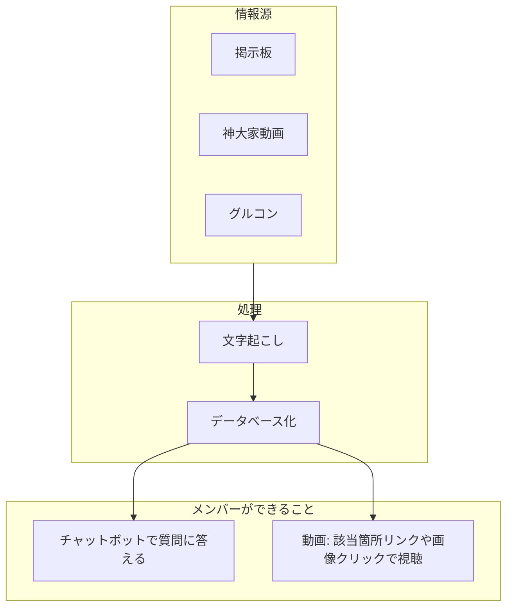

# 2月28日 目黒さん面談 — 方針と資料準備

**面談日**: 2026年2月28日（土）10〜12時の1時間程度・オンライン  
**目的**: 神・大家さん倶楽部における生成AI活用の方向性について意見交換し、リスキリング講座への誘いにつなげる

- **第一目的**: **神・大家さん倶楽部全体で豊かになれる仕組みを作ること**。できればセミナーに紹介してもらい、実際にリスキリング講座を受けてマージをもらえればいいが、あくまで第一は「神大家全体が豊かになれる仕組み」を共有しておきたい。
- **しゃべる例として**: これから紹介するリスキリング講座は **チャプロ** のもの。チャプロの今の仕組みのなかで「便利だな」と思えるところを**つながり**として示すとよい。その参考例が下記URL（チャプロのプロンプト例）。ここでやれることの紹介を**第一に説明したい**（有力候補）。

---

## 面談で伝えたいイメージ

- **神・大家さん倶楽部の全般**でAI活用を進めていきたい、というイメージを共有する。
- **AI活用の幅**: IT技術に詳しい人は、**Cursor**のような形で自動化や高度なことができますよ、という話もする（AI活用が幅広いことを示すため）。
- **伝えたいポイント（方針）**:
  - 高度なAIの使い方（Cursorのような開発・自動化）もある。
  - ただ、神・大家さんの**皆さんの90%がうまく使えるところ**をやっているので、**簡単に使えるところ**を進めていく必要がある。
  - **Cursorみたいな使い方は、皆さんに適用すべきではない**と思っている。ここをはっきり伝えたい。
- **伝えたいこと**: そういうアプリや仕組みを作ることによって、**皆さんが効率的にできる環境**が構築できたらいいな、と思っている。そのことを伝えたい。
- その一環として**今すでにできていること**を1つ挙げ、それを**説明の中心**にする。
  - **管理会社の一覧作成**：駅を中心にGoogleマップで一覧表示するもの。倶楽部の皆さんにも使ってもらえると思っているので、ここを中心に説明したい。

---

## 方針（全体の流れ）

1. **2月28日までに**
   - リスキリング講座の内容を学んでおく
   - 説明用のネタ・実例をそろえる
   - 説明の形と資料（構成・スライド等）を決める

2. **面談での説明の形（DX互助会・勉強会1回目スタイル）**
   - **メイン**: 「こういうところを考えています」という**いくつかのアイデア**と、その**実例**を中心に説明
   - **最後**: 「リスキリング講座を気軽に受けてみませんか？」という提案で締める

3. **資料づくり**
   - ネタをそろえながら、どういう形で説明するかの資料を一緒に作っていく（Cursor等で手伝い希望）

---

## 説明の構成案（たたき台）

| 順 | 内容 | メモ |
|---|------|------|
| 1 | 自己紹介・今日の目的 | 東海幹事、社内でAI活用推進、倶楽部で協力したい。**第一目的は神大家全体で豊かになれる仕組みを作ること**（セミナー紹介・マージはできれば） |
| 2 | AI活用の幅と方針 | ITに詳しい人はCursor等で自動化もできる→ただし神・大家では90%が使える「簡単なところ」を進める。Cursor型は皆に適用すべきではない、と伝える |
| 3 | **第一に説明：チャプロのプロンプト例** | 紹介する講座は**チャプロ**のもの。プロンプトで人口動態調査→エリアデータ＋物件購入アドバイスが出る。発展で相続路線価・災害ハザードマップも。URLでやれることの紹介を共有 |
| 4 | 今できていること（中心） | 管理会社一覧・駅中心のGoogleマップ。皆さんに使ってもらえる例として説明 |
| 5 | 今後の素案（説明用） | 周辺マップアプリの流れ・Replit／Gensparkなど。木村さんとの話から。説明資料で流れを共有 |
| 6 | その他のアイデア | コミュニティのデータベースを活かしたアプリ：有志情報・物件・お役立ちの体系化、チャットボット、やってるところ一覧。神大家動画・グルコン等の文字起こし→DB→チャット。動画は該当箇所リンク・画像クリックで視聴。運営にやってもらえると助かるという要望。必要に応じて補足 |
| 7 | 提案：リスキリング講座 | **チャプロ**の講座。上記の流れからつなぐ。難しい内容ではない→学んだ人の9割が自分でアプリを作れる→まず社員の中で進めてはどうか、という話に進めたい |

※ 時間に合わせて2・3のボリュームを調整

---

## ネタ・実例（ここにストック）

### ★ 第一に説明したいこと：チャプロのプロンプト例（人口動態調査）

**参考URL**: [（一次判断）物件購入するエリアの人口動態、それを踏まえたアドバイスを出力するプロンプト | チャプロAI](https://chapro.jp/prompt/321186/2526)

- **一言**: リスキリング講座は**チャプロ**のもの。講座のステップ1でプロンプトを作ると、**人口動態調査**で調べたエリアのデータが出てくる。その「やれること」を第一に説明したい。
- **やれること（URLの内容）**:
  - **目的**: 物件購入を予定しているエリアが、投資戦略に合っているかを**一次判断**する。
  - **データソース**: 国立社会保障・人口問題研究所（IPSS）の将来推計が中心。新線・大規模再開発など**特殊要因**がある地域は自治体の最新値で上書き。
  - **出力**:  
    1. **人口動態調査結果** — 調査住所＋隣接市区町村の人口数・増減率を**表形式**で要約（例：2005年・2020年・2035年・2045年、対基準年比・増減率）。  
    2. **物件購入アドバイス** — 人口増減率に基づく評価軸（増加〜10％減＝中長期保有の安全圏、約15％減前後＝注意して選別、15％超減＝攻め枠・短中期など）で、保有方針や物件条件を提案。
  - **つながり**: チャプロのいまの仕組みで「プロンプトでここまで出せる」と示すと、講座の価値が伝わりやすい。
- **発展（説明前に整理したい）**: 人口動態に加え、**相続路線価**や**災害ハザードマップ**も「物件購入前に調べる情報」として合わせて出るようにしている。ここはブラッシュアップして使いやすくし、**説明前に整理して分かりやすく話せる状態**にしたい。
- **TODO**: 上記「発展」の内容（相続路線価・ハザードマップの出し方・画面）を整理し、面談で簡潔に説明できる形にする。

---

### ★ 説明の中心（今できていること）

**管理会社の一覧作成 — 駅を中心にGoogleマップで一覧表示**
- **一言**: 駅を中心に管理会社をGoogleマップで一覧にしたもの。物件検討や依頼先の確認に使える。
- **実例・デモ**: （実際の画面・URLや共有方法をここにメモ）
- **倶楽部の皆さんに**: 同じやり方で自分のエリアでも作れる・使えると思っているので、ここを中心に説明したい。
- **講座とのつながり**: こうした「一覧化・可視化」の考え方は、講座で学ぶ業務効率化にもつながる。

---

### 素案（まだできていない・説明資料で伝えたい）

**周辺マップをアプリで作る — 木村さんとの話から**

- **きっかけ**: 木村さんと話したときに「周辺マップをアプリで作れるといいですね」という話になった。その素案を説明資料で示したい。
- **使うAIツール**: アプリを作るAIツールとして **Replit** や **Genspark（ジェンスパーク）** などがある。それをもとに作れるイメージを説明する。
- **想定する流れ（こういうのが作れますよ、の説明用）**:
  1. **自分の物件の住所を入力**する
  2. **近くのマップ**を出す
  3. **タベログから人気のお店を一覧**で出す
  4. **何をアピールするか**をその中からピックアップする
  5. ピックアップした結果で、**アイコンとおすすめ情報をプロット**する
  6. **テンプレートのイメージ**から**周辺マップを更新**する
- **一言で**: 「住所を入れたら、タベログの人気店を選んで周辺マップにプロットし、テンプレから周辺マップを更新する、そんなアプリがAIツールで作れるイメージです」
- **伝えたいこと**: こうしたアプリを作ることで、**皆さんが効率的にできるところ**が構築できたらいいな、というメッセージで締める。
- **説明資料**: 上記の流れを図や箇条書きで示したスライドがあると、素案として伝えやすい。

---

### その他のアイデア（必要に応じて補足）

**コミュニティのデータベースを活かしたアプリ**
- **タイトル**: コミュニティのデータベースを活かしたアプリ
- **一言**: 倶楽部の中にある情報を体系的にまとめて提供したり、必要な情報をチャットボットで出せるようにしたり、データベースが生きる一覧にまとめたい。
- **具体的なイメージ**:
  1. **体系的な情報提供**: 有志情報・物件情報・お役立ち情報を体系的にまとめたものを提供する。
  2. **チャットボット**: 必要な情報を質問に答える形で出せるようにする（例：「〇〇駅周辺の管理会社は？」「こんなときどうする？」）。
  3. **やってるところの一覧**: 神・大家さん倶楽部のなかで、すでにデータベースや情報を活用している取り組みを一覧にまとめる。どこで何をやっているかが分かると、横のつながりや参考にしやすくなる。
  4. **神大家動画・グルコン等の活用（運営への要望）**: 今のコミュニティ掲示板に加え、**神大家動画**や**グルコン**などを文字起こししてデータベース化し、チャットボットで聞けるようにしたい。根幹のデータベースに関わるところなので、**運営でやってもらえると非常に助かります**（要望として伝えたい）。**できることの具体例**：チャットボットで内容を質問して答えを得る。動画は「ここら辺見てね」のようなリンクで該当箇所へ誘導し、該当箇所の画像をクリックするとその部分を視聴（秒数指定で飛べるかは要検証）。やりたいことの具体例であり、**運営にやってほしいこと**として説明する。
- **伝えたいこと**: コミュニティの資産（データ・知見）を活かして、皆さんが探しやすく・使いやすい形にしていくイメージ。
- **講座とのつながり**: データの整理・可視化や簡単なアプリ化は、講座で学ぶ内容とも親和性がある。

### 図解（神大家動画・グルコン等のDB化と利用）

全体の流れと、運営にやってもらえると助かる部分・メンバーが得られることを示す。**根幹DBは運営にやってもらえると助かります**。

（必要に応じて他のアイデアも追加）

---

## 提案：リスキリング講座（話の流れ・伝えたいこと）

上記（AI活用の幅・今できていること・今後の素案・皆さんが効率的にできる環境）の流れから、次の話に進めたい。

- **前提**: 紹介するのは**チャプロ**のリスキリング講座。チャプロのいまの仕組み（例：人口動態プロンプトでやれること）を「つながり」として見せてから講座を提案する。
- **流れ**: 初対面なので、**フック3（気軽さ）で着地する前に、フック1（助成金）**を入れた方がよい。75%助成金が出る話を先に伝えてから「気軽に」で締める。
- **フック1**: 「この講座は助成金の対象で、**75%が補助で戻る**んです。数百万円単位の助成、ご存知でしたか？」というような一言を入れる。
- **今進めているAIリスキリングの講座は、難しい内容ではない**。
- **学んだ人の9割くらいが、自分でアプリを作れるようになる**（90%が業務で使えるレベルに、という話とつなげてもよい）。
- なので、**まず社員の中で進めてはどうか**、という提案をしたい。
- **フック3で着地**: あわせて「まずは気軽に、セミナーから受けてみませんか？」とハードルを下げる言い回しで締める。

---

## 資料構成・スライド案

- **形式**: （未定）スライド / メモのみ / 共有画面でデモ など
- **枚数・時間**: 1時間のうち説明〜意見交換〜提案の配分

### スライド構成（案）
1. 表紙・今日の目的（神・大家さん倶楽部の全般でAIを進めたいイメージ。**第一目的＝神大家全体で豊かになれる仕組み**）
2. 自己紹介（短く）
3. **AI活用の幅と方針** — 高度な使い方（Cursor等）もあるが、神・大家では90%が使える「簡単なところ」を進める。Cursor型は皆に適用すべきではない
4. **第一に説明：チャプロのプロンプト例** — 紹介する講座はチャプロのもの。プロンプトで人口動態調査→エリアデータ＋アドバイス。発展で相続路線価・ハザードマップも
5. 今できていること — **管理会社一覧（駅中心・Googleマップ）**
6. 実例・デモ（スクショ or 短いデモ）
7. **今後の素案** — 周辺マップをアプリで（木村さんとの話）。Replit／Genspark等 → 流れを説明
8. **リスキリング講座の提案（チャプロ）** — フック1：助成金で75%が戻る → 難しい内容ではない／9割がアプリ作れる → まず社員で進めては → フック3「気軽に受けてみませんか？」
9. まとめ・次のアクション

### メモ・修正したい点
- **第一目的**: しゃべった内容として「第一目的は神大家全体で豊かになれる仕組みを作ること。セミナー紹介・マージはできれば」を共有する。
- **チャプロの例**: 第一に説明する有力候補。URLでやれること（人口動態→表＋アドバイス）を紹介。発展の相続路線価・災害ハザードマップは、説明前に整理して分かりやすく話せるようにする。
- **コミュニティDBを活かしたアプリ**: 説明する場合は「有志情報・物件・お役立ちの体系化」「チャットボットで必要な情報を出す」「神大家のなかでやってるところを一覧でまとめる」の3点を簡潔に。神大家動画・グルコン等の文字起こし→DB化→チャット。運営への要望として伝える。図解で説明。
（ここに「ここはこうしたい」「この例を入れたい」などを追記）

---

## 当日の構成案（流れ・どこまで説明するか）

AIキックオフセミナー要点（説明しない勇気・売り込みしない・フック3で着地）を踏まえた、当日の説明の流れと範囲。

### 流れ（スライド順）

| # | スライド | 説明するところ | どこまで／注意 |
|---|----------|----------------|----------------|
| 1 | 表紙 | 今日の目的：神・大家さん倶楽部の全般でAI活用を進めたい。**第一目的＝神大家全体で豊かになれる仕組み** | 短く |
| 2 | 自己紹介 | 東海幹事、社内でAI活用推進、倶楽部で協力したい | 短く |
| 3 | AI活用の幅と方針 | 高度な使い方（Cursor等）もある→神・大家では90%が使える「簡単なところ」を進める。Cursor型は皆に適用すべきではない | 方針をはっきり伝える。Keytone比較は出さない |
| 4 | **第一に説明：チャプロのプロンプト例** | 紹介する講座は**チャプロ**のもの。プロンプトで人口動態調査→エリアの人口データ＋物件購入アドバイスが出る。発展で相続路線価・災害ハザードマップも。URLでやれることを共有 | 第一に説明したい有力候補。発展部分は整理できたら分かりやすく |
| 5 | 今できていること | 管理会社一覧（駅中心・Googleマップ）。皆さんに使ってもらえる例 | 実例・デモ可能なら画面共有 |
| 6 | 今後の素案 | 周辺マップをアプリで（木村さんとの話）。住所→マップ→タベログ人気店→ピックアップ→プロット→テンプレ更新。Replit／Genspark等。皆さんが効率的にできる環境を構築できたら | 流れを箇条書きで。詳しくは聞かれたら |
| 7 | 講座の提案（チャプロ） | **フック1**：助成金で75%が戻る話を先に（初対面なのでここで興味を引く）→ 難しい内容ではない／9割がアプリ作れる → まず社員で進めては → **フック3**「気軽に受けてみませんか？」で着地 | 詳細・価格はセミナーに流す（説明しない勇気） |
| 8 | まとめ・次のアクション | 今日のポイント・次にできること | 短く |

### どこまで説明するか（要点に沿った線引き）

- **する**: 考えていること・方針・今できていること・今後の素案・講座の存在と「気軽に」「まず社員で」の提案。
- **しない**: 講座の詳細カリキュラム・価格・他社比較（Keytone等）。「詳しくはセミナーで」と案内する。
- **想定質問**: 「いくら？」「どんな内容？」→「75%助成で戻る／詳しくは無料セミナーで」など、要点の切り返しを参照。

### HTMLスライド

上記構成で **260228_目黒さん面談_スライド.html** を同フォルダに用意。写しながら説明できる。

---

## 用語・注意事項

### 講座の売りと Keytone との比較

- **「9割の人が作れる」簡単さ**が、今進めているリスキリング講座の売り。
- よく比べられるのが **Keytone**。Keytone もローコードツールで「みんなが作れるようになる」とうたっている。
- 一方で、**Keytone 自体は実際にはみんなが使える感じではなく、扱いが難しい**と聞いている。
- **TODO**: Keytone の概要を一度調べ、**難しさがどれくらいか**を理解しておきたい（比較・質問対策用）。
  - （調査結果やメモをここに追記）
- **当日の説明**: キントーンの話は技術的で営業につながらないので、**説明するつもりはない**。まず自分が知っていることが大切。明示したMDの要点を踏まえて、流れと「どこまで説明するか」は下記「当日の構成案」に従う。

---

## 参照

- **やりとり（DX共有）**: DX互助会_共有フォルダ `06_projects/神・大家さん倶楽部_AI活用推進/目黒さんとのやりとり.md`
- **DX互助会 第1回勉強会**: 要約は `04_logs/DX互助会勉強会1_要約.md`、スライド https://m19mhrts83-cyber.github.io/dx-slides/ 、配布資料 handout.html
- **講座の案内・言い回し**: 300_AIリスキリング講座 の 05_セミナー・学習資料（AIキックオフセミナー_要点.md 等）
- **チャプロ・第一に説明したい例（人口動態プロンプト）**: https://chapro.jp/prompt/321186/2526 — 物件購入エリアの人口動態調査＋アドバイスを出力するプロンプト（生成AIプロンプト研究所「チャプロAI」）
