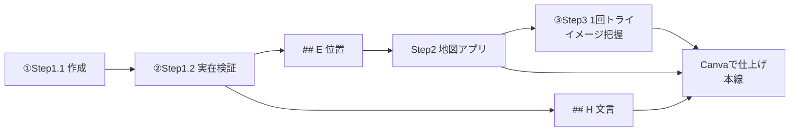

# 神・大家さん倶楽部 周辺MAP自動生成フロー — 運営説明 構成案

**目的**: 運営向けに「周辺マップ作成フローの構築と安定化」を説明する資料のたたき台。
**使い方**: Drive `200_NoteBookLM/03_周辺MAP作成手順説明/` の写しを NotebookLM にソース追加 → スタイルは同階層の **`00_ゼロイチマスタースタイル`** → チャット冒頭でスタイル宣言 → Studio（Nano Banana Pro）でスライド化。
**日付**: 2026-07-25（**通し検証・本線確定: 2026-07-26**／**幸田さん比較反映: 2026-07-26**／**Driveノート配置: 2026-07-27**）

関連:
- **NotebookLM 投入フォルダ（正・admin Drive）**: `200_NoteBookLM/03_周辺MAP作成手順説明/`
- **共通スタイル（ゼロイチ）**: `200_NoteBookLM/00_ゼロイチマスタースタイル/`（いけとも／`cute-illustration`）
- Q&A 側の同種資料: `運営説明_Q&Aチャットボット_構成案.md`
- 7/29 運営説明骨子: `運営説明_20260729_骨子.md`
- **7/29 1時間タイム表**: `運営説明_20260729_1時間タイム表.md`（MAP30分／Q&A20分／進め方10分）
- フロー正本: `AI×周辺MAP/03_使い方_基本と発展.md`
- Canva手順（本線）: `AI×周辺MAP/15_Canva手順_印刷用仕上げ_PathA.md`
- Step1 プロンプト正本: `AI×周辺MAP/01_Raimoプロンプト_Step1基本洗い出し.md`（Step1.1）／`02_DeepResearchプロンプト_評判店リサーチ.md`（Step1.2）
- Step2 アプリ: `shuhen-map.html`（[公開URL](https://m19mhrts83-cyber.github.io/project-GE/shuhen-map.html)）
- Step3 プロンプト正本: `AI×周辺MAP/11_Raimoプロンプト_C1下地色味寄せ.md`
- APIキー・コスト: `AI×周辺MAP/運用手順_周辺MAP_MapsAPIキー_運営移管.md`
- Canva成果物例: `AI×周辺MAP/試走出力/2026-07-26_PathA_Canva/`
- 幸田さん実践の元資料: `806_神大家AI推進/1.受信添付(Stock)/2026-07-21/20260721_14:58_成果報告共有.pptx`

---

## いま伝えたいこと（結論・2026-07-26更新）

**再現性の高い基本は「AIでネタと下地 → Canvaで仕上げ」**。生成AIだけで1枚絵にするより、位置が正しく・2件目以降もテンプレ流用しやすい。

幸田さんの ChatGPT＋Gemini 実践は **「AIでここまで作り込める」良好事例**として尊重する。一方、全員展開の本線には、**地図をAIに描き替えさせない**今回の手順の方が向く（理由は次節の比較）。

| 観点 | これまで（幸田さん方式の見え方） | いま（今回の本線） |
|---|---|---|
| 背景地図 | Google MapスクショをAIでイラスト化し、位置がぶれやすい | アプリが Google の地図APIで実地図を安定生成 |
| 駅までの動線 | AIへの修正指示で何度も描き直し | 最寄駅→物件を自動描画（1本・赤線）※Canva仕上げ時は消してもよい |
| 施設の選び方 | 機械的な羅列／AIの推測に寄りがち | ターゲット／ペルソナに合う施設を洗い出し（**ペルソナの深掘りは運営相談中**） |
| 情報の正しさ | 後から店名を口頭で訂正（幻覚が混ざる） | **実在チェック専用のプロンプト**で架空・閉店を落とす |
| 店の魅力づけ | 生活インフラ中心で物足りない | **評判店を足す品質向上プロンプト**で「行きたくなる店」を補う |
| 仕上げ | AI一枚絵を10〜12回微修正（30分〜1時間） | **Canvaでピン・吹き出しを手置き**（本線・確定） |

### やってみた結果 — 再現性の高い基本手順（確定）

1. **Step1.1 → Step1.2 → Step2** まで進める（候補→実在検証→地図位置）
2. そのネタを元に **Step3 を1回**試し、色味・紙面のイメージを掴む
3. イメージが掴めたら **Canva で作成**する（手順: `15_Canva手順_印刷用仕上げ_PathA.md`）

※ Step4.1（生成AIで印刷用1枚）はトーン試作用。地理・ピン位置は崩れやすいため、**実務の本線にはしない**。

---

## 0. 幸田さん方式と今回の比較（7/29用・必須）

出典: 成果報告共有.pptx「周辺マップの作成方法 (1/3)〜(3/3)」。**敬意を持って改良のベースとして扱う**（否定しない）。

### 0-1. 幸田さんがやったこと（要約）

**ChatGPT＋Gemini の両使い**（Copilotは非推奨）で、Google Mapのスクショを起点に **AIで1枚絵を作り込む**方式。**実行プロンプトは計12回・所要は毎回30分〜1時間**。

| # | ツール | 指示の内容（要約） |
|---|---|---|
| 0 | 準備 | Snipping Tool で Google マップを切り出し |
| 1〜5 | ChatGPT | イラスト化 → 物件・最短ルート強調 → 建物イラスト化 → 色・余分な店の調整 → 物件位置の訂正 |
| 6〜9 | Gemini | 物件位置の移動、赤点線ルートの引き直し、余分な点・線の削除 |
| 10〜12 | ChatGPT | 日本語をはっきり → **店名の誤り8件を実名に訂正** → 距離・不要店削除・物件名変更 |

いちばんの特徴: **地図をAIに描き替えさせる**ため、位置ずれと店名の幻覚が起き、**後から口頭で何度も直す**。

### 0-2. 今回（松野）がやったこと（要約）

| # | 工程 | 内容 |
|---|---|---|
| 1.1 | 作成プロンプト | 住所・物件名・ターゲットから施設・Access・コメントの**候補** |
| 1.2 | 実在検証（Deep Research） | 候補を1件ずつ検索し実在確認。評判店を補完。**## E（位置）／## H（文言）** |
| 2 | 地図アプリ | Google Maps API の**実地図**に ## E を載せ、位置を確定してスクショ |
| 3 | 色味寄せ | 1回だけ試し、紙面のイメージを掴む |
| C | **Canva仕上げ（本線）** | 実地図を背景に固定し、## H でピン・吹き出し・人物を手置き |

いちばんの特徴: **地理は実地図のまま動かさない**。店名は**載せる前に**実在検証する。

### 0-3. 観点別の比較

| 観点 | 幸田さん方式 | 今回（本線） |
|---|---|---|
| 地図の作り方 | スクショをAIでイラスト化（描き替え） | **実地図をそのまま背景**（描き替えない） |
| 位置の正確性 | AIがずらす → 毎回プロンプトで手直し | 実地図なので位置がブレない |
| 施設名の信頼性 | 幻覚した店名を後から訂正 | **実在検証で先に確定** |
| ツール | ChatGPT + Gemini を往復 | Raimoプロンプト群 + 地図アプリ + Canva |
| 手戻り | 10〜12回の微修正 | 検証を先に済ませ、仕上げはCanva |
| 所要時間 | 毎回 30分〜1時間 | 初回は長め・2件目以降はテンプレ流用で短縮 |
| 再現性 | 作り込めるが個人差・修正回数に依存 | 手順化され、同水準を狙える |
| 向き | **学習の入口・挑戦枠として有効** | **全員展開の本線** |

### 0-4. 運営への言い方（話者メモ）

- 「幸田さんのやり方は、**AIでちゃんと作り込めた良い事例**です」
- 「ただし地図をAIに描き替えさせると、位置と店名の直しが何度も必要になる」
- 「今回は**ネタと検証はAI、地図は実地図、仕上げはCanva**に分け、会員向け本線にしました」
- 「幸田さん方式は上級者向けの挑戦枠として残せます」

### 0-5. キャンバス・デモの見せ方（7/29）

| 用途 | 正本 | 見せ方 |
|------|------|--------|
| **資料（NotebookLM）** | `参照_幸田さんvs今回_比較（キャンバス写し）.md` | s2c は **§0-3 の比較表1枚**。12プロンプト詳細は付録ソース参照 |
| **口頭（当日）** | Cursor Canvas `shuhen-map-kouda-vs-matsuno` | s2b〜s2c で **Canvas を映して**左右の手順をスクロール説明（資料より情報量多い） |
| **実演** | `00_デモ手順.md` | 比較のあと Step2 実地図 → Canva 完成形（差が最も伝わる） |

Canvas の全文は NotebookLM スライドに詰め込まない（1枚に収まらない）。**表は s2c、詳細は Canvas または付録 MD** に分ける。

---

## 1. 現状の課題とアプリ化による解決アプローチ（幸田さんプロンプトの改良）

従来の幸田さんのプロンプト運用における課題に対し、アプリ化（Google API 等の活用）とプロンプトの2段構えで、汎用性と出力の安定性を向上させた。

### 課題1：背景地図の作成・共有の手間

- **現状**: スクリーンショットをベースにAIでイラスト化し、位置の調整や共有が不安定だった（幸田さん事例でも位置訂正プロンプトが複数回）。
- **対策**: 地図生成部分をアプリ化。Google 提供の API 等を活用し、**実地図のまま**背景を安定生成。汎用性を高めた。

### 課題2：駅までの最短ルート表示の難しさ

- **現状**: 手動／AIへの修正指示でのルート描画に手間がかかっていた。
- **対策**: アプリ側で「最寄り駅までの最短ルート（道筋）」を自動描画・算出できるようにし、精度を安定化させた。

### 課題3：入居者目線での魅力的な周辺情報の選定

- **現状**: 機械的な周辺情報だけでは、入居希望者の「住みたい」という意欲を十分に喚起できない。
- **対策**: 以前、運営側からいただいた情報をもとに、「入居者にとって魅力的な施設」をプロンプトで洗い出し、その施設の位置特定（マッピング）までをアプリで完結できるようにした。

### 課題4：キャッチーなビジュアルと紹介文の作成

- **現状**: 地図上に情報を載せるだけでは、ビジュアルや訴求力が不足する。
- **対策**: Step1.2 の **## H** で紹介コメントを用意し、**Canva** で吹き出し・人物を配置。AI一枚絵に頼らず、必要な箇所だけ微調整する。

### 課題5：AIが実在しない店を挙げてしまう（新規）

- **現状**: AIは「ありそうな店名」を作ってしまうことがある。幸田さん事例でも最終段階で店名を8件訂正していた。閉店・別支店の混入も懸念。
- **対策**: プロンプトを**2段構え**にした。**Step1.1（作成）** で候補を洗い出し、**Step1.2（実在検証＋品質向上）** で1件ずつ検索して実在・営業状況を確認する。あわせて評判の良い店を足す。実在が確認できなかった店は地図に載せない。
- **狙い**: 「誰がやっても」だけでなく「**載せた情報が確かめられている**」状態にする。**訂正を後工程に回さない**。

---

## 2. 周辺マップ作成の全体ステップ（本線＝Canva仕上げ）

**本線（再現性優先・2026-07-26確定）**: AIはネタと下地まで。仕上げは Canva。

用意しているプロンプトの役割:

| プロンプト | 役割 | ひとことで |
|---|---|---|
| **①作成**（Step1.1） | 住所から周辺施設・Access・紹介コメントの**候補**を出す | たたき台をつくる |
| **②実在検証＋品質向上**（Step1.2） | 候補を検索して**実在確認**し、評判店を足す。**## E（位置）**と**## H（文言）**を出す | 嘘を落として、Canva用のネタも残す |
| **③下地色味寄せ**（Step3） | 地図スクショの色味を紙面向きに寄せる（**1回トライしてイメージ把握**） | 下地の感覚を掴む |
| （参考）印刷用仕上げ Step4.1 | AIで1枚絵のトーン試作 | **実務本線にはしない**（地理が崩れやすい） |

```
【本線】再現性の高い基本手順

① Step1.1 → Step1.2 → Step2 まで進める
   ・1.1 作成（通常チャット）… 候補
   ・1.2 実在検証＋品質向上（Deep Research）… ## E / ## H
   ・Step2 地図アプリ … ## E で位置確定・スクショ（クリーン／ピン付き）

② Step3 を1回トライし、大体のイメージを掴む
   ・色味・紙面感の確認用。完璧を求めない

③ イメージが掴めたら Canva で作成（本線）
   ・背景＝Step2の地図／文言＝## H／ピン・吹き出し・人物をペタペタ
   ・手順詳細: AI×周辺MAP/15_Canva手順_印刷用仕上げ_PathA.md
   ・2件目以降はテンプレ流用で短縮
```



### 本構成のメリット

- 背景地図・施設位置がブレない（Google地図＋アプリ）
- 載せる店は実在確認済み（Step1.2）
- Canvaで仕上げるため、**番号ずれ・架空の駅・道の描き替えが起きない**
- 2件目以降はテンプレ流用で速い

---

## スライド構成（19枚）

**7/29 当日**: 全体60分のうち**周辺MAPは30分**（説明18〜20分＋デモ10分）。詳細は `運営説明_20260729_1時間タイム表.md`。  
当日は**8枚に短縮**して話す（s4〜s8・s15・s15b は「今後の進め方」ブロックへ回す）。

各スライド: 見出し／箇条書き最大3点／話者メモ。イラスト欄は挿絵の意図。

### s1 タイトル

- 周辺マップ自動生成フローの構築と安定化
- 幸田さん実践をベースにした改良と、アプリ化のご報告
- 2026年・松野

話者メモ: ツール自慢ではなく「誰でも同じ水準で出せるようになった」ことを共有する。幸田さんの実践への敬意を先に伝える。
イラスト: 完成した周辺マップ1枚

### s2 結論 — なにが良くなったか

- 再現性の高い基本は「Step1.1→1.2→2 → Step3で1回イメージ → Canva仕上げ」
- 背景地図・位置が安定し、載せる店は実在確認済み
- AI一枚絵より Canva の方が品質・直しやすさが高い（通し検証で確認）

話者メモ: 先に結論。「全部AIに任せる」ではなく「ネタはAI、仕上げはCanva」が本線だと伝える。
イラスト: ビフォーアフター／Canva成果物

### s2b 幸田さん方式 — 何をやったか

- ChatGPT＋Geminiの両使い（Copilot非推奨）。Google Mapスクショからスタート
- イラスト化→ルート強調→位置・色の修正→店名訂正まで **12プロンプト**
- 所要は毎回 **30分〜1時間**。「AIで作り込めた」良好事例

話者メモ: 否定しない。「ベースとして非常に参考になった」と敬意を示す。詳細プロンプトは資料付録／口頭で触れる程度でよい。
イラスト: スクショ→イラストMAPのビフォーアフター（pptx画像）

### s2c 幸田さん方式 vs 今回 — いちばんの違い

- 幸田さん: 地図を**AIに描き替え**させる → 位置ずれ・店名の幻覚を後から直す
- 今回: **実地図は動かさない**／店名は**載せる前に**実在検証／仕上げはCanva
- 全員展開の本線は今回。幸田さん方式は学習の入口・挑戦枠として残せる
- **比較表**: §0-3 の8行表をこのスライド1枚に収める（地図・店名・手戻り・所要が核心）

話者メモ: 「どちらが偉い」ではなく用途分け。**§0-3 の表を1枚で見せる**あと、深掘りは Cursor Canvas を映す（12プロンプトの流れ）。付録は `参照_幸田さんvs今回_比較（キャンバス写し）.md`。
イラスト: 比較表（8行・2列）。左右に小さな地図アイコン（AI描き替え vs 実地図）を添える程度でよい

### s3 これまでの課題（5点）

- 背景地図づくりとスクショのやり取りが手間で、位置がぶれる
- 駅までのルートを手で描くのが大変
- 施設が機械的な羅列になり、住みたい気持ちが動かない

話者メモ: 残る2点（見た目・紹介文／AIが実在しない店を挙げる）は次以降で個別に。幸田さんのプロンプト運用で見えた課題として整理。
イラスト: 困っている作業者

### s4 課題1 → 背景地図をアプリ化

- これまで: スクショをAIでイラスト化し、位置調整と共有が不安定
- いま: 地図生成をアプリ化し、Google の API で**実地図**を安定生成
- 物件が変わっても同じ手順で使える（汎用性）

話者メモ: 「毎回ゼロから地図を描き替える」作業が消えた点を強調。
イラスト: 地図が自動で出る絵

### s5 課題2 → 駅までの最短ルートを自動描画

- これまで: 手動／AI修正でのマッピングとルート描画に手間
- いま: 最寄り駅→物件の道筋を自動で描画・算出
- 徒歩の見せ方がブレない

話者メモ: 直線ではなく実際の道筋。物件の訴求で効く部分。
イラスト: 駅から物件への赤い線

### s6 課題3 → 入居者目線で施設を選ぶ

- これまで: 機械的な周辺情報だけでは「住みたい」が動かない
- いま: 運営からいただいた情報をもとに、入居者に魅力的な施設を洗い出す
- 洗い出した施設の位置特定までをアプリで完結

話者メモ: 入居者像（ペルソナ）を先に決めてから施設を選ぶのがポイント。
イラスト: 入居者像と施設アイコン

### s7 課題4 → ビジュアルと紹介文

- これまで: 地図に情報を載せるだけでは訴求力が不足
- いま: ## H で紹介コメントを用意し、Canvaで吹き出し・人物を配置
- AI一枚絵に頼らず、必要な箇所だけ微調整

話者メモ: 全部を人が書かない。AIのたたきをCanvaで直す形に変えた。
イラスト: 吹き出し付きの紙面

### s8 課題5 → 実在しない店を載せない仕組み（新規）

- これまで: AIは「ありそうな店名」を作ることがあり、閉店・支店違いも混ざる（幸田さん事例でも最終で店名を複数訂正）
- いま: プロンプトを2段構えにし、候補を1件ずつ検索して実在・営業を確認
- あわせて評判の良い店を足し、確認できなかった店は地図に載せない

話者メモ: ここが今回の新規追加。「後から直す」のではなく「確かめてから載せる」を仕組みにした点を強調する。
イラスト: チェックマークと除外された店

### s9 全体像 — 本線のステップ

- ①作成 → ②実在検証（## E 位置／## H 文言）→ Step2 アプリ
- Step3 を1回トライしてイメージ把握 → **Canvaで仕上げ（本線）**
- AI印刷用仕上げ（Step4.1）はトーン試作のみ（必須ではない）

話者メモ: 「1.1→1.2→2までネタを固め、3で感覚、Canvaで完成」の3拍子を覚える、と伝える。
イラスト: フロー図（Canvaがゴール）

### s10 Step1-1 — 作成プロンプトでたたき台

- 入力は「住所」「物件名」「ターゲット」だけ。通常チャットで数十秒
- 周辺施設・Access・紹介コメントの候補がテキストで出る
- この時点は「候補」。まだ地図には載せない
- 出力末尾に「次工程へ渡す用」のコードブロックが1つ出る

話者メモ: 入力が少ないことが普及の条件。ここで止めずに必ず次の検証へ進む、と伝える。
イラスト: フォームとテキスト出力

### s11 Step1-2 — 実在検証＋品質向上プロンプト

- 新しいチャットでディープリサーチをオンにして実行（途中で切り替えられない仕様のため）
- 引き継ぎは Raimo の変数に 1-1 のブロックを入れ、**MyPrompt全体をコピー1回**
- 候補を1件ずつ検索し、架空の店・閉店・支店違いを除外（理由も残る）
- さらに評判の良い店を足す
- 出力は2系統: **## E（Step2・位置）** と **## H（紙面文言：エリア一言／Access／ピンコメント／人物素材）**

話者メモ: 「作成」と「検証」を分けたのが信頼性の要。検証の時点で紙面用のネタも揃えるので、後からコメントを作り直さなくてよい。
イラスト: 検索結果と◯×の一覧＋2つのコードブロック

### s12 Step2 — アプリで地図をビジュアル化

- ## E の確定リストを貼ると、背景地図と施設の位置が自動生成
- 最寄駅→物件の徒歩動線も表示できる
- 画面をスクリーンショットで保存して次へ

話者メモ: ここが今回いちばん効いた改良。会員はキー入力なしで使える。アプリは位置だけ。文言は ## H を別途残す。
イラスト: アプリ画面（番号ピン付き地図）

### s13 Step3 → Canva — イメージ把握から仕上げ

- Step3: 色味寄せを**1回**試し、紙面のイメージを掴む（完璧不要）
- Canva: Step2の地図＋## H の文言でピン・吹き出し・人物を配置（本線）
- 2件目以降はテンプレ流用。手順書あり（初級者向け）

話者メモ: 「全部AIで1枚」より「Canvaで貼る」方が品質と再現性が高い、と通し検証で分かった。
イラスト: Step3下地 → Canva完成

### s14 事例 — Grandole志賀本通

- Step1〜2でネタと地図を作り、Canvaで印刷用に仕上げた
- 単身向けだったため店寄りになった可能性あり（改善検討中）
- 同じ手順を他物件にも適用できる

話者メモ: 実名で出してよいと確認済み（2026-07-25）。Canva成果物を見せる。
イラスト: Canva成果物1枚

### s15 ご相談 — ペルソナ設定の深さ

- 木村さんから教えていただいた**ペルソナ設定**まで踏み込み、おすすめ施設を寄せた方が刺さると考えている
- 一方、基本手順は「ターゲット一行」でも回せる（速さ・再現性）
- **どこまでを必須／どこからを発展版にするか**、運営と相談したい

話者メモ: 断定せず選択肢を出す。案A＝基本はターゲット一行、こだわる物件だけペルソナ。案B＝最初からペルソナ必須。
イラスト: ペルソナカードと施設アイコン

### s15b 改善検討 — 施設のバリエーションと名所

- 現状はお店寄りになりやすい → **公園・緑地**なども拾えるようにしたい（単身向け試作の偏りかも要確認）
- 見本にある「桜の名所」のような**名所・季節スポット**も、あれば載せられる形にしたい
- プロンプト側でもカテゴリ指示を足して改善中

話者メモ: 「改善ポイントとして挙げつつ、プロンプトも直していく」と伝える。
イラスト: 公園・桜のアイコン

### s16 本日の確認事項

- 本線フロー（1.1→1.2→2→Step3一回→Canva）でよいか
- 幸田さん方式は挑戦枠／学習入口、本線は今回の手順、でよいか

話者メモ: **7/29のMAPブロック（30分）では上記2点だけ**。ペルソナ・API実費・報酬は「今後の進め方」（10分）で扱う。報酬は口頭1文のみ（目黒さん共有済み・タイミング見て再相談）。
イラスト: チェックリスト（2項目）

### s17 クロージング

- ご質問を歓迎
- 次の一歩（例: 運営メンバーで1物件を試す）
- ご協力へのお礼

話者メモ: 次アクションを1つだけ決めて終わる。
イラスト: 完成マップの余韻

---

## NotebookLM 投入用プロンプト草案

**事前添付（ソース）** — Drive `200_NoteBookLM` から:
1. `03_周辺MAP作成手順説明/運営説明_周辺MAP_構成案.md`（本ファイルの写し）
2. `00_ゼロイチマスタースタイル/NotebookLM_マスタースタイル_cute-illustration.md`（いけとも／cute-illustration）

**チャット冒頭（スタイル宣言）**:

```text
登録済みソースのマスタースタイル（ゼロイチ／いけともゆるイラスト／cute-illustration）に従うこと。
Studio で生成するすべてのスライド画像も、同一スタイル（白背景・水彩風ゆるイラスト・丸ゴシック）にすること。
周辺MAP運営説明のスライドは、構成案の見出し順を維持すること。
```

**原稿整形プロンプト**:

```text
あなたは資料構成の編集者です。添付の「運営説明_周辺MAP_構成案.md」に従い、
神・大家さん倶楽部の運営向けスライド原稿を整えてください。
見た目は添付のいけともゆるイラストスタイル（cute-illustration）に揃える前提で書く。

制約:
- スライドは s1〜s17（s2b／s2c／s15b を含む）の見出し順を維持する
- 各スライドは「タイトル1行＋箇条書き最大3点＋話者メモ1行」に収める
- 専門用語は運営向けに平易な日本語にする（API/Raimo/GitHub 等は必要最小限）
- ステップ名は Step1.1／1.2／2／3／Canva を本線とし、旧称（Phase A/B/C、C1、C2）は使わない
- 本線は「①作成→②実在検証→Step2→Step3を1回→Canva仕上げ」。②を省略できる工程として書かない
- Step4.1（AI印刷用仕上げ）はトーン試作のみで、実務本線ではないと明記する
- Step1.2 の出力は ## E（地図）と ## H（紙面文言）の2系統であること
- ハルシネーション等の用語は使わず「AIが実在しない店を挙げることがある」と平易に書く
- 100%自動と誤解させない（Canvaでの手置きがある）
- 費用はレンジや上限の考え方で示し、確定見積のように断定しない
- **Canvaは本線の仕上げ工程**として書く（「不要」と書かない）
- ペルソナの深さ・公園／名所の載せ方は「運営への相談・改善検討」として残す
- **幸田さんの実践は「改良のベース・良好事例」として敬意をもって扱う**（否定しない）
- **s2b／s2c で「幸田さん方式（ChatGPT+Gemini・12プロンプト・30分〜1時間）」と「今回（実地図＋実在検証＋Canva）」の比較を必ず入れる**
- 比較の核心は「地図をAIに描き替えさせるか／実地図のままにするか」と「店名を後から直すか／載せる前に確かめるか」
- 幸田さん方式は学習の入口・挑戦枠、今回は全員展開の本線、と用途分けで書く

出力: スライド番号ごとに、そのまま読み上げ可能な原稿。
```

構成の塊:
- s2–s2c: 結論と幸田さん比較（必須）
- s3–s8: 課題ごとの対策（5点。s8が実在検証の新規追加）
- s9–s13: 全体像と各ステップの中身（プロンプト＋アプリ＋Canva）
- s14: 事例
- s15–s17: 相談・確認・クロージング

---

## 内部付録（運営資料には載せない）

### 実体の対応

| スライド上の呼び方 | 実体 |
|---|---|
| ①作成プロンプト（Step1-1） | Raimo MyPrompt `【周辺MAP作成_Step1】基本コンテンツ叩き作成`（473911 / 正本 `01`）＝Step1.1 |
| ②実在検証＋品質向上（Step1-2） | Raimo MyPrompt `【周辺MAP作成_Step1.2】実在検証・評判店リサーチ`（473910 / 正本 `02`）。**新しいチャット＋Deep Researchオン**。変数 `{Step1.1出力（Step1.2へ渡す用）}`。出力 **## E＝Step2用／## H＝紙面文言** |
| Step2 アプリ | `【周辺MAP_Step2】背景地図・施設位置取得`（`shuhen-map.html` / Pages）。投入は ## E |
| ③下地色味寄せ（Step3） | Raimo MyPrompt `Step3`（474296 / 正本 `11`）。スクショの色味のみ |
| ④-1 印刷用仕上げ（Step4.1） | Raimo MyPrompt `【周辺MAP作成_Step4.1】印刷用仕上げ`（474298 / 正本 `13`）。**トーン試作のみ。実務本線は Canva**（`15`） |
| Canva仕上げ（本線） | `15_Canva手順_印刷用仕上げ_PathA.md`。投入は Step2地図＋## H。成果物例: `試走出力/2026-07-26_PathA_Canva/` |
| ④-2 画像検証（Step4.2） | Raimo MyPrompt `【周辺MAP_Step4.2】画像検証・修正提案`（474383 / 正本 `14`）。**①完成MAP＋②骨格PNG必須**。粗検証＋コピペ修正案（1.1→1.2 と同じ関係） |
| チャット微修正 | Step4.1 出力後の Gemini・ChatGPT（Step4.2 のコピペ修正案を貼る） |
| 入居者像 | `04_…ペルソナ設定`（473915）／事例は Grandole志賀本通「サキ」 |
| 施設の深掘り | Step1.2 `02_DeepResearch…`（473910）／`05_アドバンス周辺MAP洗い出し`（473916） |
| 幸田さん実践（比較用） | `806…/20260721_14:58_成果報告共有.pptx`（周辺マップ作成方法 1/3〜3/3・実行プロンプト12件） |

### 費用・キー

- 使用API: Maps JavaScript / Places / Geocoding / Directions
- 予算アラート: **¥3,000／月**（2026-07-25 作成、しきい値 50/90/100%）
- Maps JS はブラウザ公開前提のため、キーは**リファラ制限＋API制限**付きブラウザキーで運用（隠せない前提）
- 運営移管チェックリスト: `運用手順_周辺MAP_MapsAPIキー_運営移管.md`

### 資料化前に揃えたい宿題（2026-07-26 更新）

- **Canva の扱い**: **本線確定**（2026-07-26）。仕上げは Canva。AI一枚絵（Step4.1）はトーン試作のみ。
- **幸田さん比較**: **反映済み**（2026-07-26）。§0 およびスライド s2b／s2c。
- **旧称の掃除**: **対応済み**（2026-07-25）。旧C1=**Step3 下地色味寄せ**、旧C2=**Step4.1 印刷用仕上げ**。`10` 系・`試走出力` は履歴として旧称のまま残す。
- **事例の物件名**: **実名でOK**（確認済み・2026-07-25）。Grandole志賀本通で記載。
- **Step1.2 の Raimo更新**: **要貼替**（2026-07-25）。## E（Step2）と ## H（紙面文言）を分離出力する版へ更新。ユーザーが Raimo へ反映。
- **Path C（Raimoパンフレット）**: **不採用**（縦型のみ・地図精度不足）。会員説明には載せない。