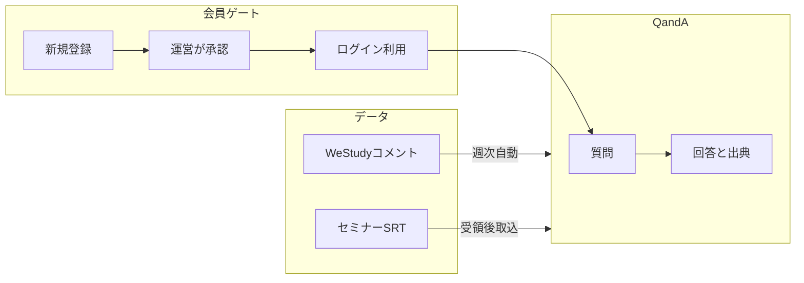

# 神・大家さん倶楽部 Q&Aチャットボット — 運営説明 構成案

**目的**: 運営向けに現状を説明し、今後の進め方（SRT提供・引き渡し・ペース・報酬）を相談する資料のたたき台。  
**使い方**: 本ファイルを NotebookLM 等に投入 → スキル図イラストと組み合わせてスライド化。  
**日付**: 2026-07-20（時点の想定。最終資料化時に文言を整える）

関連:
- チャットボット本体: `神・大家さん倶楽部情報Q&Aチャットボット/`
- 統合プラン Phase 6: `~/.cursor/plans/承認依頼メール導入調査_64791e01.plan.md`
- Notta/SRT手順: `神・大家さん倶楽部情報Q&Aチャットボット/運用手順_Notta取込.md`

---

## いま対応すべきこと（結論）

追加の機能実装は不要。コンテンツ面の「やりたいこと」は一通り揃っている。優先は運用合意・進め方の相談と監視。

| 優先 | 内容 | いまやること |
|------|------|----------------|
| 高 | セミナー動画の **SRT** 提供方法・ファイル名 | 説明で相談。合意後に大量受入れ手順を固定 |
| 高 | 引き渡しタイミング（案A／案B） | 両案提示し、方向性の希望を聞く |
| 中 | 週次 GitHub Actions の安定性 | 次の2〜3回の日曜実行を成功／件数で確認 |
| 中 | 今後案件・相談頻度 | 提案し、運営の希望と擦り合わせ |
| 中（別枠） | 報酬体系 | **本説明では決め切らない**。別途個別でよいか確認 |
| 低 | 技術負債（内部） | 会員公開前の改善候補。本題にしない |

懸念への答え（説明用）:
- **週次自動の安定性** → 仕様変更直後なので、次数回の成功確認を見守る。
- **動画の受け渡し** → ファイル名＝講義タイトル、形式は SRT。渡し方・頻度を運営と決める。

---

## 現状スナップショット（事実）

- **アプリ**: 神・大家さん倶楽部向け Q&Aチャットボット（Raimo 上で稼働）
- **会員ゲート**: 新規登録 → 承認待ち → 運営がメール確認して承認 → ログインして利用
- **メール**: 承認依頼（運営宛）／承認完了（申請者宛）／パスワード再設定（申請者宛）
- **コミュニティ**: WeStudy コメントを週1回、決めたルールで差分取得・反映
- **セミナー**: 文字起こし（SRT）のサンプル登録済み。出典は「WeStudyセミナー動画」。本格拡充は提供ルール次第
- **パスワード再設定**: メールのURLから。有効期限は日本時間で発行日＋7日の **23:59** まで



---

## 今後の進め方（現時点の想定・相談用）

最終資料化時に整える前提の草案。

### 1. 動画セミナーの SRT 提供方法

- **形式**: `.srt`（Notta 等の文字起こし）。照合用 `.xlsx` は任意
- **ファイル名**: **講義タイトルをそのままファイル名**にする（取込・出典表示の前提）
- **渡し方の候補**: 共有フォルダへ配置／指定メールへ添付／運営ストレージの受け取り箱
- **頻度の目安**: 新セミナー公開の都度、または月次まとめ、など運営の負荷に合わせる

### 2. 運営への引き渡しタイミング（2案）

| 案 | 内容 | 向いているとき |
|----|------|----------------|
| **(a)** | 運営に一度使ってもらい、ある程度公開できそうな状態になってから引き渡す | 運営が早い段階から触りたい／公開前に運営主導で整えたい |
| **(b)** | ベータとして一部ユーザーに協力テスト → 問題なければ運営用意の場所へコード移管し動くようにする | 会員目線の検証を先に固めたい／移管を一度にまとめたい |

その場で強制決定しなくてよい。「方向性の希望」を聞く。

### 3. 今後進めるべき案件・相談のペース

- **短期**: SRTルール合意、引き渡し案の選択、週次自動の見守り
- **中期**: 選んだ案に沿った移行、セミナーSRTの本格投入
- **ペースの提案例**: 月1回の短い進捗共有＋必要時だけ臨時（確定は運営と）

### 4. 報酬体系

- 本説明会では金額・条件を決めない
- **別途タイミングを決めて個別に進める**形でよいか、確認する

---

## スライド構成（16枚）

各スライド: 見出し／箇条書き3点／話者メモ。池田さん提供のスキル図は「イラスト」欄の意図で配置。

### s1 タイトル

- 神・大家さん倶楽部 Q&Aチャットボット
- 現状のご説明と、今後の進め方のご相談
- 2026年・松野

話者メモ: 今日はデモ自慢より「使える形になったこと」と「決めたいこと」を共有する。  
イラスト: スキル図ヒーロー

### s2 なにができるか

- コミュニティの知見とセミナーの内容を、質問形式で参照できる
- 「どこに書いたか探す」負担を減らす
- 回答には出典が付く

話者メモ: 検索エンジンではなく、倶楽部の中身に根ざしたQ&A。  
イラスト: 会員が質問する絵

### s3 だれのためのものか

- 神・大家さん倶楽部の会員向け
- 一般公開はしない
- 運営が承認した人だけがログインできる

話者メモ: 会員限定であることが設計の前提。  
イラスト: 会員ゲート／バッジ

### s4 使い方（会員）

- メールで新規登録 → 承認待ち
- 運営が承認 → 承認完了のメールが届く
- ログインして質問

話者メモ: 実機があれば30秒デモ。なければこの流れだけ。  
イラスト: 横並びフロー

### s5 回答の信頼

- 出典例: WeStudyコミュニティ／WeStudyセミナー動画
- 根拠つきで答えを返すイメージ
- データが増えるほど答えの幅が広がる

話者メモ: 「AIが勝手に話す」のではなく、入れた情報から答える。  
イラスト: 出典吹き出し

### s6 データ① コミュニティコメント

- WeStudyのコメントを、決めたルールで整理
- 週1回、自動で差分を取り込む仕組み
- 仕様変更直後なので、しばらく稼働を見守る

話者メモ: 荒取りルールまで含めて週次取得できる状態。完璧保証ではなく運用監視。  
イラスト: カレンダー／自動

### s7 データ② セミナー動画

- 文字起こし（SRT）を登録すると、セミナー内容も参照できる
- サンプル登録は完了
- 本格的な本数は、提供方法の合意後

話者メモ: ここから「相談1」へつなぐ。  
イラスト: 動画→文字

### s8 運営のお仕事（承認）

- 新規登録があると、運営宛に承認依頼メール
- 倶楽部会員のメールか確認して「承認」
- 申請者には承認完了メール（アプリURL付き）

話者メモ: 会員かどうかの判断は運営側。仕組みはゲートを担保する。  
イラスト: 運営が承認する絵（最重要）

### s9 パスワードを忘れたとき

- 「忘れた方」からメールを送る
- 届いたURLから新しいパスワードを設定
- 有効期限は、発行から1週間後の日本時間23:59まで

話者メモ: 旧パスワードは不要。期限切れならもう一度メールから。  
イラスト: メールとリンク

### s10 相談1 — SRTの提供方法

- 形式は **SRT（文字起こし）** を正本にしたい
- **ファイル名＝講義タイトル** にしてほしい（整理・取込の前提）
- 置き場・渡す頻度は、運営のやりやすい形で相談したい

話者メモ: 「STL」ではなく SRT。候補（フォルダ／メール／受け取り箱）を口頭で補足。  
イラスト: ファイルの受け渡し

### s11 相談2 — 引き渡し案A

- 運営に一度使ってもらう
- ある程度、公開できそうな状態になった段階で引き渡す
- 早い段階から運営主導で整えたいときに向く

話者メモ: 案Bと対比。どちらがよいか希望を聞く。  
イラスト: 運営が先に触る

### s12 相談2 — 引き渡し案B

- ベータとして一部ユーザーに協力してもらう
- 問題がなさそうなら、運営用意の場所へ移管し動くようにする
- 会員目線の検証を先に固めたいときに向く

話者メモ: 移管作業はチェックリストあり。本番移管は合意後。  
イラスト: ベータ→移管

### s13 相談3 — 今後の案件とペース

- 短期: SRTルール、引き渡し方針、週次の見守り
- 中期: 移行とセミナー本格投入
- ペース例: 月1回の短い共有＋必要時のみ臨時（ご希望に合わせる）

話者メモ: 細かい案件リストは後追い可。今日は頻度感の合意が欲しい。  
イラスト: カレンダー

### s14 相談4 — 報酬について

- 本日の場では金額・条件は決めない想定
- 別途タイミングを決めて、個別に進める形でよいか確認したい
- 本資料の本題は「仕組みと進め方」

話者メモ: 深入りしない。Yes/調整希望だけ確認。  
イラスト: 控えめ（なくても可）

### s15 本日の確認事項

- SRTの提供方法・ファイル名ルールの方向性
- 引き渡しは案A／案Bのどちらに近いか（または保留）
- 相談のペース感
- 報酬は別途個別でよいか

話者メモ: チェックリストを読み上げ、メモを取る。  
イラスト: チェックリスト

### s16 クロージング

- ご質問を歓迎
- 次の一歩（例: SRTの試し渡し、引き渡し方針の確定日）
- ご協力へのお礼

話者メモ: 次アクションを1つだけ決めて終わる。  
イラスト: スキル図余韻

---

## NotebookLM 投入用プロンプト草案

```text
あなたは資料構成の編集者です。添付の「運営説明_Q&Aチャットボット_構成案.md」に従い、
神・大家さん倶楽部の運営向けスライド原稿を整えてください。

制約:
- スライドは s1〜s16 の見出し順を維持する
- 各スライドは「タイトル1行＋箇条書き最大3点＋話者メモ1行」に収める
- 専門用語は運営向けに平易な日本語にする（Raimo/GAS/GitHub 等は必要最小限）
- 文字起こしファイルは必ず「SRT」と書く（STLと書かない）
- 報酬スライドは「本日は決めない・別途個別」を崩さない
- 引き渡しは案Aと案Bを対等に並べ、押し売りしない

出力: スライド番号ごとに、そのまま読み上げ可能な原稿。
```

スキル図との合成メモ:
- 前半（s2–s9）: 会員利用・承認・データ
- 後半（s10–s15）: 相談・チェックリスト（イラストは少なめでも可）

---

## 内部付録（運営資料には載せない）

- 週次: `.github/workflows/westudy-raimo-weekly.yml`（日曜 06:30 JST）。件数0も正常な場合あり
- 移管: `運用手順_登録承認メール通知.md` の運営移管チェックリスト → 統合プラン Phase 5
- 技術負債: パスワードが実質平文保存。会員本格公開前にハッシュ化を検討
- 表記: 資料・口頭とも **SRT** で統一（音声の「STL」は誤変換想定）

---

## 将来構想（拡張案・補足／本編スライド任意）

運営説明の必須パートではない。必要なら「参考：これから」1枚程度。

### データの持ち方（いま）

| 系統 | テーブル | 出典 |
|------|----------|------|
| コミュニティコメント | `comments` | `[WeStudyコミュニティ]` |
| セミナー動画 | `knowledge_sources` ＋ `knowledge_chunks` | `[WeStudyセミナー動画]` |

テーブルは分かれている。質問への回答では **両方から関連情報を集め、要約して答え、出典を付ける**（横断参照）。

### 構想

1. **コメントと動画セミナーを厚くする** — 週次コメント＋SRT本格投入が進むと、知りたいことがパッと引き出せる形に近づく。
2. **LINE オープンチャットも参照できるようにする** — いま Jarvis でパートナー／815 のやり取り（スレッド含む）を蓄積中。安定して参照できるようになったら DB 化し、将来 Q&A が LINE 情報も根拠にできるようにする構想。

詳細メモ: 統合プラン Phase 7（`承認依頼メール導入調査`）。
