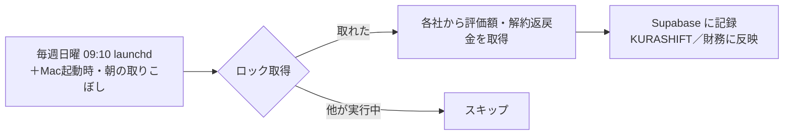
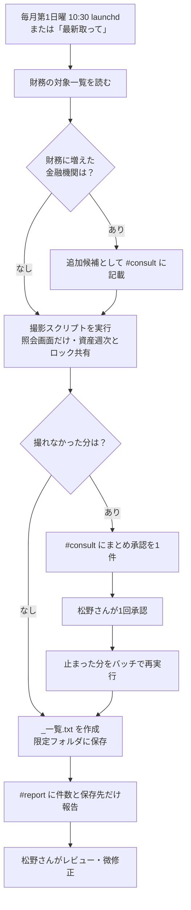

# 618 資産記録・エビデンス係 — 作業フロー（叩き台）

## 週次（運用中）

```mermaid
flowchart LR
  W[毎週日曜 09:10 launchd<br>＋Mac起動時・朝の取りこぼし] --> L{ロック取得}
  L -- 取れた --> R[各社から評価額・解約返戻金を取得]
  L -- 他が実行中 --> S[スキップ]
  R --> D[Supabase に記録<br>KURASHIFT／財務に反映]
```

## 月次の撮影（設計中）

```mermaid
flowchart TD
  A[毎月第1日曜 10:30 launchd<br>または「最新取って」] --> B[財務の対象一覧を読む]
  B --> C{財務に増えた<br>金融機関は？}
  C -- あり --> C1[追加候補として #consult に記載]
  C -- なし --> D
  C1 --> D[撮影スクリプトを実行<br>照会画面だけ・資産週次とロック共有]
  D --> E{撮れなかった分は？}
  E -- なし --> G
  E -- あり --> F[#consult にまとめ承認を1件]
  F --> F1[松野さんが1回承認]
  F1 --> F2[止まった分をバッチで再実行]
  F2 --> G[_一覧.txt を作成<br>限定フォルダに保存]
  G --> H[#report に件数と保存先だけ報告]
  H --> I[松野さんがレビュー・微修正]
```
