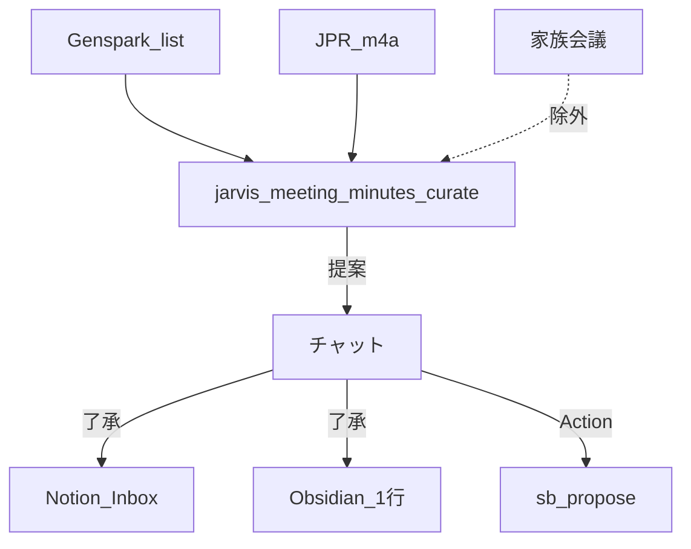

# フロー — 議事録整理係（714）素案

- ビルダー共有: https://agent-team-builder-teal.vercel.app/s/uksxiDIzE1AEckKH
- 更新: 2026-10-17

## いまの結論（文字1行）

スキャン → 候補提案（無言作成なし）→ 了承後に Notion Inbox ＋ 索引。家族会議は除外。

```mermaid
flowchart TD
  GS[Genspark_list] --> Curate[jarvis_meeting_minutes_curate]
  JPR[JPR_m4a] --> Curate
  Curate -->|提案| Chat[チャット]
  Chat -->|了承| Notion[Notion_Inbox]
  Chat -->|了承| Obs[Obsidian_1行]
  Chat -->|Action| SB[sb_propose]
  Fam[家族会議] -.->|除外| Curate
```
