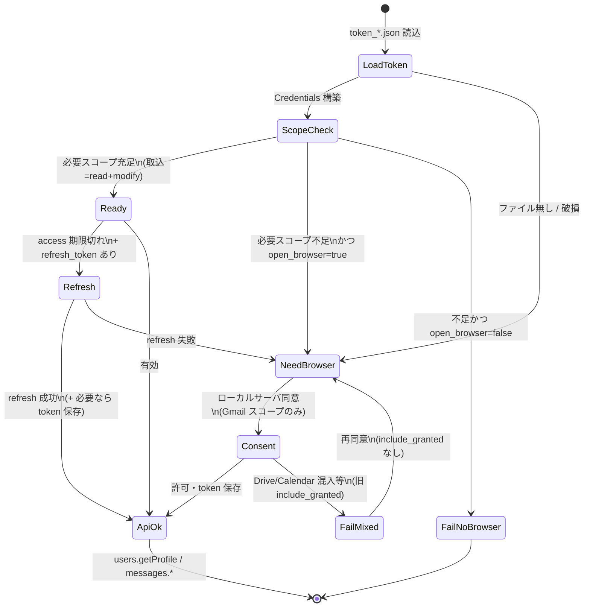

# GCP OAuth 本番移行 — Jarvis 個人利用（2026-08-26）

**方針**: 「アプリを公開（Publish）」のみ。**Verification / CASA 申請はしない**（個人利用例外）。

## 前提 URL（GitHub Pages 反映後）

| 項目 | URL |
|---|---|
| アプリのホーム | https://m19mhrts83-cyber.github.io/project-GE/docs/jarvis-oauth-home.html |
| プライバシーポリシー | https://m19mhrts83-cyber.github.io/project-GE/docs/jarvis-oauth-privacy.html |
| GCP プロジェクト | `988579281735`（credentials.json と同系） |
| ブランディング直接リンク | https://console.cloud.google.com/auth/branding?project=988579281735 |

**先に `git push`** して Pages が 404 にならないことを確認してから Console を触る。

---

## 手順 A — Search Console（承認済みドメイン）

1. [Google Search Console](https://search.google.com/search-console) を **m19m** で開く
2. **プロパティを追加** → **URL プレフィックス**
   - `https://m19mhrts83-cyber.github.io/`
3. 所有権確認（HTML ファイル or DNS。GitHub Pages なら HTML タグ or `gh-pages` ルートにファイル配置）
4. 確認完了後、GCP Console → OAuth 同意画面 → **承認済みドメイン** に `m19mhrts83-cyber.github.io` を追加

---

## 手順 B — OAuth 同意画面（Branding）

1. [Branding](https://console.cloud.google.com/auth/branding?project=988579281735) を開く
2. 入力例:

| フィールド | 値 |
|---|---|
| アプリ名 | `Jarvis 個人自動化` |
| ユーザーサポートメール | `m19m.hrts83@gmail.com` |
| デベロッパーの連絡先 | `m19m.hrts83@gmail.com` |
| アプリのホームページ | 上記 **ホーム URL** |
| プライバシーポリシー | 上記 **プライバシー URL** |
| 利用規約 | （空で可） |

3. **Data Access（スコープ）** で実際に使うものだけ宣言:
   - `.../auth/gmail.readonly`
   - `.../auth/gmail.modify`
   - `.../auth/gmail.send`
   - `.../auth/calendar.events`（カレンダー用・別 token でも可）

4. **Brand verification（Verify Branding）** → 成功したら **Publish branding**

---

## 手順 C — 本番公開（Verification は出さない）

1. OAuth 同意画面 → **公開ステータス**（画面名は「対象 / Audience」）
2. **「アプリを公開」 / Publish app** をクリック
3. **Verification Center へ「検証を申請」は押さない**
   - 個人利用・少数アカウント → [Exceptions — Personal use](https://developers.google.com/identity/protocols/oauth2/production-readiness/restricted-scope-verification)

### 確認結果（2026-09-12）

- プロジェクト `yaritori-gmail-487109`（client `988579281735-…`）の **公開ステータス: 本番環境（外部）** を Console で確認済み。
- 7日 refresh 切れ対策としての Publish は済。残る再同意は主に **スコープ不一致**（下記）。

### 再同意が頻発する別原因（コード側・2026-09-12 対策済）

| 症状 | 原因 | 対策 |
|---|---|---|
| パートナー確認のたびブラウザ | `token_estate` に `gmail.send` が無く、取込が 215 全スコープを要求 | 取込・LINE公式エクスポートは **read/modify のみ**要求 |
| `Scope has changed` | `include_granted_scopes=true` で Drive/Calendar が混入 | 再同意時は **付けない**（Gmail 専用を維持） |

### Gmail token ステート図（2026-09-12）

パートナー取込（`gmail_to_yoritoori` / LINE公式エクスポート）の判定。送信は別経路で `GMAIL_SCOPES_215`（send 含む）を要求する。



| 状態 | 意味 | 運用での見え方 |
|---|---|---|
| Ready / ApiOk | 取込に足りる | ブラウザなしでパートナー確認が進む |
| NeedBrowser | 再同意が必要 | Chrome が開く（本来は稀） |
| FailNoBrowser | 非対話で止める | LINE公式エクスポート等。勝手にブラウザを開かない |
| estate + send 欠落 | 取込は ApiOk、送信だけ不足 | ヘルスは「取込可・送信は要再同意」 |

estate で **送信**も安定させたいときは、一度だけ `gmail.send` 込みで再同意:

```bash
cd ~/git-repos/215_kamiooya/C1_cursor/1b_Cursorマニュアル
~/selenium_env/venv/bin/python - <<'PY'
from pathlib import Path
from gmail_to_yoritoori import build_service_for_token
from gmail_api_scopes import GMAIL_SCOPES_215
svc, email = build_service_for_token(Path("token_estate.json"), scopes=GMAIL_SCOPES_215)
print("OK", email)
PY
```

---

## 手順 D — 各 Google アカウントで再同意

本番移行後、**3アカウントすべて**で一度再同意（refresh_token 更新）。

```bash
cd ~/git-repos && ~/selenium_env/venv/bin/python scripts/jarvis_gmail_token_health.py
```

表示されたコマンドを **admin / estate / m19m** それぞれで実行。ブラウザでは:

- 「Google で確認されていないアプリ」→ **詳細** → **Jarvis 個人自動化（安全ではないページ）に移動**
- **3スコープすべて**にチェック → 許可

カレンダー:

```bash
cd ~/git-repos/215_kamiooya/C1_cursor/1b_Cursorマニュアル
~/selenium_env/venv/bin/python google_calendar_create.py --auth-console --login-hint admin@livingsupport-matsu.co.jp
```

---

## 手順 E — 確認

```bash
cd ~/git-repos && ~/selenium_env/venv/bin/python scripts/jarvis_gmail_token_health.py
# 判定: 全 token OK

cd ~/git-repos/215_kamiooya/C1_cursor/1b_Cursorマニュアル
export YORITOORI_BASE_PATH="$HOME/Library/CloudStorage/OneDrive-個人用/215_神・大家さん倶楽部/C2_ルーティン作業/26_パートナー社への相談"
~/selenium_env/venv/bin/python mailgates_attachment_fetch.py --dry-run
```

---

## やらないこと

- **Verification + CASA Tier 2** 申請（個人 Jarvis には不要・高コスト）
- User type を **Internal** に変更（m19m / estate が対象外になる）
- Testing に戻す（7日 refresh 切れが再発）

## 関連

- token ヘルス: `scripts/jarvis_gmail_token_health.py`
- Gmail 初回設定: `215_kamiooya/C1_cursor/1b_Cursorマニュアル/Gmail_API_設定手順.md`
- Google アカウント使い分け: `docs/Googleアカウント使い分け.md`
