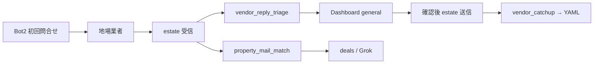

# Jarvis Dashboard — 地場業者返信下書き（Bot2 連携）

更新: 2026-08-22

## 位置づけ

| 経路 | アプリ | 下書き・送信 |
|---|---|---|
| パートナー（LEAF 等） | **jarvis-dashboard** `/partner` | DraftWorkbench → estate 送信 |
| 一般メール（admin） | **jarvis-dashboard** `/general` | 同上 |
| 地場業者返信（Bot2 問合せ後） | **jarvis-dashboard** `/general` | **同じ DraftWorkbench**（milestone・ブロックしない） |
| 具体物件の第一問合せ | **trade-desk** KURASHIFT deals | 2段確認 UI |
| Bot2 初回 Web 問合せ | Grok Bot2 | 都度承認不要（委任済み） |

業者返信は **KURASHIFT 専用 UI ではなく**、既存の Dashboard メール下書きフローに載せる。

## 流れ



## Mac コマンド

```bash
cd ~/git-repos && set -a && source .env.jarvis_private && set +a

# estate 返信 → Dashboard general（下書き付き）
~/selenium_env/venv/bin/python scripts/jarvis_kurashift_vendor_reply_triage.py --push --mark-inbound-replied

# Web 送信後 → 業者 YAML synced
~/selenium_env/venv/bin/python scripts/jarvis_triage_vendor_catchup.py
```

朝バンドル `jarvis_morning_mac_refresh.py` に組込済み。

## Dashboard 操作

1. ホーム / **general（その他）** または `/mail/{id}` を開く
2. ラベル **「地場業者返信（milestone）」** を確認
3. テンプレ初稿を編集 → Gemini/Cursor 見直し可
4. **送信確認モーダル** → estate から返信

## 正本

| 項目 | パス |
|---|---|
| 返信テンプレ | `config/kurashift_re_vendor_reply_template.yaml` |
| 業者リスト | `config/kurashift_re_vendor_list.yaml` |
| 取込 | `scripts/jarvis_kurashift_vendor_reply_triage.py` |
| YAML 同期 | `scripts/jarvis_triage_vendor_catchup.py` |
| 裁き方 | `config/grok_vendor_outreach_format.md` §返信 |

## 注意

- **auto_pass**（物件が条件外）≠ 業者ブロック
- 物件 PDF 付き返信は `property_mail_match --apply` も併走（morning refresh 内）
- OneDrive `5.やり取り.md` 追記は **パートナー専用**。業者返信は YAML + triage のみ
