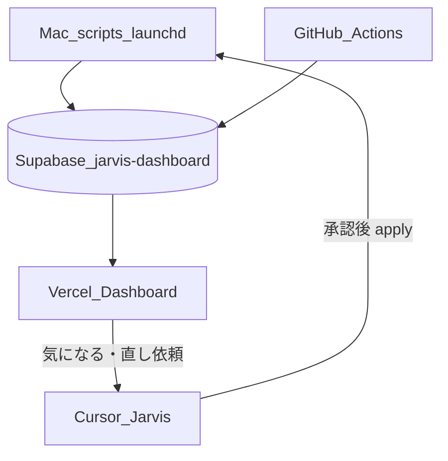

# Jarvis ダッシュボード — 設計メモ・引き継ぎベース（2026-08-01）

**目的**: 自分の理解の整理／DX50・神大家メンバーへ機能を渡すときのベース。  
**更新サイクル**: 使う → 検証 → 変更が溜まったら本資料を更新。  
**本番**: https://jarvis-dashboard-amber.vercel.app/  
**コード**: `~/git-repos/apps/jarvis-dashboard/`  
**NotebookLM ソース置き場**: Drive `200_NoteBookLM/05_Jarvisダッシュボード_設計と引き継ぎ/`

---

## 1. ダッシュボードの概要

Jarvis ダッシュボードは、**個人の秘書 AI（Jarvis）が集めた情報を、スマホでもパッと見るための画面**である。

| レイヤ | 役割 |
|---|---|
| **表示** | Vercel 上の Next.js（ログイン必須）。iPhone／Mac 共通 |
| **投影 DB** | Supabase プロジェクト `jarvis-dashboard`（運営の `kamiooya-qa` とは分離） |
| **収集** | 主に Mac（launchd・スクリプト）。一部は GitHub Actions |
| **対話・直し** | Cursor ローカル／Cloud Agent。ダッシュボード自体からは対外送信しない |

**設計思想（短く）**

1. **見る場所はクラウド、重い収集は Mac**（CHRLINE・Playwright・ローカル Drive）
2. **気になることは「状況ウォッチ」に寄せる**（レベル: ok / info / warn / attention）
3. **勝手に外へ出さない**（メール送信・Zaim 設定変更はユーザー承認後）
4. **正本はファイル／YAML、DB は投影**（再構築可能）



### ホーム画面の構想（継続・2026-08-01 更新）

PC を開いたときに **パッと立ち上がって見る**画面（朝オープン継続）。メール確認と同時に、他の気になる項目の「要確認」が一目で分かる。

**見た目方針（確定）**: Soft Card — 余白・角丸・左ボーダーの3色で秘書ダッシュボードらしい読みやすさ。BI風の巨大KPIや表密度は採用しない（Fabric/Tableau からは階層と色の意味だけ借用）。

| ブロック | 役割 |
|---|---|
| **要確認（状況ウォッチ）** | attention / warn / info の **3段階色分け**カード。見なきゃあかんものが上 |
| **メール（ざっと見る）** | pending を一覧。要点だけ。クリックで `/mail/[id]` 詳細（本文・下書き） |
| **同期情報** | 折りたたみ。普段は邪魔にしない |

色の意味（共通）:

| レベル | 表示 | 色 |
|---|---|---|
| attention / priority high | **要確認** | 赤系 |
| warn / medium | **注意** | 橙系 |
| info / low | **参考** | 青系 |

ok はホームに出さず、`/situation` で全体確認。

### サイドバー構成（2026-08-01 時点）

| ナビ | パス | 一言 |
|---|---|---|
| **ホーム** | `/` | 要確認カード＋メールざっと見（朝の入口） |
| パートナー | `/partner` | 要返信・下書き（レーン詳細） |
| オプチャ | `/openchat` | 815 情報収集（返信提案なし） |
| それ以外 | `/general` | admin Gmail 等 |
| 状況ウォッチ | `/situation` | 気になる項目の全件 |
| 神大家運営 | `/kamiooya` | レーンカード |
| 3棟・物件 | `/properties` | 同上 |
| 戸建て | `/kodate` | 同上 |
| AI・Raimo | `/ai-raimo` | 同上 |
| 数値 | `/metrics` | Zaim CF・電力・Vポイント等 |
| 課金 | `/billing` | SaaS／定額・従量の注視 |
| NotebookLM | `/notebooklm` | Drive ソース作業セット |

---

## 2. 各項目の仕様・設計思想

### 2.0 ホーム（`/`）

- **思想**: 起動直後の「見る」専用。直す操作は詳細や Cursor へ。
- **見た目**: Soft Card（`globals.css` の `--radius-card` 等）
- **データ**: `watch_status`（ok 以外）＋ `triage_items` pending
- **詳細**: `/mail/[id]`／レーンページ／`/situation`

### 2.1 状況ウォッチ（`/situation`）

- **思想**: 「今フォローすべきか」をレベル付きカードで並べる。詳細修正は Jarvis に任せる。
- **データ**: `watch_status` ＋ `.jarvis_state/situation_watch.json`
- **集約**: `scripts/jarvis_situation_watch.py` ← `config/situation_watch.yaml`
- **主なカード例**: 電力 CF、ETC 月次、Vポイント、LINE 公式エクスポート、815 監視、Zaim 集計・二重取込、夜間トリアージ 等

### 2.2 数値（`/metrics`）

- **思想**: モチベーション用のキャッシュフロー（法人／個人）と自宅エネルギー。SaaS 課金はここではなく `/billing`。
- **正本**: Zaim 年度 CSV → `jarvis_finance_metrics.py`／`jarvis_energy_cf_collect.py`

### 2.3 課金／SaaS（`/billing`）— 今回追加

- **思想**: 「定額をやめられるか」「無料→有料・従量を見失わないか」を一覧する。
- **正本**: `config/subscriptions.yaml`（監査メモは OneDrive サブスク一覧 MD）
- **投影**: `subscription_services` テーブル ← `jarvis_subscriptions_push.py`
- **分類**: AI / 生活 / 通信 / 教育 / コミュニティ / インフラ（Free 注視）
- **やらない**: 請求 API 自動取得（Phase 2）

### 2.4 NotebookLM 作業セット（`/notebooklm`）— 今回追加

- **思想**: ソース正本は admin Drive `200_NoteBookLM`。D&D は Mac Finder＋NotebookLM。
- **Mac**: localhost `8766` ヘルパーが Finder＋ブラウザを開く
- **Vercel／iPhone**: Web リンクのみ（Finder 不可）

### 2.5 Zaim 集計・二重取込（状況ウォッチ）— 今回追加

- **思想**: 家計精度の「ズレを直す」前に、**ズレが見える**こと。直すのは承認後に Web Zaim。
- **検知**: `jarvis_zaim_quality_check.py` ← `config/zaim_quality_watch.yaml`
- **対象**: 日常買い物（食費・雑貨店）のスマートレシート × クレカ同額
- **対象外**: ETC（往復の同額は正常）
- **集計フラグ**: `常に集計に含める` / `集計に含めない` のルール違反・must_include（オリコ等）
- **直し**: `jarvis_zaim_money_apply.py`（Playwright・承認後）

### 2.6 トリアージ／レーン（既存）

- 夜間バッチで pending を用意 → 朝ダッシュボード表示
- 815 は情報収集枠（返信提案しない）

---

## 3. 実際の動かし方（挙動）

### 朝〜日常

1. Mac 起床後、必要なら本番 URL またはローカルが開く
2. `/situation` で attention／warn を眺める
3. パートナー返信は画面上で下書き編集→確認後送信（または Cursor に依頼）。送信後は `sent`、やり取りは OneDrive 正本

### データの流れ（典型）

```text
Zaim CSV / サブスク YAML / 各種 state JSON
        ↓ Mac スクリプト
   Supabase（投影）
        ↓
   Vercel ダッシュボード
        ↓ ユーザーが「直して」
   Jarvis → dry-run → 承認 → Playwright / yoritoori 等
```

### 今回の機能のコマンド（要約）

```bash
# 課金一覧を DB へ
python scripts/jarvis_subscriptions_push.py --push

# Zaim 品質検知 → 状況ウォッチ
python scripts/jarvis_zaim_quality_check.py
python scripts/jarvis_situation_watch.py
python scripts/jarvis_dashboard_push.py --watch-only

# Zaim 直し案の確認／適用（承認後）
python scripts/jarvis_zaim_money_apply.py --from-watch --dry-run
python scripts/jarvis_zaim_money_apply.py --from-watch --apply --yes --limit 3

# NotebookLM 作業セット（Mac）
python scripts/jarvis_notebooklm_workbench_open.py
# ヘルパー常駐: launchd/install_notebooklm_workbench_launchd.sh
```

詳細は `docs/運用コマンド一覧.md`。

---

## 4. 今回決めたこと（2026-08-01 セッション）

| 決定 | 内容 |
|---|---|
| 課金の正本 | `config/subscriptions.yaml`。OneDrive サブスク一覧は監査メモ |
| 課金の表示 | 専用 `/billing`（`/metrics` に混ぜない） |
| NotebookLM 導線 | `/notebooklm`＋Mac ヘルパー。朝の自動オープンには載せない |
| Zaim 重複 | **日常買い物のみ**検出。ETC は検出しない |
| Zaim 集計 | 「含める／含めない」のルール違反も検知。アオキはクレカ除外が正と判明 |
| Zaim 修正 | アプリではなく **Web＋Playwright**。ユーザーが「こう直して」＋承認後のみ |
| 資料更新 | 検証→変更蓄積→本 MD／NotebookLM ソースを更新するサイクル |
| ホーム | PC起動でパッと見る。要確認3色＋メールざっと見→`/mail/[id]` 詳細 |
| ホーム見た目 | **Soft Card**（余白・角丸・左ボーダー）。BI風巨大KPIは不採用 |

### 実装コミット（参考）

- `ed70b47` NotebookLM 作業セット
- `2915142` 課金／SaaS `/billing`
- `f9c9a07` Zaim 品質ウォッチ＋Web 直し導線
- `5aa5cee` ホーム＝要確認3色＋メールざっと見→詳細
- `0c54388` Soft Card トーン磨き

---

## 5. 今後の調整・見るべきポイント

### 検証しながら直す候補

1. **ホーム Soft Card** — 実利用で余白・色の強さ・メール並びを微調整
2. **Zaim Web apply のセレクタ** — 初回実適用で UI 差分が出やすい。スクショは `zaim_budget_sync/screenshots/money_edit/`
3. **Zaim CSV 鮮度** — 現状エクスポートが 2026-06-27 まで。再取得後に検知件数が変わる
4. **Amazon 二重経路** — ルールは YAML 済み。実データでのヒット頻度を見る
5. **オリコ must_include** — 「含めない」になった月を見逃さないか
6. **課金 YAML の金額** — Cursor Usage・年額換算の手メンテ負荷
7. **Vercel／Supabase 実額** — 今は Free 注視のみ。請求が出たら YAML を更新

### アプリ化・引き継ぎで考える軸（DX50／神大家向け）

| 観点 | 自分用 Jarvis | 他者向けアプリ化で問うこと |
|---|---|---|
| 正本 | 個人 YAML／OneDrive | マルチテナントの設定 UI？ |
| 収集 | Mac 前提 | クラウドのみで足りるか／何を諦めるか |
| 承認 | チャットで確認 | アプリ内の確認画面・権限 |
| 秘密 | `.env.jarvis_private` | Secrets／Vault |
| 815 方針 | 情報収集のみ | プロダクトごとに返信ポリシーを切る |
| NotebookLM | Drive フォルダ規約 | ソース置き場の標準パッケージ |

### 思考プロセスのチェックリスト（変更前に見る）

- [ ] これは「見る」か「直す」か。「直す」なら承認は誰が・どこで？
- [ ] 正本はファイルか DB か。二重正本になっていないか
- [ ] Mac 依存を増やすか。増やすなら launchd／ドキュメントは？
- [ ] 状況ウォッチに載せるなら、うるささ（毎日 attention）にならないか
- [ ] 神大家／DX に出すとき、個人アカウント前提が残っていないか

---

## 6. 今後の置き場（コード／Supabase／OneDrive）

方針は変えない: **コードは git-repos、業務・検討の厚みは OneDrive、投影データは Supabase**。容量大は OneDrive。

| 何 | どこに置く | メモ |
|---|---|---|
| **アプリ・スクリプト・YAML・スキーマ** | `~/git-repos/`（`apps/jarvis-dashboard/`・`scripts/`・`config/`） | Git で版管理。秘密は `.env.jarvis_private` のみ |
| **Supabase 投影** | プロジェクト `jarvis-dashboard`（運営の `kamiooya-qa` とは別） | テーブル追加で機能増やす。正本は YAML/CSV。DB だけ増やし続けて正本にしない |
| **検討メモ・検証スクショ・下書き PDF** | OneDrive `215_…/C1_cursor/1c_…/Jarvisダッシュボード/` | 検討を溜めるスタイルを継続 |
| **NotebookLM ソース／スライド成果** | admin Drive `200_NoteBookLM/05_…` と `★アウトプット/` | 説明用。コード正本ではない |
| **家計・税の生データ** | OneDrive `50_税金,確定申告/` 等 | Zaim CSV・サブスク監査メモ |

```text
[考える・溜める] OneDrive 検討メモ
        ↓ 仕様が固まったら
[実装] git-repos（コード + schema.sql + YAML）
        ↓ push
[投影] Supabase jarvis-dashboard
        ↓
[見る] Vercel ダッシュボード
        ↓ 説明が必要なら
[伝える] Drive 200_NoteBookLM → NotebookLM
```

### Supabase が溜まるとき

- **残してよい**: `watch_status`・メトリクス・カードなど、ダッシュボード表示用の投影
- **増やし方**: 新機能は **テーブル追加**（用途ごとにプロジェクトを増やさない）
- **掃除候補**: 一時実験テーブル・古いトリアージ残骸。正本が YAML/CSV にあるなら投影は作り直せる
- **スキーマ正本**: 必ず `apps/jarvis-dashboard/supabase/schema.sql` に追記してから適用

---

## 関連パス早見

| 用途 | パス |
|---|---|
| ダッシュボードアプリ | `apps/jarvis-dashboard/` |
| スキーマ | `apps/jarvis-dashboard/supabase/schema.sql` |
| 課金 YAML | `config/subscriptions.yaml` |
| Zaim 品質 YAML | `config/zaim_quality_watch.yaml` |
| 状況ウォッチ YAML | `config/situation_watch.yaml` |
| 運用コマンド | `docs/運用コマンド一覧.md` |
| Cloud Agent | `docs/Jarvis_Cloud_Agent.md` |
| NotebookLM Drive | `200_NoteBookLM/`（admin） |
| OneDrive 検討 | `215_…/C1_cursor/1c_…/Jarvisダッシュボード/` |

---

*初版: 2026-08-01。変更が溜まったら版を上げ、NotebookLM ソースも同じフォルダで更新する。*
