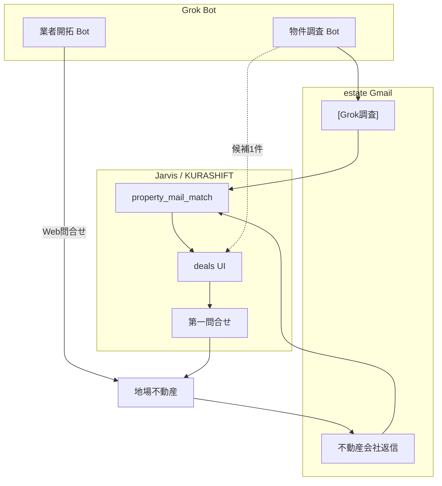

# KURASHIFT × Grok Bot — 不動産パイプライン（Jarvis + Grok 併走）

更新: 2026-08-22

## 全体像

| 役割 | 担当 | 正本 |
|---|---|---|
| ネット調査（路線価・ハザード） | **物件調査 Bot** | `[Grok調査]` メール → `mail_grok` |
| 地場業者への初回接触 | **業者開拓 Bot** | 既存リスト + `config/grok_vendor_outreach_format.md` |
| メール取込・スコア・ファネル | **KURASHIFT** | `property_mail_match.py` / deals |
| 物件詳細の第一問合せ | **KURASHIFT UI** | estate 送信・2段確認 |
| PDF 添付の中身読取 | **未実装（Phase PDF）** | 下記 |

---

## Bot 1 — 物件調査（実装済・本線）

- テンプレ: `config/grok_property_report_format.md`
- 取込: `jarvis_kurashift_property_mail_match.py --grok-only --apply`
- deals「Grok調査用コピー」で候補を Bot に渡す

---

## Bot 2 — 業者開拓（試行・次フェーズ）

**目的**: 戸建ては地場不動産経由。リストアップ済み業者サイトへ **規定の問い合わせ** を送り、メール返信で物件が上がってくる導線を増やす。

**Grok に任せること**

1. リストの URL を開く（会社概要・問合せフォーム）
2. 規定文面で「戸建投資・愛知中心・物件情報希望」を送信（Web フォーム）
3. 送信ログを `[Grok業者]` 件名または estate 宛メモで残す（任意）

**Jarvis に任せること**

- 業者リスト正本: `config/kurashift_re_vendor_list.yaml`（要作成・ユーザー既存リストを転記）
- 返信メール → 既存 `property_mail_match`（admin/estate）
- 候補化後 → 物件調査 Bot へ（Grok調査用コピー）または自動 `[Grok調査]` 依頼（将来）

**テンプレ**: `config/grok_vendor_outreach_format.md`

**注意**

- Web フォーム送信は **対外操作** → Bot 説明に「送信前にユーザー確認」または試行は estate 経由メール問合せのみ
- コンピューター常時許可は Bot 専用・リスト URL のみに限定

---

## 現行の判断基準（property_mail_match）

**入力**: Gmail **件名 + 本文テキストのみ**（PDF 添付は未読）

| 段階 | 条件 | 結果 |
|---|---|---|
| スコア | 愛知/岐阜/三重ヒント、戸建、利回り、価格500〜3500万 等で加点 | `match_score` |
| 明確除外 | 件名ノイズ、区分のみ、都内のみ、スコア下限未満 | `passed` + `auto_pass_reason` |
| Grok 上書き | `聞く価値=見送り` または `ハザード=除外`（聞く以外） | `passed` |
| Grok 加点 | 聞く・土地100%・路線価・駐車場・HZ | スコア調整 |

買い進め条件の正: `kurashift_buy_plan_criteria` + Notion（戸建・20%・300万・土地値60%・愛知中心）。

**Grok 調査後**の最終判断は deals 上の `grok.*` + 第一問合せ返信（PDF 含む）を人が見る。

---

## Phase PDF — 添付読取（未実装・要目合わせ）

**現状**: `property_mail_match` は **PDF を開かない**。価格・土地面積は本文の正規表現（`(\d{2,5})\s*万`、`土地面積` 行）のみ。

**懸念（ユーザー指摘）**: 不動産会社返信は PDF 多め → 本文だけでは不足。

**提案ロードマップ**

| Phase | 内容 |
|---|---|
| PDF-0 | 返信メールの PDF を Gmail API で `kurashift_re_deal_attachments/` に保存（deal_id 紐付け） |
| PDF-1 | Mac: `pdfplumber` / Gemini で 価格・土地面積・構造 を抽出 → `summary_json.extracted` |
| PDF-2 | 抽出結果を deals UI 表示 + スコア再計算（任意） |
| PDF-3 | Grok Bot に PDF 要約を `[Grok調査]` 形式で estate 送信（Jarvis 取込と同型） |

**目合わせポイント**

- PDF から自動確定する項目 vs 人確認必須項目
- 健美家メルマガ型（本文に十分情報） vs 地場 PDF のみ型の優先度

---

## 実装順（Jarvis + Grok 併走）

1. ✅ 倍率→固定資産税依頼、Grok調査コピー、路線/HZ 拡張
2. 業者リスト YAML + Grok 業者開拓テンプレ（Bot 説明に貼る）
3. estate に `[Grok調査]` / 地場返信が来たら `--apply` で E2E
4. Phase PDF-0（添付保存）→ PDF-1（抽出）
