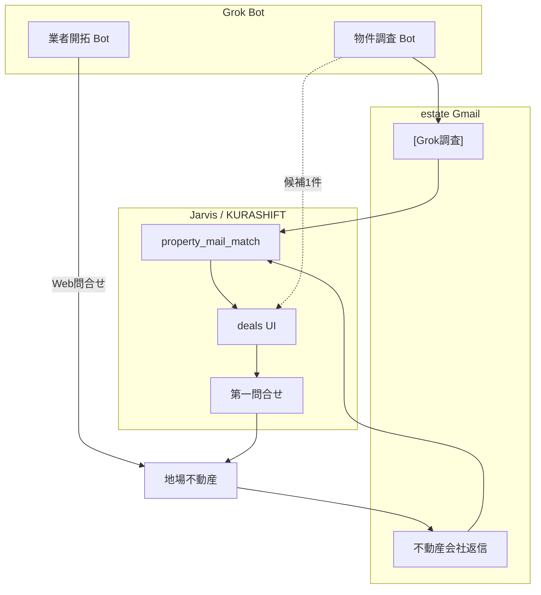
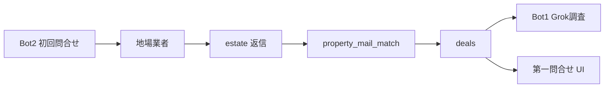

# KURASHIFT × Grok Bot — 不動産パイプライン（Jarvis + Grok 併走）

更新: 2026-08-22

## 全体像

| 役割 | 担当 | 正本 |
|---|---|---|
| ネット調査（路線価・ハザード） | **物件調査 Bot** | `[Grok調査]` メール → `mail_grok` |
| 地場業者への初回接触 | **業者開拓 Bot** | 既存リスト + `config/grok_vendor_outreach_format.md` |
| メール取込・スコア・ファネル | **KURASHIFT** | `property_mail_match.py` / deals |
| 物件詳細の第一問合せ | **KURASHIFT UI** | estate 送信・2段確認 |
| PDF 添付の中身読取 | **未実装（Phase PDF）** | 下記 |

---

## Bot 1 — 物件調査（実装済・本線）

- テンプレ: `config/grok_property_report_format.md`
- **Grok Instructions 貼り付け**: `config/grok_property_bot_grok_paste.md`
- 取込: `jarvis_kurashift_property_mail_match.py --grok-only --apply`
- deals「Grok調査用コピー」で候補を Bot に渡す
- Step A 手順: `docs/KURASHIFT_grok_first_stepA.md`

---

## Bot 2 — 業者開拓（試行・次フェーズ）

**Grok Bot 名**: **物件業者開拓**  
**Instructions**: `config/grok_vendor_outreach_bot_grok_paste.md`（コードブロックを Grok に貼る）

**目的**: 戸建ては地場不動産経由。リストへ **順次問合せ** + Grok **日次 N 件探索** で表を増やす。

| 操作 | 担当 | コマンド / 正本 |
|---|---|---|
| リスト取込 | Jarvis | `--import-csv` → `kurashift_re_vendor_list.yaml` |
| 次に問合せ | Grok / 手動 | `--next 3` |
| 結果記録 | Jarvis | `--mark ID --status contacted` / 返信時 `replied` |
| 日次探索 | Grok Bot | `--grok-discovery-prompt` → YAML 追記 → `--merge-append` |
| **返信・物件** | Jarvis / KURASHIFT | `property_mail_match` → deals（**ブロックしない**） |
| **返信下書き・送信** | **Jarvis Dashboard** | `docs/Jarvis_Dashboard_業者返信下書き.md` |

**送信**: Bot2 は approved A'-v2 で **Web フォーム送信まで自動**（1日3社・都度承認不要）。

正本: `config/kurashift_re_vendor_list.yaml`（gitignore）  
CLI: `scripts/jarvis_kurashift_vendor_list.py`  
Grok 追記形式: `config/grok_vendor_discovery_append.md`

---

## 現行の判断基準（property_mail_match）

**入力**: Gmail **件名 + 本文テキストのみ**（PDF 添付は未読）

| 段階 | 条件 | 結果 |
|---|---|---|
| スコア | 愛知/岐阜/三重ヒント、戸建、利回り、価格500〜3500万 等で加点 | `match_score` |
| 明確除外 | 件名ノイズ、区分のみ、都内のみ、スコア下限未満 | `passed` + `auto_pass_reason` |
| Grok 上書き | `聞く価値=見送り` または `ハザード=除外`（聞く以外） | `passed` |
| Grok 加点 | 聞く・土地100%・路線価・駐車場・HZ | スコア調整 |

買い進め条件の正: `kurashift_buy_plan_criteria` + Notion（戸建・20%・300万・土地値60%・愛知中心）。

**Grok 調査後**の最終判断は deals 上の `grok.*` + 第一問合せ返信（PDF 含む）を人が見る。

---

## Phase PDF — 添付読取（未実装・要目合わせ）

**現状**: `property_mail_match` は **PDF を開かない**。価格・土地面積は本文の正規表現（`(\d{2,5})\s*万`、`土地面積` 行）のみ。

**懸念（ユーザー指摘）**: 不動産会社返信は PDF 多め → 本文だけでは不足。

**提案ロードマップ**

| Phase | 内容 |
|---|---|
| PDF-0 | 返信メールの PDF を Gmail API で `kurashift_re_deal_attachments/` に保存（deal_id 紐付け） |
| PDF-1 | Mac: `pdfplumber` / Gemini で 価格・土地面積・構造 を抽出 → `summary_json.extracted` |
| PDF-2 | 抽出結果を deals UI 表示 + スコア再計算（任意） |
| PDF-3 | Grok Bot に PDF 要約を `[Grok調査]` 形式で estate 送信（Jarvis 取込と同型） |

**目合わせポイント**

- PDF から自動確定する項目 vs 人確認必須項目
- 健美家メルマガ型（本文に十分情報） vs 地場 PDF のみ型の優先度

---

## 実装順（Jarvis + Grok 併走）

1. ✅ 倍率→固定資産税依頼、Grok調査コピー、路線/HZ 拡張
2. ✅ 業者リスト YAML + Grok 業者開拓テンプレ（`status: approved`）
3. ✅ estate `[Grok調査]` → `--grok-only --apply`（朝バンドル含む）→ deals 3件取込済（2026-08-22）
4. ✅ Phase PDF-0（`jarvis_kurashift_re_deal_pdf_fetch.py` + deals UI 添付件数）
5. ✅ E2E パイプライン（fixture PASS）— `jarvis_kurashift_grok_e2e_runner.py` / `docs/KURASHIFT_re_inquiry_E2E_checklist.md`
6. ⏳ 本番第一問合せ（`聞く` 実物件待ち）— `docs/KURASHIFT_grok_first_stepA.md` §5
7. ⏳ Phase PDF-1（PDF 中身抽出）
8. ⏳ 業者開拓送信（Bot2 自動送信・`--next 3`）— Instructions 更新済み 2026-08-22

---

## 業者返信（milestone）— ブロックしない

問合せ後に業者から **質問・物件PDF** が estate に届くのは成功。Gmail ブロック／拒否リストには載せない。

| 返信 | 裁き |
|---|---|
| 予算・エリア等の質問 | estate 短文返信 + `--status replied` |
| 物件資料 | deals 取込 → Grok → ファネル |
| スパム・無関係 | 物件 `passed` のみ（業者ブロックとは別） |
