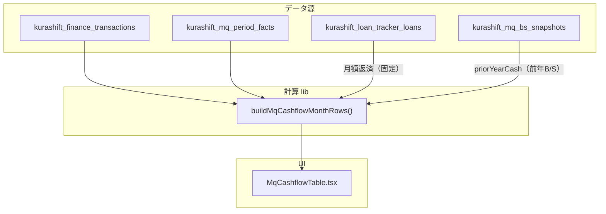
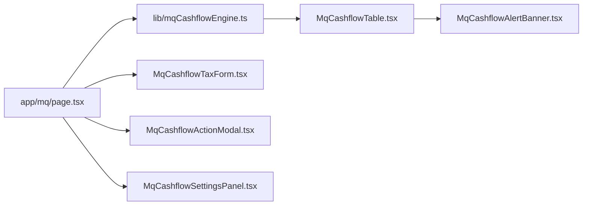
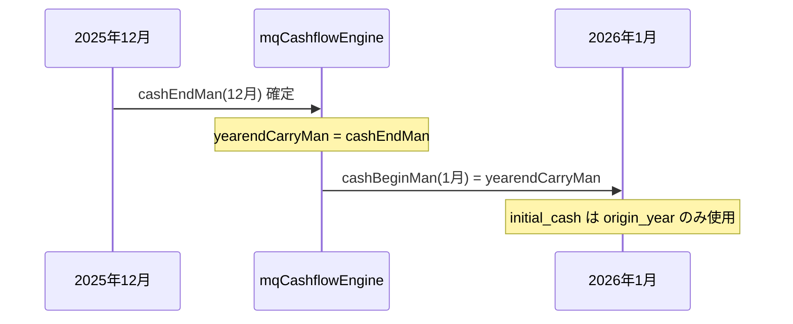
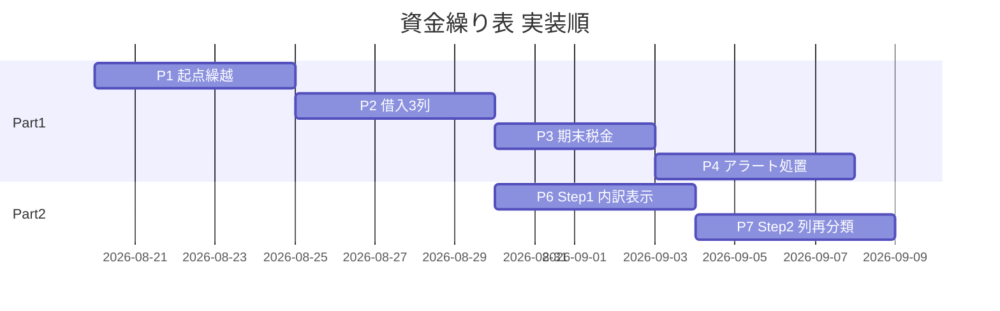
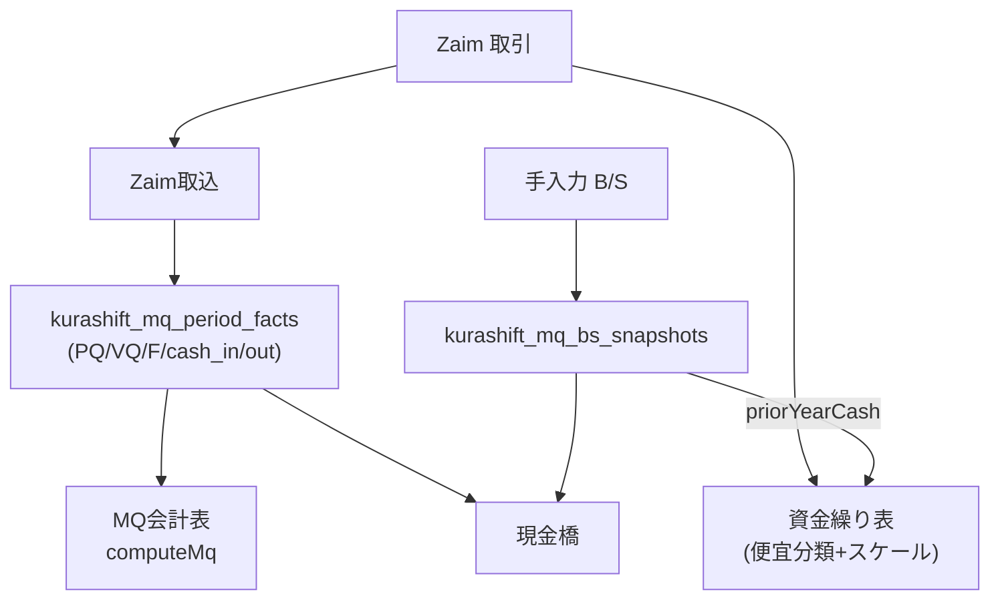
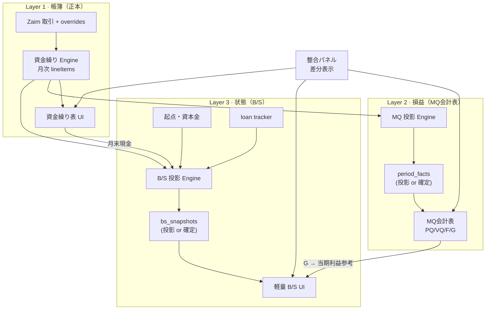
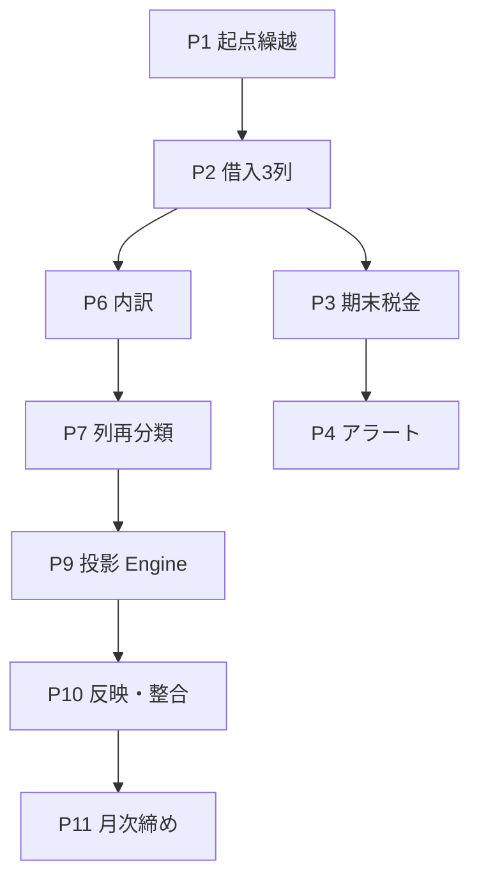

# KURASHIFT MQ会計 — 資金繰り表 改修設計

**作成日**: 2026-08-19  
**対象アプリ**: `apps/trade-desk`（`/mq?view=cashflow`）  
**目的**: 「キャッシュ・イズ・キング」の思想に沿い、月次の現金推移・借入区分・期末決算・翌年繰越・マイナス回避シミュレーションを一貫して評価できる資金繰り表に刷新する。

---

## 0. 設計の前提

| 項目 | 方針 |
|---|---|
| 単位 | **万円**（既存 MQ ポリシー踏襲。10万円 = `10`） |
| 起点 | **2025年1月**（法人設立月） |
| 初期残高 | **10万円**（資本金。`cash_begin_man = 10`） |
| 主対象 | **法人（corporate）** を第一優先。個人・合算も同ロジックで表示可 |
| 正本 DB | `jarvis-dashboard` Supabase（既存 MQ テーブル群に追加） |
| **情報の起点** | **資金繰り表（現金繰越表）＝帳簿に近い正本**。BS・PL（MQ会計表）はここから整える |
| MQ 会計表との関係 | 資金繰りの明細・列 → MQ 要素（PQ/VQ/F/G）・B/S 科目へ **投影**（後述 Part 3） |

---

## 1. 現状（As-Is）とギャップ

### 1.1 現状アーキテクチャ



### 1.2 現状の行構成

| 区分 | 行 | 備考 |
|---|---|---|
| 収入 | 売上（cash_in）のみ | 借入流入列なし |
| 出金 | 修繕・広告・経費・管理費・取得時・税理士・**返済**・年払・税 | 返済は loan tracker 月額固定 |
| 残高 | 月末現金・差引増減 | **期首残高行なし** |
| 参考 | 返済比率 | — |

### 1.3 ギャップ一覧（今回解消）

| # | 要望 | 現状 | ギャップ |
|---|---|---|---|
| 1 | 2025/1 起点・期首10万 | 前年 B/S 現金 or null | 設立起点・初期資本金の明示設定なし |
| 2 | 借入区分（長期/短期/個人） | 流入列なし | 資金調達の性質を識別できない |
| 3 | 期末利息・税金・繰越 | 年払・税は Zaim 分類のみ | 12月決算処理・手動税金・翌年期首自動引継ぎなし |
| 4 | マイナスアラート | なし | 視覚警告なし |
| 5 | 処置シミュレーション | なし | バーチャル借入行の追加・再計算なし |
| 6 | セル内訳・列の修正 | スケール後の数値のみ表示 | 取引明細不可・経費/取得時の誤分類を自己修正できない → **Part 2** |

---

## 2. 目標 UI（To-Be）— 表レイアウト

### 2.1 マトリクス構造（MG形式・横軸=月）

```
┌────────┬────┬──────────────┬─────┬─────┬ … ┬─────┬─────┐
│ 大項目 │符号│ 項目         │ 1月 │ 2月 │   │11月 │12月 │
├────────┼────┼──────────────┼─────┼─────┼ … ┼─────┼─────┤
│ 残高   │    │ 期首残高     │  10 │  △  │   │  △  │  △  │  ← 1月=設定値、2月以降=前月末
├────────┼────┼──────────────┼─────┼─────┼ … ┼─────┼─────┤
│ 収入   │ ＋ │ 売上         │  +  │  +  │   │  +  │  +  │
│ 収入   │ ＋ │ 長期借入     │     │     │   │     │     │  ← 新規
│ 収入   │ ＋ │ 短期借入     │     │     │   │     │     │  ← 新規
│ 収入   │ ＋ │ 個人借入     │     │     │   │     │     │  ← 新規（役員借入）
│ 収入   │ ＋ │ 処置（計画） │     │  +  │   │     │     │  ← シミュレーション行（任意）
├────────┼────┼──────────────┼─────┼─────┼ … ┼─────┼─────┤
│ 出金   │ −  │ 修繕 …       │  −  │  −  │   │  −  │  −  │  （既存維持）
│ 出金   │ −  │ 返済         │  −  │  −  │   │  −  │  −  │
│ 出金   │ −  │ 利息（期末） │     │     │   │     │  −  │  ← 12月のみ（設定/手入力）
│ 出金   │ −  │ 税金支払     │     │     │   │     │  −  │  ← 12月・手動入力
├────────┼────┼──────────────┼─────┼─────┼ … ┼─────┼─────┤
│ 残高   │ ±  │ 差引増減     │  ±  │  ±  │   │  ±  │  ±  │
│ 残高   │    │ 月末現金     │  △  │  △  │   │  △  │  △  │  ← マイナス時ハイライト
├────────┼────┼──────────────┼─────┼─────┼ … ┼─────┼─────┤
│ 決算   │    │ 期末繰越     │     │     │   │     │  →  │  ← 12月→翌年1月へ（表示のみ）
└────────┴────┴──────────────┴─────┴─────┴ … ┴─────┴─────┘
```

### 2.2 マイナスアラート UI

| 要素 | 仕様 |
|---|---|
| セル | `月末現金 < 0` の月列ヘッダー＋セルを `.mq-cashflow-alert-negative`（赤系背景・⚠️アイコン） |
| バナー | 表上部に「**{YYYY-MM} で現金がマイナス（−X 万円）** — 処置を追加してください」 |
| 一覧 | マイナス月を時系列で列挙（クリックで該当月へスクロール） |
| 処置 CTA | バナー横に「処置を追加」→ モーダルで種別・月・金額を入力 |

### 2.3 年度切替・複数年表示

| モード | 仕様 |
|---|---|
| 単年（既定） | 2025年選択 → 1〜12月。12月末繰越を翌年1月期首に自動反映 |
| 連続年 | 2025→2026→… をタブ or 年セレクタで切替。前年末 = 翌年期首（計算で連鎖） |
| 起点以前 | 2025年1月より前は表示不可（設定画面で起点変更は将来拡張） |

---

## 3. 計算エンジン設計

### 3.1 残高推移ロジック

```typescript
// 疑似コード — lib/mqCashflowEngine.ts（新規）

type MonthInputs = {
  cashBeginMan: number;           // 期首（1月=設定、2月以降=前月末）
  salesMan: number;               // 売上
  borrowLtMan: number;            // 長期借入（流入）
  borrowStMan: number;            // 短期借入
  borrowOfficerMan: number;       // 個人借入
  actionInflowMan: number;        // 処置シミュレーション合計
  expenseOutMan: number;          // 経費合計（既存バケット和）
  loanRepaymentMan: number;       // 返済
  interestMan: number;            // 利息（通常0、12月のみ）
  taxPaymentMan: number;          // 税金支払（通常0、12月のみ）
};

function netChange(m: MonthInputs): number {
  const inflow =
    m.salesMan +
    m.borrowLtMan +
    m.borrowStMan +
    m.borrowOfficerMan +
    m.actionInflowMan;
  const outflow =
    m.expenseOutMan +
    m.loanRepaymentMan +
    m.interestMan +
    m.taxPaymentMan;
  return inflow - outflow;
}

function cashEnd(cashBegin: number, net: number): number {
  return cashBegin + net;
}

// 月次ループ
let cursor = initialCashForYear(year); // 1月期首
for (const month of months) {
  const begin = month === jan ? cursor : prevCashEnd;
  const end = cashEnd(begin, netChange(inputs));
  cursor = end; // 翌月へ
}
```

### 3.2 期首残高の決定順位

| 優先 | ソース | 条件 |
|---|---|---|
| 1 | **前年末の資金繰り期末繰越** | `year > origin_year` かつ前年度12月が計算済み |
| 2 | **設定テーブル `initial_cash_man`** | `year === origin_year`（2025）の1月 |
| 3 | B/S スナップショット | 上記が無い場合のフォールバック（既存 `priorYearCash`） |
| 4 | null | 要入力表示 |

**2025年1月の既定**: `initial_cash_man = 10`（10万円）

### 3.3 借入流入のデータ源マッピング

| 列 | 自動取得 | 手入力 | 分類ルール |
|---|---|---|---|
| **長期借入** | loan tracker の **実行日（disbursement）** を月次集計 | 月次上書き可 | `category_major` が物件融資系 / tags に `property` |
| **短期借入** | Zaim 入金で「借入」「フリーローン」「教育ローン」等 | 月次上書き可 | **事業用**のみ。自動車ローン等は `exclude` |
| **個人借入** | 原則手入力 | 月次入力 | 役員借入・個人持出。B/S `liabilities_st` の役員借入と整合確認 |

> loan tracker の `payload` に実行日・区分が無い場合は、Phase 1 では手入力を正とし、Phase 2 でトラッカー拡張を検討。

### 3.4 期末（12月）決算処理

| 項目 | タイミング | 入力方法 | 備考 |
|---|---|---|---|
| **利息支払** | 12月 | 手動 + 将来: loan tracker 年間利息見積 | MG資金繰り表の期末差引に相当 |
| **税金支払** | 12月（翌年1〜3月支払も12月計上可） | **手動フォーム必須** | 法人税・住民税・事業税等を1行に集約 |
| **期末繰越** | 12月表示 | 自動計算 | `cash_end_dec` = 翌年1月 `cash_begin` |

**計上方針（ユーザー選択可）**:

- `tax_accrual_month`: `december`（期末計上）| `payment`（支払月）— 既定は **december**（資金不足を早期に見る）

### 3.5 処置シミュレーション（バーチャル行）

| 属性 | 型 | 説明 |
|---|---|---|
| `id` | uuid | — |
| `year` | int | 対象年 |
| `month` | 1-12 | 流入を計上する月 |
| `kind` | enum | `officer` / `borrow_st` / `borrow_lt` |
| `amount_man` | numeric | 万円 |
| `label` | text | 例:「2025/3 役員借入500万計画」 |
| `is_virtual` | bool | true=シミュレーション（実績と区別） |
| `sort_order` | int | 同一月複数処置の順序 |

**再計算**: 処置 CRUD のたびに `buildMqCashflowMonthRows` を **サーバー側で再実行**し、挿入月以降の `cashBegin` → `cashEnd` を連鎖更新。フロントは楽観更新 + API レスポンスで確定。

---

## 4. データモデル（新規・拡張）

### 4.1 新規テーブル

#### `kurashift_mq_cashflow_settings`

法人・事業線ごとの起点と初期残高。

```sql
create table public.kurashift_mq_cashflow_settings (
  id uuid primary key default gen_random_uuid(),
  business_line text not null default 'realestate',
  entity text not null check (entity in ('personal', 'corporate')),
  origin_month date not null,              -- 例: 2025-01-01
  initial_cash_man numeric not null,       -- 例: 10（万円）
  tax_accrual_month text not null default 'december'
    check (tax_accrual_month in ('december', 'payment')),
  note text,
  updated_at timestamptz not null default now(),
  unique (business_line, entity)
);
```

**シード（法人）**:

```sql
insert into kurashift_mq_cashflow_settings
  (business_line, entity, origin_month, initial_cash_man, note)
values
  ('realestate', 'corporate', '2025-01-01', 10, '法人設立・資本金10万円');
```

#### `kurashift_mq_cashflow_adjustments`

月次の手動上書き・期末項目・借入流入。

```sql
create table public.kurashift_mq_cashflow_adjustments (
  id uuid primary key default gen_random_uuid(),
  business_line text not null default 'realestate',
  entity text not null,
  period_month date not null,              -- YYYY-MM-01
  field_key text not null,                 -- 下記 enum
  amount_man numeric not null,             -- 万円（流入=+, 流出=- は field で固定）
  source text not null default 'manual'
    check (source in ('manual', 'import', 'simulation')),
  note text,
  created_at timestamptz not null default now(),
  unique (business_line, entity, period_month, field_key, source, note)
);

-- field_key 候補:
-- borrow_lt, borrow_st, borrow_officer,
-- interest_yearend, tax_payment,
-- sales_override, expense_override（将来）
```

#### `kurashift_mq_cashflow_actions`

処置シミュレーション（バーチャル行）専用。adjustments へ統合してもよいが、UI 上「計画行」として分離するため独立テーブル推奨。

```sql
create table public.kurashift_mq_cashflow_actions (
  id uuid primary key default gen_random_uuid(),
  business_line text not null default 'realestate',
  entity text not null,
  period_month date not null,
  action_kind text not null
    check (action_kind in ('officer', 'borrow_st', 'borrow_lt')),
  amount_man numeric not null check (amount_man > 0),
  label text not null default '',
  is_active boolean not null default true,
  sort_order int not null default 0,
  created_at timestamptz not null default now(),
  updated_at timestamptz not null default now()
);
```

### 4.2 既存テーブルとの関係

| 既存 | 役割（変更後） |
|---|---|
| `kurashift_mq_period_facts` | 売上・出金・cash_end の実績正本（変更なし） |
| `kurashift_finance_transactions` | 経費バケット分類・短期借入検知（拡張） |
| `kurashift_loan_tracker_loans` | 月次返済 + **長期借入実行**（payload 拡張待ち） |
| `kurashift_mq_bs_snapshots` | B/S 現金。資金繰り繰越との **整合チェック**用 |

### 4.3 TypeScript 型（拡張）

```typescript
// lib/mqCashflow.ts — MqCashflowMonthRow 拡張案

export type MqCashflowMonthRow = {
  month: string;

  // --- 残高 ---
  cashBeginMan: number | null;       // NEW: 期首残高
  cashEndMan: number | null;
  netCashFlowMan: number | null;
  isNegative: boolean;               // NEW: アラート用

  // --- 収入 ---
  salesMan: number | null;
  borrowLtMan: number | null;      // NEW
  borrowStMan: number | null;      // NEW
  borrowOfficerMan: number | null; // NEW
  actionInflowMan: number | null;  // NEW: 処置合計

  // --- 出金（既存） ---
  repairMan: number | null;
  advertisingMan: number | null;
  expenseMan: number | null;
  managementMan: number | null;
  acquisitionMan: number | null;
  taxAccountantMan: number | null;
  loanRepaymentMan: number | null;
  annualTaxMan: number | null;

  // --- 期末 NEW ---
  interestYearendMan: number | null;
  taxPaymentMan: number | null;
  yearendCarryMan: number | null;   // 12月のみ: 翌年期首へ

  // --- 参考 ---
  repaymentRatio: number | null;

  // --- メタ ---
  actions?: MqCashflowAction[];    // 内訳表示用
};
```

---

## 5. API 設計

| Method | Path | 用途 |
|---|---|---|
| GET | `/api/mq/cashflow?year=&line=&entity=` | 計算済み月次行 + アラート + 設定 |
| GET/PUT | `/api/mq/cashflow/settings` | 起点・初期残高・税金計上方針 |
| GET/POST/PATCH/DELETE | `/api/mq/cashflow/adjustments` | 期末税金・利息・借入上書き |
| GET/POST/PATCH/DELETE | `/api/mq/cashflow/actions` | 処置シミュレーション CRUD → **再計算返却** |

**レスポンス例（GET cashflow）**:

```json
{
  "year": 2025,
  "settings": { "originMonth": "2025-01", "initialCashMan": 10 },
  "rows": [ /* MqCashflowMonthRow[] */ ],
  "alerts": [
    { "month": "2025-08", "cashEndMan": -3.2, "severity": "critical" }
  ],
  "carryToNextYear": { "2025": 12.5 }
}
```

---

## 6. コンポーネント構成



| コンポーネント | 責務 |
|---|---|
| `mqCashflowEngine.ts` | 設定・facts・txns・adjustments・actions を統合し月次行を生成 |
| `MqCashflowTable.tsx` | 行定義拡張（期首・借入3列・期末2列・処置行） |
| `MqCashflowAlertBanner.tsx` | マイナス月サマリー + 処置 CTA |
| `MqCashflowTaxForm.tsx` | 12月税金支払の手入力（年・法人固定） |
| `MqCashflowActionModal.tsx` | 処置追加（種別・月・金額・ラベル） |
| `MqCashflowSettingsPanel.tsx` | 起点・初期残高（管理者向け。初回はシード） |

---

## 7. Zaim / loan tracker 連携拡張

### 7.1 短期借入の自動検知（`mqCashflowClassify.ts`）

```typescript
const BORROW_ST_PATTERNS = [
  "フリーローン", "フリー", "教育ローン", "事業性", "運転資金",
];
const BORROW_ST_EXCLUDE = [
  "マイカー", "自動車", "カーローン", "車両",
];

function classifyInflow(txn): "sales" | "borrow_st" | "borrow_lt" | "exclude" {
  // income_jpy > 0 の txn を分類
}
```

### 7.2 長期借入（loan tracker）

- Phase 1: `kurashift_mq_cashflow_adjustments.field_key = 'borrow_lt'` で手入力
- Phase 2: loan tracker `payload.disbursements[]` → 実行月に自動計上
- 返済行は現状通り `monthly_payment_jpy`（出金）。**流入と返済を混同しない**

---

## 7.5 事業費目ホワイトリスト（2026-08-21）

資金繰り表は **ライフプラン経費を含めない**。Zaim の事業関連費目だけを集計する。

| 優先 | 内容 |
|---|---|
| 1 | txn override（画面再分類） |
| 2 | 学習ルール |
| 3 | 事業ホワイトリスト（`mqCashflowBusinessAllowlist.ts`） |
| — | 該当なし → **除外**（列に載せない） |

### 収入（→ 売上）

- `19.1 家賃収入(個人/法人)`
- 不労所得（売却）／`19.3 不労所得(LUUP)`／`19.4 事業収入(不動産)`／不動産収入（AI）／`19.6_保険金収入`

### 支出

- `δ.19F.賃貸経営(個人事業/法人)` → 内訳ヒューリスティック（修繕・管理・返済・税理士・年払・広告・経費）
- `δ.21F.AIリスキリング` / `γ.6.2C`×不動産投資関連 / `βご褒美`×不動産 → 当面すべて **経費**

### 主体の既定

カテゴリに個人/法人があればそれを優先。保険金・γ/β/事業収入不動産などは **個人** 既定（`config/finance_entity_map.yaml` も同趣旨で追記）。

### UI

年度チップは **左＝過去 → 右＝最新**。既定表示年は最新。

### 7.6 事業BS・PL（ゼミ準拠・別ビュー）

伝統的な不動産事業評価は **`/mq?view=re-pl`**（資金繰り・MQ会計表とは別レーン）。  
設計: `docs/KURASHIFT_不動産事業BS_PL_設計_20260824.md`。

---

## 8. 翌年繰越ロジック（詳細）



| ケース | 動作 |
|---|---|
| 2025→2026 | 2025/12 月末現金 → 2026/1 期首（自動） |
| B/S との差 | B/S 現金と資金繰り期末が不一致なら ⚠️「B/S整合」行を表示（差分額） |
| 手動修正 | 12月 `cash_end` を facts で上書きした場合、**繰越は facts 優先** |

---

## 9. テスト計画

| レイヤ | ファイル | ケース |
|---|---|---|
| Unit | `mqCashflowEngine.selftest.ts` | 期首10→月次推移、12月税金差引、翌年繰越 |
| Unit | | マイナス検知、処置追加後の再計算 |
| Unit | | 借入3列の合算が netCashFlow に反映 |
| Integration | API route tests | adjustments CRUD → GET cashflow 一致 |
| E2E | `/mq?view=cashflow` | 2025法人表示、税金入力、処置追加でアラート解消 |

**代表シナリオ（受け入れ）**:

1. 2025/1 期首 **10万円** が表示される  
2. 8月でマイナス → 赤アラート → 8月に「個人借入 50万」処置 → 8月以降再計算でプラス  
3. 12月に「税金支払 30万」入力 → 12月末現金が減る → 2026/1 期首に反映  
4. 長期・短期・個人借入が別列で識別される  

---

## 10. 実装フェーズ

| Phase | 内容 | 成果物 |
|---|---|---|
| **P1** | DB migration + settings シード + Engine 骨格 | 期首残高・翌年繰越 |
| **P2** | 借入3列 + adjustments API + 表 UI 拡張 | 流入識別 |
| **P3** | 期末利息・税金フォーム + 12月処理 | 決算評価 |
| **P4** | マイナスアラート + actions シミュレーション | 処置・再計算 |
| **P5** | loan tracker 実行日連携・B/S 整合表示 | 自動化 |

**P1〜P2 で MVP**（起点・残高推移・借入列・繰越）。P3〜P4 でご要望の「評価」と「シミュレーション」を完結。  
**P6〜P7（Part 2）** でセル内訳表示（Step 1）と列の再分類（Step 2）。P2 完了後に P6 を着手可能。

---

## 11. 既存コード変更ポイント

| ファイル | 変更概要 |
|---|---|
| `lib/mqCashflow.ts` | → `mqCashflowEngine.ts` に計算集約。旧関数はラッパー化 |
| `components/MqCashflowTable.tsx` | ROWS 定義拡張、アラート CSS、処置行の虚線表示 |
| `app/mq/page.tsx` | cashflow API 呼び出し、TaxForm/ActionModal 配置 |
| `app/globals.css` | `.mq-cashflow-alert-negative`, `.mq-cashflow-row-virtual` |
| `apps/jarvis-dashboard/supabase/migrations/` | 新規3テーブル |
| `docs/KURASHIFT_不動産賃貸経営.md` | ③-D MQ 資金繰り節へリンク追記 |

---

## 12. 未決事項（実装前確認）

| # | 質問 | 提案デフォルト |
|---|---|---|
| 1 | 税金は「12月計上」か「支払月計上」か | 12月計上（資金不足を早期発見） |
| 2 | 合算表示時の借入列 | 法人+個人を単純加算（内訳は entity タブで） |
| 3 | 利息の自動見積 | Phase 1 は手入力。loan tracker 金利×残高は Phase 2 |
| 4 | 処置行を実績化したとき | `is_active=false` にして adjustments へ移行（将来） |
| 5 | AI 事業線 | realestate と同 UI を Phase 5 で横展開 |

---

## 13. 参考：現行実装アンカー

- 計算: `apps/trade-desk/lib/mqCashflow.ts` — `buildMqCashflowMonthRows`
- UI: `apps/trade-desk/components/MqCashflowTable.tsx`
- 繰越: `apps/trade-desk/app/mq/page.tsx` — `priorYearCash` / `cashBeginFor`
- 方針: `apps/trade-desk/lib/mqPolicy.ts` — 年別クローズ

---

# Part 2 — セル内訳（ドリルダウン）と列の再分類

**追記日**: 2026-08-19  
**背景**: 経費列に購入費用が混在するなど、便宜分類の結果が表上の列と実態でズレる。セルをクリックして **根拠データ** を見られ、必要なら **その場で列を直して再計算** できるようにする（Jarvis への都度依頼を減らす）。

---

## 14. 現状の課題（なぜ中身が見えないか）

### 14.1 スケーリングによる「見えない調整」

現行 `buildMqCashflowMonthRows` は、Zaim 取引を `classifyExpenseTxn` でバケット分けしたあと、**facts の cash_out − ローン返済** に合わせて比例スケールしている。

```276:310:apps/trade-desk/lib/mqCashflow.ts
    if (
      safeExpenseTotalMan != null &&
      rawSum > 0
    ) {
      const scale = safeExpenseTotalMan / rawSum;
      // ... 各列を scale して residual を expense に寄せる
    }
```

| 問題 | 影響 |
|---|---|
| セル合計 ≠ 取引明細の和 | ドリルダウン不可 |
| 分類根拠が UI に出ない | 「なぜ経費？」が分からない |
| ユーザー修正が code / チャット依存 | 購入費→取得時列などの修正が遅い |

### 14.2 分類の2系統

| 系統 | 用途 | 列キー |
|---|---|---|
| **MQ 会計** | `kurashift_mq_account_map` → pq/vq/f/cash_out | MQ 会計表 |
| **資金繰り便宜分類** | `classifyExpenseTxn()` ヒューリスティック | 資金繰り表の出金列 |

**Part 2 では資金繰り列を正**とし、取引単位の上書きテーブルで管理する（MQ map とは独立。将来「MQ も連動」は拡張）。

---

## 15. 目標 UX（2ステップ）

### Step 1 — セルクリック → 根拠テーブル

```
資金繰り表（経費 · 3月 · −45万）
        │ クリック
        ▼
┌─────────────────────────────────────────────────────────┐
│ 内訳 · 経費 · 2025年3月 · 合計 −45.0万                   │
├──────────┬────────┬──────────┬────────┬────────┬────────┤
│ 日付     │ 科目   │ 店名/内容 │ 金額   │ 現在列 │ 根拠   │
├──────────┼────────┼──────────┼────────┼────────┼────────┤
│ 03/05    │ 賃貸/… │ ○○設備  │ −12.0万│ 経費   │ 自動   │
│ 03/12    │ 賃貸/… │ △△保証料│ −28.0万│ 経費   │ 自動   │  ← 本来は「取得時」
│ 03/31    │ —      │ 端数調整 │  −5.0万│ 経費   │ スケール│
└──────────┴────────┴──────────┴────────┴────────┴────────┘
  ※ Step 2 以降: 行クリックで列変更メニュー
```

### Step 2 — 内訳行クリック → 列変更 → 即再計算

```
行「△△保証料 −28.0万」をクリック
        ▼
┌──────────────────────┐
│ 移動先の列を選択      │
│ ○ 修繕               │
│ ○ 広告               │
│ ● 取得時  ← 選択     │
│ ○ 管理費             │
│ …                    │
│ [適用して再計算]      │
└──────────────────────┘
        ▼
表の「経費」3月 −45 → −17、「取得時」0 → −28 に更新
```

---

## 16. 列キー（再分類の選択肢）

Part 1 の拡張列を含む **資金繰り専用 enum** `CashflowColumnKey`:

| キー | 表示名 | セクション | 再分類可 |
|---|---|---|---|
| `sales` | 売上 | 収入 | ○（入金 txn） |
| `borrow_lt` | 長期借入 | 収入 | ○ |
| `borrow_st` | 短期借入 | 収入 | ○ |
| `borrow_officer` | 個人借入 | 収入 | ○ |
| `repair` | 修繕 | 出金 | ○ |
| `advertising` | 広告 | 出金 | ○ |
| `expense` | 経費 | 出金 | ○ |
| `management` | 管理費 | 出金 | ○ |
| `acquisition` | 取得時 | 出金 | ○ |
| `tax_accountant` | 税理士 | 出金 | ○ |
| `loan_repayment` | 返済 | 出金 | △（loan tracker 行のみ） |
| `annual_tax` | 年払・税 | 出金 | ○ |
| `interest_yearend` | 利息（期末） | 出金 | 手入力のみ |
| `tax_payment` | 税金支払 | 出金 | 手入力のみ |
| `action_inflow` | 処置（計画） | 収入 | 処置 UI で編集 |
| `residual` | 端数調整 | 出金 | 表示のみ（再分類不可） |

**ドリルダウン不可**（計算内訳パネル）: `cash_begin`, `cash_end`, `net_cash_flow`, `repayment_ratio`, `yearend_carry`

---

## 17. データモデル（Part 2 追加分）

### 17.1 `kurashift_mq_cashflow_txn_overrides`

取引1件あたり、資金繰り表の **列をユーザーが指定** した上書き。

```sql
create table public.kurashift_mq_cashflow_txn_overrides (
  id uuid primary key default gen_random_uuid(),
  txn_id bigint not null
    references public.kurashift_finance_transactions(id) on delete cascade,
  business_line text not null default 'realestate'
    check (business_line in ('realestate', 'ai')),
  cashflow_column text not null,  -- CashflowColumnKey
  note text,
  created_by uuid references auth.users(id),
  created_at timestamptz not null default now(),
  updated_at timestamptz not null default now(),
  unique (txn_id, business_line)
);

create index kurashift_mq_cashflow_txn_overrides_col_idx
  on public.kurashift_mq_cashflow_txn_overrides (business_line, cashflow_column);
```

| ルール | 内容 |
|---|---|
| 優先順位 | **override > 自動分類**（`classifyExpenseTxn` / 入金分類） |
| 削除 | override 行 DELETE → 自動分類に戻る |
| 合算表示 | `entity=combined` でも override は txn 単位（entity フィルタは txn.entity で絞る） |

### 17.2 計算中間型 `CashflowLineItem`

Engine が月×列ごとに保持する明細（DB 非永続、API レスポンス用）。

```typescript
export type CashflowLineItemSource =
  | "txn"           // kurashift_finance_transactions
  | "loan_tracker"  // 返済行
  | "adjustment"    // 手動 adjustments
  | "action"        // 処置シミュレーション
  | "residual"      // スケール端数（Phase out 目標）
  | "computed";     // 期首・期末など

export type CashflowLineItem = {
  id: string;                    // txn_id or synthetic uuid
  source: CashflowLineItemSource;
  txnId?: number;
  txnDate: string | null;
  category: string | null;
  subcategory: string | null;
  place: string | null;          // description / to_account / memo から代表
  amountMan: number;             // 符号付き（出金=マイナス）
  columnKey: CashflowColumnKey;
  classifyReason: "override" | "heuristic" | "account_map" | "manual" | "residual";
  classifyDetail?: string;       // 例: "matched: 保証料 → acquisition"
};
```

### 17.3 スケーリング方針の変更（重要）

| Phase | 方針 |
|---|---|
| **移行期（Step 1 リリース時）** | 従来スケールを維持しつつ、内訳に **「端数調整」行** を synthetic で表示（`source=residual`） |
| **Step 2 安定後** | override が増えた月は **スケールをオフ**（明細の和 = セル）。facts との差は「要確認」バッジ |
| **最終** | facts cash_out は参考。資金繰り表は **txn 明細の和が正** |

---

## 18. API 設計（Part 2）

### Step 1

```
GET /api/mq/cashflow/cell-detail
  ?year=2025
  &month=2025-03
  &column=expense
  &line=realestate
  &entity=corporate
```

**Response**:

```json
{
  "ok": true,
  "header": {
    "year": 2025,
    "month": "2025-03",
    "columnKey": "expense",
    "columnLabel": "経費",
    "totalMan": -45,
    "txnCount": 2,
    "hasResidual": true
  },
  "items": [
    {
      "id": "txn-88231",
      "source": "txn",
      "txnId": 88231,
      "txnDate": "2025-03-05",
      "category": "賃貸",
      "subcategory": "経費",
      "place": "○○設備",
      "amountMan": -12,
      "columnKey": "expense",
      "classifyReason": "heuristic",
      "classifyDetail": "fallback bucket"
    }
  ],
  "reclassifiable": true
}
```

**非 txn セル**（返済）:

```json
{
  "items": [
    {
      "id": "loan-abc",
      "source": "loan_tracker",
      "place": "○○銀行 · アパート融資",
      "amountMan": -15,
      "columnKey": "loan_repayment",
      "classifyReason": "manual"
    }
  ]
}
```

### Step 2

```
PATCH /api/mq/cashflow/txn-override
Body: {
  "txnId": 88231,
  "businessLine": "realestate",
  "cashflowColumn": "acquisition",
  "note": "保証料は取得時費用"
}
```

**Response**: 更新した override + **再計算済み** `{ rows, alerts, cellDetail? }` を返す（フロントは表全体を差し替え）。

```
DELETE /api/mq/cashflow/txn-override?txnId=88231&businessLine=realestate
```

→ 自動分類へ復帰。

---

## 19. UI コンポーネント

| コンポーネント | Step | 責務 |
|---|---|---|
| `MqCashflowTable.tsx` | 1 | 金額セルに `button`/クリック可能スタイル。`data-column` + `data-month` |
| `MqCashflowCellDetailPanel.tsx` | 1 | 右スライド or モーダル。根拠テーブル・合計・分類理由 |
| `MqCashflowReclassifyMenu.tsx` | 2 | 行クリックで Popover。列選択肢（収入/出金グループ） |
| `MqCashflowReclassifyConfirm.tsx` | 2 | 移動元→移動先の確認（オプション。金額大きいとき） |

### 19.1 根拠テーブル列

| 列 | 内容 |
|---|---|
| 日付 | `txn_date` |
| 科目 | `category / subcategory` |
| 店名・内容 | `description` → なければ `to_account` → `memo` |
| 金額 | 万円・符号付き |
| 現在の列 | 資金繰り列名 |
| 根拠 | 自動 / 上書き / 端数調整（アイコン + tooltip） |

### 19.2 インタラクション

| 操作 | 動作 |
|---|---|
| セルクリック | Step 1 パネル open + API fetch |
| 行クリック（Step 2） | 再分類メニュー表示（`source=txn` のみ） |
| 列選択 + 適用 | PATCH → 表全体再計算 → パネル内訳も更新 |
| Esc / 背景クリック | パネル close |
| キーボード | 表セル Enter で open（アクセシビリティ） |

### 19.3 CSS

```css
.mq-cashflow-cell-clickable { cursor: pointer; text-decoration: underline dotted; }
.mq-cashflow-cell-clickable:hover { background: var(--mq-cf-hover); }
.mq-cashflow-detail-panel { /* スライドオーバー */ }
.mq-cashflow-detail-row-reclassifiable { cursor: pointer; }
.mq-cashflow-detail-row-residual { opacity: 0.7; font-style: italic; }
```

---

## 20. 分類エンジン改修

### 20.1 `lib/mqCashflowClassify.ts` + `mqCashflowBusinessAllowlist.ts`

```typescript
export function resolveCashflowColumn(
  txn: FinanceTxnLite,
  opts: { businessLine: string; overrides: Map<…>; rules: … }
): { column: CashflowColumnKey | null; reason: string } {
  // override → learned_rule → business allowlist
  // ヒットしない収入・支出は reason: "excluded", column: null
}
```

- **収入は全部売上にしない**（ホワイトリストのみ）
- **支出もホワイトリストのみ**列振り分け（Δ19F はヒューリスティック、AI/γ/β不動産は経費固定）

### 20.2 `buildMqCashflowMonthRows` の置き換え

1. 全年 txn + overrides をロード  
2. 各 txn を `resolveCashflowColumn` → `lineItemsByMonthColumn[mo][col].push`  
3. 列合計 = lineItems の和（スケールは residual のみ）  
4. 月次残高は Part 1 Engine と同じ  

### 20.3 代表表示名（place）の決定順

```
description → to_account → from_account → memo → "（摘要なし）"
```

---

## 21. 実装フェーズ（Part 2 追記）

| Phase | 内容 | 依存 |
|---|---|---|
| **P6 — Step 1** | migration overrides テーブル、`cell-detail` API、Classify  refactor、DetailPanel UI | P2 完了推奨（列定義固定） |
| **P7 — Step 2** | PATCH/DELETE override API、ReclassifyMenu、表の即時再計算 | P6 |
| **P8（任意）** | 「同じ科目で今後も」→ `account_map` / ルール提案 | P7 |

**P6 単独でも価値あり**（中身が見えるだけで購入費の誤分類に気づける）。P7 で自己修正が完結。

---

## 22. テスト計画（Part 2）

| ケース | 期待 |
|---|---|
| 経費セルクリック | 該当月の expense 列 txn 一覧。合計 ≒ セル表示 |
| 保証料 txn が経費に入っている | 根拠テーブルに科目・店名付きで表示 |
| override を acquisition に変更 | 経費セル減・取得時セル増。パネル再 fetch で列名更新 |
| override 削除 | 自動分類に復帰 |
| 返済セル | loan tracker 内訳（txn 再分類不可） |
| 端数調整行 | クリック不可・説明 tooltip |
| 合算 entity | personal + corporate txn が混在表示（entity 列追加） |

**Unit**: `mqCashflowClassify.selftest.ts` — override 優先、入金/出金分岐  
**Integration**: cell-detail API が PATCH 後に変わること  

---

## 23. 既存コード変更（Part 2）

| ファイル | 変更 |
|---|---|
| `lib/mqCashflow.ts` | lineItems 生成、residual 明示 |
| `lib/mqCashflowClassify.ts` | **新規** |
| `lib/mqIngestDb.ts` | txn fetch に `id` 含む（既に TXN_COLS に id あり） |
| `components/MqCashflowTable.tsx` | クリック handler |
| `components/MqCashflowCellDetailPanel.tsx` | **新規** |
| `components/MqCashflowReclassifyMenu.tsx` | **新規** |
| `app/api/mq/cashflow/cell-detail/route.ts` | **新規** |
| `app/api/mq/cashflow/txn-override/route.ts` | **新規** |
| `supabase/migrations/..._cashflow_txn_overrides.sql` | **新規** |

---

## 24. 未決事項（Part 2）

| # | 質問 | 提案 |
|---|---|---|
| 1 | 再分類時に MQ 会計 map も更新するか | Step 2 では **資金繰りのみ**。将来「MQ にも反映」チェックボックス |
| 2 | 同じ科目の一括変更 | P8。Step 2 は **1 txn ずつ** |
| 3 | パネル配置 | 右スライド（表を見たまま）。モバイルは全画面 |
| 4 | 監査ログ | override の created_by / updated_at を UI に表示 |

---

## 25. 全体ロードマップ（Part 1 + Part 2）



※ P6 は P2 完了後に並行可能（列キー確定が必要）。P4 とは独立。  
**Part 3（P9〜P11）** で資金繰り正本 → MQ会計表・B/S 連動。

---

# Part 3 — 資金繰り正本 → MQ会計表・B/S 連動

**追記日**: 2026-08-19  
**ユーザー方針**: 資金繰り表（現金繰越表）の金額を **起点** として、B/S・P/L・MQ会計表を整えていく。簿記の **帳簿に近い情報** が正本。MQ会計で表す B/S と、MQ会計表（PQ/VQ/F/G）が **連動** する仕様とする。

---

## 26. 思想 — 帳簿起点の3層アーキテクチャ

### 26.1 現状（As-Is）— データが分岐している



| 問題 | 内容 |
|---|---|
| **二重の正** | MQ facts（Zaim→account_map）と資金繰り（ヒューリスティック）が別系統 |
| **現金の断絶** | `cash_end` は facts 手入力 or 累積推計。B/S 現金は別スナップ |
| **整える順序がない** | 「現金が足りるか」→「MQで儲かっているか」→「B/Sが釣合うか」がバラバラ |

### 26.2 目標（To-Be）— 資金繰りを帳簿（Layer 1）に



| 層 | 役割 | 会計対応 |
|---|---|---|
| **L1 資金繰り** | いつ・いくら現金が動いたか（借入区分含む） | **キャッシュ・ブック**（帳簿） |
| **L2 MQ会計表** | 売上・原価・固定費・利益の **構造評価** | **P/L 相当**（MQ 要素法） |
| **L3 軽量 B/S** | 期末の資産・負債・純資産の **位置** | **B/S 第5表要約** |

**原則**: L2/L3 は L1 から **機械的に投影** できる。ズレたら L1（列の再分類・期末調整）を直す。

---

## 27. 資金繰り列 → MQ 要素 → B/S 科目マッピング

### 27.1 正本マップ `config/mq_cashflow_column_bridge.yaml`（新規）

| 資金繰り列 | MQ 要素 | facts フィールド | B/S への影響 | 備考 |
|---|---|---|---|---|
| `sales` | `pq` | `pq` ↑, `cash_in` ↑ | — | 家賃収入 |
| `borrow_lt` | — | `cash_in` ↑ | `liabilities_lt` ↑ | 物件融資実行 |
| `borrow_st` | — | `cash_in` ↑ | `liabilities_st` ↑ | 運転・フリー等 |
| `borrow_officer` | — | `cash_in` ↑ | `liabilities_st` ↑ | 役員借入 |
| `repair` / `advertising` / `expense` | `f` | `f` ↑, `cash_out` ↑ | — | |
| `management` | `vq` | `vq` ↑, `cash_out` ↑ | — | 変動費寄り |
| `acquisition` | `f` | `f` ↑, `cash_out` ↑ | `fixed_assets` ↑ | 取得費用 |
| `tax_accountant` | `f` | `f` ↑, `cash_out` ↑ | — | |
| `loan_repayment` | `cash_out` のみ | `cash_out` ↑ | `liabilities_lt` ↓ | **G/F に入れない** |
| `annual_tax` | `f_annual` | `f_annual` ↑ | — | 固都税等 |
| `interest_yearend` | `f` | `f` ↑, `cash_out` ↑ | — | 期末利息 |
| `tax_payment` | — | `cash_out` ↑ | `retained_earnings` 間接 | 法人税等 |
| `cash_end` | — | `cash_end` | **`cash`** | B/S 現金の主ソース |

### 27.2 投影 Engine（`lib/mqCashflowProject.ts`）

L1 の `CashflowLineItem[]` を月次集約 → `period_facts` 相当・B/S 科目を生成。  
投影後 `computeMq()` で企業方程式を検算。ローン元本が G に入っていないことを自動確認。

### 27.3 B/S 投影（期末）

| 科目 | ソース |
|---|---|
| `cash` | L1 **月末現金** |
| `capital` | 設立時 `initial_cash_man` |
| `liabilities_lt/st` | 借入列 − 返済 + loan tracker で整合チェック |
| `fixed_assets` | Σ`acquisition` − 減価 |
| `retained_earnings` | 前期 + 年間 G − 税金（簡易） |
| `current_profit` | 当年度 G or 手入力優先 |

---

## 28. 連動 UI

### 28.1 `/mq` レーン拡張

| レーン | ラベル | データ源 |
|---|---|---|
| `cashflow` | 資金繰り表 **（帳簿）** | L1 直接 |
| `mq` | MQ会計表 | L2 投影 or 確定 facts |
| `bs` | 軽量 B/S | L3 投影 or 確定 snapshot |
| `reconcile` | 整合 **（新規）** | L1 vs L2 vs L3 差分 |

### 28.2 現金橋（`MqStrackPanel`）改修

| 項目 | 改修後 |
|---|---|
| 前期繰越・期末現金 | **L1 資金繰り** を優先（B/S 手入力より正） |
| 入金・出金 | L1 月次合計 |
| バッジ | 「資金繰り連動」/ 「facts と差分あり」 |

### 28.3 整合パネル（`MqReconcilePanel` — 新規）

資金繰り（正本）・MQ facts・B/S の3値を並べ、差分を表示。  
**「資金繰りを MQ/B/S に反映」** で L2/L3 を確定（確認モーダル付き）。

---

## 29. データモデル（Part 3）

- `kurashift_mq_cashflow_projections` — 反映履歴・監査
- `period_facts.source` に `'cashflow'` を追加
- `bs_snapshots.source` に `'cashflow_project'` を追加
- `source=manual` の月は apply 時スキップ（既存 Zaim ingest 保護と同様）

Part 2 の列再分類（P7）後、P10 で **「MQ会計表にも反映」** オプションを提供。

---

## 30. API（Part 3）

| Method | Path | 用途 |
|---|---|---|
| GET | `/api/mq/cashflow/project` | L1→L2/L3 プレビュー |
| POST | `/api/mq/cashflow/project/apply` | facts / B/S 確定反映 |
| GET | `/api/mq/reconcile` | 3層差分 |
| GET | `/api/mq/cashflow/bridge` | 現金橋用 L1 集約 |

---

## 31. 年次クローズ — 「整える」フロー

1. 資金繰り表で現金推移・マイナス確認（P1–P4）  
2. セル内訳・列再分類（P6–P7）  
3. 12月 利息・税金入力（P3）  
4. 整合パネルで MQ/B/S プレビュー（P9）  
5. 「反映」で facts・B/S 確定（P10）  
6. MQ会計表で G・方程式確認  
7. 翌年1月へ繰越（P1）

---

## 32. PL との関係

| 観点 | L1 資金繰り | L2 MQ会計表 |
|---|---|---|
| 時間軸 | キャッシュのタイミング | 構造・稼働（月次配分含む） |
| ローン元本 | 出金 | G/F に入れない |
| 借入実行 | 流入 | PQ/VQ/F に入れない |

**「PLを整える」= L1 から L2 を投影して MQ 会計表を整合**、と UI で説明する。

---

## 33. 実装フェーズ（Part 3）

| Phase | 内容 | 依存 |
|---|---|---|
| **P9** | bridge YAML + `mqCashflowProject.ts` + プレビュー API | P2, P6 |
| **P10** | apply・整合パネル・現金橋 L1 連動 | P9 |
| **P11** | 月次締め統合・月次自動促し | P10, P1 |

---

## 34. 全体ロードマップ（Part 1 + 2 + 3）



**推奨着手順**: P1 → P2 → P6 → P7 → P9 → P3/P4/P10 → P11

---

*本設計書は実装 PR の正本とする。Phase ごとに受け入れテスト完了後、次 Phase へ進む。*
