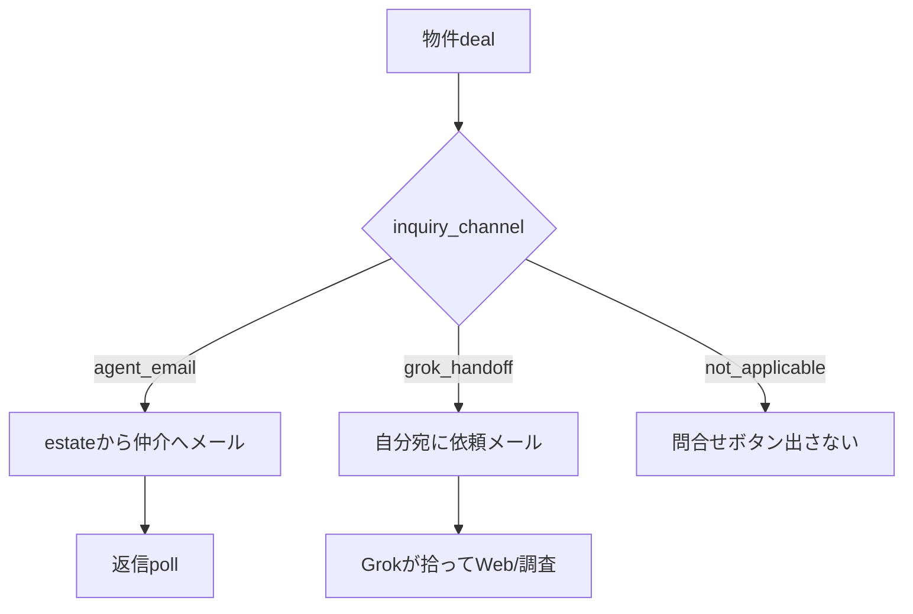

# 不動産賃貸 — 業者開拓ウォッチ & 物件候補パイプライン（実務者設計）

**更新**: 2026-08-23  
**役割**: 品質点検済み仕様の実装正本（Phase 1）  
**本番**: https://jarvis-trade-desk.vercel.app/realestate  
**関連**: [`KURASHIFT_GrokBot_不動産パイプライン.md`](KURASHIFT_GrokBot_不動産パイプライン.md)

---

## 0. 顧客意図（変更しない）

| # | 要望 | 成功の定義 |
|---|---|---|
| 1 | **業者開拓の状況ウォッチ** | 取り込んだ地場リストに対し、Web 問合せフォームから「物件情報をください」を送った **誰に・いつ・結果どう** が一覧で分かる |
| 2 | **物件候補パイプライン** | メール／Web 調査で **検討中の物件** が一覧に載り、候補への問合せ・返信・検討結果（見送り等）の **履歴が追える** |

**やらないこと（Phase 1）**

- Grok Bot の Instructions 変更（別タスク）
- Web フォーム送信の KURASHIFT 内実行（S2 Bot / Mac 既存のまま）
- 業者返信の下書き・送信 UI（Jarvis Dashboard 本線のまま。KURASHIFT は **見る**）

---

## 1. 開発者初案（要約）

既存データを活かし、新規 DB は最小限。

| 機能 | 初案 |
|---|---|
| 業者開拓 | YAML 正本 → Mac 投影 → 新ページ `/realestate/vendors` |
| 物件候補 | 既存 `kurashift_re_deals` を拡張表示。`/realestate/deals` にフィルタ＋詳細ドロワー |

**根拠データ**

- 業者: `config/kurashift_re_vendor_list.yaml`（status / contacted_at / last_result / notes）
- 物件: `kurashift_re_deals` + `kurashift_re_deal_messages` + `summary_json.grok`
- 更新経路: Grok `--mark` → `jarvis_grok_bucho_mail_apply.py` / `property_mail_match` → deals

---

## 2. 品質点検（QA）— 結果と反映

### 2.1 顧客意図との整合

| 観点 | 判定 | 反映 |
|---|---|---|
| 業者の「送信状況」 | ✅ YAML に十分 | UI は **個人問合せ（estate）** を主表示。`ops_contacted_at` は参考列（混同防止） |
| 返信後の物件 | ⚠️ 初案のみだと業者行から deals へ辿れない | 業者行に **紐づく deals 件数＋リンク**（`vendor_id` または from ドメイン照合） |
| 物件一覧 | ⚠️ deals 既存表は情報過多 | **候補ビュー**（info/viewing 既定）と **実行ファネル**（既存）をタブ分離 |
| 返信の見え方 | ⚠️ 表セル内に埋もれる | **行展開 or 右ドロワー**でメッセージタイムライン |
| 検討履歴 | ❌ 現状は confirm/pass のみ・監査なし | `kurashift_re_deal_events` を新設し **判断ログ**を残す |
| Mac 正本 | ✅ 既存方針と一致 | YAML は Mac 正本のまま。Supabase は **投影**（双方向 sync しない） |

### 2.2 UI ベストプラクティス（CRM / パイプライン）

| パターン | 適用 |
|---|---|
| **サマリーカード上・表下** | 業者: pending/contacted/replied 件数。物件: 要返信・Grok未調査・内見候補 |
| **ステータスチップ（色）** | 6 業者 status / 5 inquiry status を固定ラベル＋色（色だけに依存しない） |
| **「要対応」キュー** | デフォルトフィルタ: 業者=replied、物件=has_reply または Grok 聞く価値=要確認 |
| **最終更新降順** | 両表とも `updated_at` / `occurred_at` 降順が既定 |
| **行クリックで詳細** | 表はスキャン用 8 列以内。詳細はドロワー |
| **ソース列** | 物件: mail_grok / mail_estate / kenbiya 等を必ず表示 |
| **空状態** | 「リスト未取込」「本日分未実行」など **次の一手**を 1 行 |

### 2.3 QA 指摘 — 初案からの変更点（確定）

1. **レーン追加**: `RealEstateLaneNav` に **「B開」業者開拓**（`/realestate/vendors`）を追加。物件は既存 **「B実」** を拡張（URL は `/realestate/deals` のまま）。
2. **deals ページ**: 上部タブ `候補 | 全ファネル | 見送り`（既定=候補）。
3. **判断履歴**: 新テーブル `kurashift_re_deal_events`（下記 §4.2）。
4. **業者↔物件**: `summary_json.vendor_id` を mail_match / triage で可能なら付与。無ければ from ドメインで弱結合リンク。
5. **同期**: `re_vendor_sync` ジョブ（YAML→Supabase 全件 replace）。deals は既存 `re_mail_match` / `re_deal_inquiry_poll` で更新。
6. **運用ハブ A**: `/realestate` に 2 枚のミニカード（業者 replied 数・候補要対応数）。

---

## 3. 情報アーキテクチャ

```mermaid
flowchart LR
  subgraph mac [Mac 正本]
    yaml[kurashift_re_vendor_list.yaml]
    grok[Grok 部長日報 --mark]
    match[property_mail_match]
  end
  subgraph db [jarvis-dashboard Supabase]
    vendors[kurashift_re_vendors]
    deals[kurashift_re_deals]
    msgs[kurashift_re_deal_messages]
    events[kurashift_re_deal_events]
  end
  subgraph ui [KURASHIFT trade-desk]
    vPage[/realestate/vendors]
    dPage[/realestate/deals]
  end
  yaml -->|re_vendor_sync job| vendors
  grok --> yaml
  match --> deals
  match --> msgs
  deals --> events
  vendors --> vPage
  deals --> dPage
  msgs --> dPage
  events --> dPage
```

---

## 4. データモデル

### 4.1 新規: `kurashift_re_vendors`（投影）

```sql
create table if not exists public.kurashift_re_vendors (
  id text primary key,                    -- YAML vendor.id
  name text not null,
  area text,
  prefecture text,
  city text,
  url text,
  contact_url text,
  channel text default 'web_form',
  contact_email text,
  phone text,
  status text not null default 'pending'
    check (status in ('pending','discovered','contacted','replied','skip','invalid')),
  source text,
  discovered_at date,
  contacted_at date,
  replied_at date,
  ops_contacted_at date,                  -- 参考（神大家運営）。UI で「運営のみ」バッジ
  last_result text,
  notes text,
  synced_at timestamptz not null default now(),
  updated_at timestamptz not null default now()
);

create index kurashift_re_vendors_status_idx
  on public.kurashift_re_vendors (status, contacted_at desc nulls last);
```

**同期スクリプト（新規）**: `scripts/jarvis_kurashift_vendor_sync.py`

- 入力: `config/kurashift_re_vendor_list.yaml`
- 出力: Supabase upsert（id キー）。削除は論理削除せず YAML に無い id は **残す**（履歴保持）— `orphaned_at` は Phase 2
- ジョブ: `job_type: re_vendor_sync`（Mac worker / 手動 EnqueueJobButton）

### 4.2 新規: `kurashift_re_deal_events`（判断履歴）

```sql
create table if not exists public.kurashift_re_deal_events (
  id uuid primary key default gen_random_uuid(),
  deal_id uuid not null references public.kurashift_re_deals(id) on delete cascade,
  event_type text not null
    check (event_type in (
      'created','status_change','inquiry_sent','inquiry_reply',
      'grok_applied','review_confirm','review_pass','note'
    )),
  from_status text,
  to_status text,
  actor text not null default 'user',     -- user | jarvis | grok | system
  summary text not null default '',
  payload jsonb not null default '{}'::jsonb,
  occurred_at timestamptz not null default now()
);

create index kurashift_re_deal_events_deal_idx
  on public.kurashift_re_deal_events (deal_id, occurred_at desc);
```

**書き込みタイミング**

| 操作 | event_type | 実装箇所 |
|---|---|---|
| mail_match 新規 deal | `created` | `jarvis_kurashift_property_mail_match.py` |
| Grok 取込 | `grok_applied` | 同上（mail_grok） |
| 第一問合せ送信 | `inquiry_sent` | inquiry API / job 成功時 |
| 返信取込 | `inquiry_reply` | `re_deal_inquiry_poll` |
| 確認した / 対象外 | `review_confirm` / `review_pass` | `/api/re/deals/[id]` POST |
| ファネル移動（将来） | `status_change` | deal PATCH 時 |

既存 deals に **遡及イベントは作らない**（Phase 1）。以降の操作から蓄積。

### 4.3 既存 deals — UI 用 computed（DB 列追加なし）

| 表示項目 | 取得元 |
|---|---|
| スコア / Grok 要約 | `match_score`, `summary_json.grok.*` |
| 問合せ状態 | `inquiry_status` |
| 返信プレビュー | `kurashift_re_deal_messages` 最新 inbound 1 件 |
| 添付 | `kurashift_re_deal_attachments` count |
| 業者 | `summary_json.vendor_id` → vendors 名 |

---

## 5. UI 仕様

### 5.1 業者開拓ウォッチ — `/realestate/vendors`

**レーン**: ③-B開（`RealEstateLaneNav` に追加）

#### サマリー行（ページ上部）

```
未送信 pending 42 · 送信済 contacted 18 · 返信あり replied 5 · スキップ skip 3
本日上限 3/日 · 最終同期 2026-08-23 08:12 · [リストを同期]
```

#### フィルタ（チップ）

| フィルタ | 既定 |
|---|---|
| すべて | — |
| **要フォロー** | status=replied OR (contacted AND contacted_at < 7日前 AND status≠replied) |
| 未送信 | pending, discovered |
| 送信済 | contacted |
| 返信 | replied |
| 除外 | skip, invalid |

#### 表（列 — 最大 9 列）

| 列 | 内容 |
|---|---|
| 状態 | チップ + ツールチップ（last_result 先頭 80 字） |
| 業者名 | name |
| エリア | prefecture + city |
| 問合せURL | contact_url リンク ↗ |
| 送信日 | contacted_at（空=—） |
| 返信日 | replied_at |
| 備考 | notes 1 行 truncate |
| 物件 | 紐づく deals 件数 → クリックで `/realestate/deals?vendor={id}` |
| 操作 | 「Grok 再開拓用コピー」は Phase 2。Phase 1 は **問合せURL** のみ |

**空状態**: 「YAML 未取込 or 未同期 → Mac で `--import-xlsx` → [リストを同期]」

**モバイル**: 表は横スクロール可。状態・業者名・送信日は sticky 左 2 列（Phase 1 は scroll のみでも可）。

---

### 5.2 物件候補パイプライン — `/realestate/deals` 拡張

#### タブ（ページ上部・Funnel カードの上）

| タブ | フィルタ |
|---|---|
| **候補**（既定） | status ∈ {info, viewing} |
| 全ファネル | archived 除く全件（現行同等） |
| 見送り | passed |

#### 候補タブ — サマリー

```
要返信 2 · 問合せ候補 8 · Grok未調査 4 · 第一問合せ未送 6 · 内見候補 1
```

フィルタ: `?inquiry=has_reply`（要返信）／`?inquiry=ready`（Tier1 問合せ候補）

#### 候補タブ — 表（列 10）

| 列 | 内容 |
|---|---|
| 優先 | match_score 降順（数値） |
| 状態 | info / viewing |
| 物件 | title + source バッジ |
| エリア | area |
| 価格 | price_man |
| Grok | 聞く価値 / HZ / 土地100%（1 行） |
| 問合せ | inquiry_status チップ |
| 最終動き | 最新 message or event の日付 + 1 行 |
| 操作 | DealReviewActions + **クイック問合せ**（Tier1）+ GrokInvestigateCopy |
| 詳細 | 「開く」→ ドロワー |

#### 詳細ドロワー（右スライド / モバイル全画面）

```
【ヘッダ】タイトル · 状態 · スコア
【Grok 調査】summary_json.grok 全文（折りたたみ可）
【メールタイムライン】kurashift_re_deal_messages 時系列
  - outbound / inbound アイコン
  - subject + body 先頭 500 字 + 「全文」展開
  - Gmail リンク
【添付】PDF 件数（将来: 一覧リンク）
【判断履歴】kurashift_re_deal_events 時系列（新規）
【第一問合せ】既存 DealInquiryActions（ドロワー内に移動可 — 表セルはチップのみ）
```

**QA 判断**: 表の「第一問合せ」列は **ステータスチップのみ**に slim 化し、操作はドロワーへ（表の横スクロール削減）。

---

### 5.3 運用ハブ `/realestate` 追記

既存 deals 件数カードに加え:

| カード | 表示 |
|---|---|
| 業者開拓 | replied / contacted / pending · → vendors |
| 物件候補 | 要返信 / 候補総数 · → deals?tab=candidates |

---

## 6. API / ジョブ

| job_type | payload | 処理 |
|---|---|---|
| `re_vendor_sync` | `{}` | YAML → `kurashift_re_vendors` upsert |
| 既存 `re_mail_match` | 変更なし | deals + messages |
| 既存 `re_deal_inquiry_poll` | 変更なし | 返信 + inquiry_status 更新 + event |

**新 API**

| Method | Path | 用途 |
|---|---|---|
| GET | `/api/re/vendors` | 一覧 JSON（フィルタ query） |
| GET | `/api/re/deals/[id]/timeline` | messages + events 統合（ドロワー用） |

EnqueueJobButton（vendors ページ）:

```tsx
<EnqueueJobButton jobType="re_vendor_sync" label="リストを同期" payload={{}} />
```

| job_type | payload | 処理 |
|---|---|---|
| `re_ops_form_draft` | `{ deal_id }` | フォーム下書き → `summary_json.ops_form_draft`（送信しない） |

---

## 6.5 神大家運営相談フォーム（1906a1a5）

| 呼び名 | 正 |
|---|---|
| 亀山さん相談 | **神大家さん運営相談**（運営窓口） |
| 送信 | [戸建て購入・東海地域フォーム](https://form.os7.biz/f/1906a1a5/)（1物件1投稿・**ユーザー確認後のみ**） |
| 下書き | `jarvis_kurashift_re_ops_form_draft.py` / ドロワー「フォーム下書き」 |
| 809 回答 | `809_神大家運営回答/5.やり取り.md`（`jarvis_kurashift_ops_consult_ingest.py`） |

フィールド定義の正本: [`config/kurashift_re_ops_form_1906a1a5.yaml`](../config/kurashift_re_ops_form_1906a1a5.yaml)

### 項目マップ（tier）

| tier | 意味 | 例 |
|---|---|---|
| **auto** | deal / grok / `.env.jarvis_private` から下書き可 | 姓名・メール・販売価格・路線価・HZ・駐車場 |
| **reply** | 第一問合せ返信・PDF で補完 | 築年数・㎡・最寄駅・入居状況 |
| **research** | 人が調査・試算（フォームの核心） | 想定家賃・修繕費・修繕後CF・残価値・融資条件 |
| **manual** | 判断・記述 | 至急度・買付価格・講師への質問・内見済み |

### Drive ルール

- **格納先**: 神大家割当 **個人 Google Drive**（自分の Gmail Drive ではない）
- **フォルダ名＝物件名**（フォームの「物件名」と一致）
- **写真なし** → 修繕費妥当性の回答不可（運営側制約）
- **ZIP 不可** — 解凍して格納
- Jarvis はフォーム **自動送信しない**（`jarvis-outbound-confirm`）

### 日次ルーティン（Phase 2）

| 順 | 実行者 | 内容 |
|---|---|---|
| 1 | あなた | Grok 本日分（業者 + 物件調査） |
| 2 | 自動 | 朝バンドル: bucho → vendor sync → inquiry poll → `re_daily_digest` |
| 3 | あなた/Jarvis | KURASHIFT 要返信・業者要フォロー（`/realestate/deals?inquiry=has_reply`） |
| 4 | あなた | ドロワーで返信・PDF 確認 |
| 5 | あなた+Jarvis | フォーム下書き → 不足項目を調査・記入 |
| 6 | あなた | 神大家個人 Drive に物件フォルダ + 写真 |
| 7 | あなた | フォーム入力 → **確認後送信** |
| 8 | 運営 | 809 回答 → 取込 |
| 9 | あなた | 内見判断 → `viewing` |

Cursor ルール（ローカル）: `.cursor/rules/kamiooya-re-purchase-form.mdc`

---

## 7. 実装フェーズ

### Phase 1（本チケット — 必須）— **2026-08-23 実装済**

- [x] migration: `kurashift_re_vendors`, `kurashift_re_deal_events`
- [x] `jarvis_kurashift_vendor_sync.py` + worker handler
- [x] `/realestate/vendors` ページ
- [x] `RealEstateLaneNav` + `kurashiftMap.ts` + `/realestate` カード
- [x] deals: タブ + 候補フィルタ + ドロワー + events 書き込み（API 3 箇所）
- [x] `docs/運用コマンド一覧.md` に `re_vendor_sync` 追記

**本番前**: Supabase に `20260823_kurashift_re_vendors_events.sql` を適用 → デプロイ → vendors 画面で「リストを同期」1 回。

### Phase 2（日次サイクル）— **2026-08-23 実装済**

- [x] 朝バンドル: `grok_bucho_mail_apply` / `vendor_sync` / `inquiry_poll` / `re_daily_digest`
- [x] `jarvis_kurashift_re_ops_form_draft.py` + `config/kurashift_re_ops_form_1906a1a5.yaml`
- [x] job `re_ops_form_draft` + ドロワー「フォーム下書き」
- [x] deals `?inquiry=has_reply` フィルタ + 返信後ガイド
- [x] `build_ops_pack` にフォーム下書き追記

**日次フロー**: Grok 本日分 → bucho apply → vendor sync → inquiry poll → KURASHIFT 要返信 → PDF/返信確認 → フォーム調査 → Drive → **確認後**フォーム送信 → 809 回答 → 内見

### Phase 2.5（問合せ閾値・Tier1 UI）— **2026-08-23 実装済**（commit `b442ca49`）

**正本**: `config/kurashift_re_inquiry_auto.yaml`  
**判定**: `apps/trade-desk/lib/reInquiryCandidate.ts` / `scripts/jarvis_kurashift_re_inquiry_rules.py`

#### Tier 定義

| Tier | 名称 | 条件（OR は明記） | 動作 |
|---|---|---|---|
| **0** | 除外 | `inquiry_status` ∈ sending / awaiting_reply / has_reply | 候補外 |
| **1** | 問合せ候補 | `(Grok 聞く/保留) OR score≥2.0` **AND** inquiry none/draft **AND** status info/viewing（または passed 再検討） | UI フィルタ `?inquiry=ready`・行内/ドロワー **クイック問合せ** |
| **2** | 日次キュー | 聞く **AND** score≥5 **AND** HZ≠除外 **AND** Tier1 | 朝 digest「送信待ち」（Web 一括確認後送信） |
| **3** | 自動送信 | 聞く **AND** score≥7 **AND** HZ=OK **AND** 土地100≠見送り **AND** `enabled:false` | Mac worker 即送信（**初期 OFF**） |

日次上限: `daily_send_cap: 5`

#### auto_pass / passed の override

- Grok `聞く` / `保留` があれば **status=passed でも Tier1**（バッジ: **再検討**）
- **除外しない** override: `mansion_unit`（区分/WR 単体）・`subject_noise` は従来どおり候補外
- **築古一棟 AP**: 件名/本文が `(築古|ボロ|空き家)×(アパート|AP|マンション一棟)` かつ東海エリア + score≥2 なら `low_score` auto_pass を **スキップ**（通常候補化）
- **RC**: `score_text` に `RC` キーワードで +0.5 点（鉄骨/RC 本文）。RC 単独キーワードは auto_pass しない

#### UI

- `/realestate/deals?tab=candidates&inquiry=ready` — Tier1 一覧
- 候補表: Tier バッジ（再検討・送信待ち）+ `DealInquiryQuickButton`（プレビュー → チェック → 送信）
- 「確認した」後に Tier1 なら問合せ CTA（`DealReviewActions`）
- 宛先なしでも Tier1 表示可 → 送信時は宛先入力
- 初級者手順: `docs/KURASHIFT_Tier1_問合せ_初級者手順.md`

### Phase 2.6（Tier2 日次一括キュー）— **🚧 実装中（未 merge）**

| 項目 | 状態 |
|---|---|
| YAML `tier2_daily_queue.enabled: true` | 🚧 ローカル |
| `/realestate/deals/tier2` 一括確認 UI | 🚧 |
| API `inquiry-tier2-queue` / `inquiry-tier2-send` | 🚧 |
| digest Tier2 行 | 🚧 |
| build 検証・deploy | ⬜ |

**運用**: Tier1 手動5件 + poll 安定後に本番レビュー（目安 2026-09-06）。一括確認チェック必須。日次上限5件は Tier1 と合算。

### Phase 3（任意）

- [ ] vendor ↔ deal 自動紐付け強化（PDF 物件名）
- [ ] 業者行から Dashboard 返信下書き deep link
- [ ] deals 表 CSV export
- [ ] 週次バッチ進捗バー（7 日 × 3 件）

---

## 8. 受け入れ基準（QA 再チェック用）

### 業者開拓

1. Grok `本日分` で `--mark … contacted` 後、**同期ジョブ 1 回**で vendors 表に送信日が見える
2. `replied` の業者が「要フォロー」フィルタに出る
3. `ops_contacted_at` のみの業者は **pending のまま**（個人未送信と区別できる）
4. contact_url から外部サイトが開ける

### 物件候補

1. mail_match 取込後、**候補タブ**に自動表示（info）
2. 第一問合せ送信 → inquiry_status=sent + events に `inquiry_sent`
3. 返信 poll 後 → has_reply + ドロワーに inbound 表示 + `inquiry_reply` event
4. 「確認した」「対象外」→ events に記録、ドロワー履歴に並ぶ
5. 既存「千三つファネル」全件表示は **全ファネルタブ**で従来同等

---

## 9. ファイル一覧（実装者）

| 種別 | パス |
|---|---|
| migration | `apps/jarvis-dashboard/supabase/migrations/20260823_kurashift_re_vendors_events.sql` |
| sync | `scripts/jarvis_kurashift_vendor_sync.py` |
| worker | `scripts/jarvis_kurashift_job_worker.py`（re_vendor_sync 分岐） |
| UI vendors | `apps/trade-desk/app/realestate/vendors/page.tsx` |
| UI deals | `apps/trade-desk/app/realestate/deals/page.tsx`（タブ・ドロワー） |
| 新 comp | `apps/trade-desk/components/DealDetailDrawer.tsx` |
| 新 comp | `apps/trade-desk/components/VendorOutreachTable.tsx` |
| API | `apps/trade-desk/app/api/re/vendors/route.ts` |
| API | `apps/trade-desk/app/api/re/deals/[id]/timeline/route.ts` |
| nav | `apps/trade-desk/components/RealEstateLaneNav.tsx` |
| map | `apps/trade-desk/lib/kurashiftMap.ts` |
| events | `apps/trade-desk/app/api/re/deals/[id]/route.ts`（POST 時 insert） |
| match | `scripts/jarvis_kurashift_property_mail_match.py`（created/grok events） |
| Phase2 digest | `scripts/jarvis_kurashift_re_daily_digest.py` |
| Phase2 form | `scripts/jarvis_kurashift_re_ops_form_draft.py` + `config/kurashift_re_ops_form_1906a1a5.yaml` |
| Phase2 morning | `scripts/jarvis_morning_mac_refresh.py`（bucho / vendor / poll / digest） |
| Phase2.5 YAML | `config/kurashift_re_inquiry_auto.yaml` |
| Phase2.5 rules | `scripts/jarvis_kurashift_re_inquiry_rules.py` |
| Phase2.5 UI | `apps/trade-desk/lib/reInquiryCandidate.ts` + `DealInquiryQuickButton.tsx` |
| Phase2.6 Tier2 | `lib/reInquiryTier2Queue.ts` + `/realestate/deals/tier2` + API |
| Tier1 手順 | `docs/KURASHIFT_Tier1_問合せ_初級者手順.md` |
| 進捗正本 | `docs/KURASHIFT_問合せパイプライン_進捗_20260823.md` |
| 経路仕分け | `apps/trade-desk/lib/reInquiryChannel.ts` + `scripts/jarvis_kurashift_re_inquiry_channel.py` |
| Grok handoff paste | `config/grok_kurashift_inquiry_handoff_paste.md` |

---

## 9.1 第一問合せ ≠ 業者開拓フォーム（2026-08-23）



| `inquiry_channel` | 条件 | UI / 送信 |
|---|---|---|
| `agent_email` | From／Reply-To が **自己以外** | To＝仲介 · `awaiting_reply` |
| `grok_handoff` | 仲介メール不可 | To＝自分 · 件名 `[KURASHIFT問合せ依頼]` · `awaiting_grok`（poll スキップ） |
| `not_applicable` | `mail_grok` 単体／業者開拓メモ | 問合せ CTA 非表示 |

| レーン | 何をするか | 誰が送るか |
|---|---|---|
| **物件の第一問合せ** | 具体物件の資料依頼 | estate → **仲介メール**（無ければ `[KURASHIFT問合せ依頼]` で自分→Grok） |
| **業者開拓 A'** | 地場リストへの顧客登録・条件マッチ依頼 | Grok Bot2 → **各社 Web フォーム** |

**To 解決順**（`config/kurashift_re_inquiry_auto.yaml` `to_resolution`）: UI 明示 → `reply_to` → `from`（自己除外）→ vendor `contact_email` → grok_handoff

`[Grok調査]` メモや「業者開拓 approved A'」単体の deal は **第一問合せボタンを出さない**（`not_applicable`）。**禁止**: `mail_grok` の From（自分）を To にそのまま使う。

---

## 10. 品質点検サインオフ

| 項目 | 結果 |
|---|---|
| 顧客意図 #1 業者送信状況 | ✅ 一覧 + フィルタ + 同期で充足 |
| 顧客意図 #2 物件候補・返信・履歴 | ✅ 候補タブ + ドロワー + events で充足 |
| 既存資産の再利用 | ✅ YAML / deals / messages を正とする |
| CRM 可読性 | ✅ サマリー・要対応・ドロワー分離 |
| スコープ抑制 | ✅ Phase 1 は read-heavy + 既存操作の event 化のみ |

**実装者へ**: 上記 Phase 1 を順に実装。疑義は §0 顧客意図を正とし、拡張は Phase 2 へ回す。
