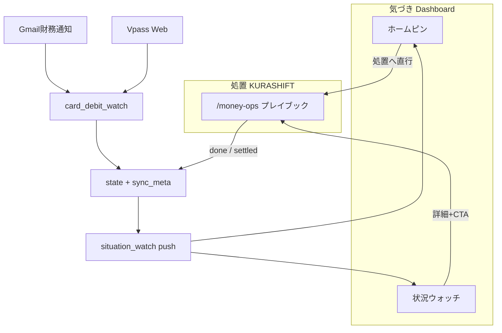

# KURASHIFT カード引落支払い — 実務者設計（2026-08-14）

**役割**: 品質点検 → 実務実装の正本  
**顧客意図**: 支払いは重要行為。気づきは Jarvis ダッシュボード、処置は KURASHIFT。寄せ無料優先。借りは返済カレンダー必須、書けないなら衛星現金化と比較。

**本番**
- Dashboard: https://jarvis-dashboard-amber.vercel.app/
- KURASHIFT: https://jarvis-trade-desk.vercel.app/money-ops

---

## 1. 製品仕様（変更しない）



| 項目 | 正 |
|---|---|
| Infinite | 本線。通知で必ず state 更新 |
| 他カード | 金額≥30万のみアラート |
| 金額ソース Phase1 | Gmail（金額表示ON時）＋ **Vpass Web**（本線）＋手動 `--set`／フォーム |
| 引落口座 | `smbc_kariya` のみ |
| 送金アシスト | 承認≠記帳。取得可能 OTP は Jarvis。アプリ OTP はユーザー。正本: `docs/KURASHIFT_送金アシスト_実務者設計_20260814.md` |
| ダッシュボード専用ページ `/card-debit` | **作らない**（処置は money-ops） |
| 年会費 | `card_annual_fee` のまま分離 |

**Deep link（固定）**
- **ホームピン / KURASHIFT Next Action** → 処置＝`https://jarvis-trade-desk.vercel.app/money-ops?...`
- **状況ウォッチ・今日のキューの一覧カード** → 気づき＝`/situation?watch=card_debit_watch`（本文に KURASHIFT CTA）

---

## 2. ライフサイクル

| キー | 意味 | 効果 |
|---|---|---|
| `plan_ready_due` | money_ops が consulting/approved/executing | warn → attention（計画作成済み。due まで再表示可） |
| `settled_due` | money_ops **done** または `--dismiss-due` | 当該 due のアラート解除 |
| `dashboard_ack_due` | ダッシュボード「確認（ピン解除）」 | ホームピンだけ消す（状況ウォッチは残る） |

クリア条件（`build_alerts` / `eval_card_debit_watch`）:
- `due_date` が `settled_due` と一致 → アラートなし
- `due_date < today` かつ（settled または 金額確定で不足≤0）→ ok／banner off
- 新 `notice`（新しい `source_message_id`）→ 再点火
- 汎用 7日 ack は支払いピンでは使わない（specialized のみ）

正本: `.jarvis_state/card_debit_watch.json` ＋ `sync_meta.card_debit_lifecycle`（Vercel 書込 → Mac runner 合流）

---

## 3. 金額把握ライン

| 優先 | 手段 | 備考 |
|---|---|---|
| 1 | Gmail「お支払い金額のお知らせ」 | **メールに金額表示ON**のときだけ yen が入る。OFFが既定 |
| 2 | **Vpass Web**（`--fetch-vpass`） | **金額把握の本線**。Myページの「〇月〇日お支払い金額（確定）」を読む。日次は `--fetch-vpass-if-pending` |
| 3 | 手動 `--set` | Vpass/メールで見た額を Jarvis に渡す |

補助: 「お支払い日のご案内」→ 引落日の補強（金額は通常なし）。

```bash
cd ~/git-repos && set -a && source .env.jarvis_private && set +a
~/selenium_env/venv/bin/python scripts/jarvis_vpass_payment_fetch.py --json
~/selenium_env/venv/bin/python scripts/jarvis_card_debit_watch.py --fetch-vpass
```

---

## 4. P0 実装マップ

| ID | 内容 | 実装場所 |
|---|---|---|
| P0-1 | 日次収集 | `launchd/dashboard_push_runner.sh`（日次 12:30 既存ジョブ相乗り）。先頭で `card_debit_watch --fetch-vpass-if-pending` → `situation_watch` → `dashboard_push` |
| P0-2 | サイクル完了 | `jarvis_card_debit_watch.py` のクリア条件＋ money-ops done → `writeCardDebitLifecycle` → `--dismiss-due` |
| P0-3 | due 単位 ack | `cardDebitAck.ts` / `CardDebitAckButton`。push で `dashboard_ack_due` を潰さない |
| P0-4 | 方針正本＋UI | `jarvis-finance-philosophy.mdc`・`docs/Jarvis_金融相談の出し方_20260814.md`・`POLICY_LOAN_UI_NOTE` |
| P0-5 | 文言／dismiss | Form 重複整理・`--dismiss-due`・引落後クリアは P0-2 |

### P1（本フェーズ必須ではない）

- Vpass 金額表示ON／メール経路の自動化強化
- SMBC 残高の引落前スポット更新
- ことら分割件数の自動提案

---

## 5. 調達・返済の判断

- **定額返済の契約者貸付は可**（株再建と同型の強制貯蓄）。必須: 月額・期間・原資を書く。
- 返済は **防衛 → 次物件キープ → NISA9万** のあとの余りから。削るなら不可 → Bloomo。
- 一行ルール: *返済カレンダーを書けない安い借りは未完了の宿題。衛星売却で終わらせる方がよいことが多い。*

詳細: `docs/Jarvis_金融相談の出し方_20260814.md` / `jarvis-finance-philosophy.mdc`

---

## 6. 手動コマンド

```bash
cd ~/git-repos && set -a && source .env.jarvis_private && set +a
~/selenium_env/venv/bin/python scripts/jarvis_card_debit_watch.py
~/selenium_env/venv/bin/python scripts/jarvis_card_debit_watch.py --fetch-vpass
~/selenium_env/venv/bin/python scripts/jarvis_card_debit_watch.py \
  --set olive_infinite --amount N --due YYYY-MM-DD
~/selenium_env/venv/bin/python scripts/jarvis_card_debit_watch.py --dismiss-due YYYY-MM-DD
~/selenium_env/venv/bin/python scripts/jarvis_situation_watch.py
~/selenium_env/venv/bin/python scripts/jarvis_dashboard_push.py --watch-only
```

運用コマンド一覧: 「カード引落ウォッチ」節。

---

## 7. 受け入れチェックリスト

- [x] 毎日（日次 push パイプライン）で Gmail→（必要なら Vpass）→ピンが更新される
- [x] money-ops を done にすると、同じ due のホームピン／warn が消えるか弱まる（`settled_due` writeback）
- [x] 新サイクルの通知で再びピンが立つ
- [x] ピン＝KURASHIFT、キュー＝situation＋CTA の役割が説明どおり
- [x] 汎用 ack だけで支払いピンが7日消えない（specialized）
- [x] 貸付が「積極推奨」文言になっていない（定額返済可の条件付き）
- [x] finance-philosophy に判断軸がある
- [x] 承認だけでは記帳されない（送金アシストは Preview→Go）
- [x] R6'／rails[] 正本あり（`docs/KURASHIFT_送金アシスト_*`）

---

## 8. 禁止

- 承認のみでの振込実行（無人無確認記帳）
- あかつき元本・SBIコアの安易な推奨
- 返済カレンダーなしの契約者貸付推奨
- `card_annual_fee` との混同
- OTP／口座全文のチャット出力