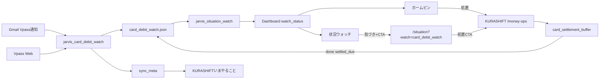

# Olive Infinite 引落・支払い体験 — 点検者向け仕様（2026-08-14）

**宛先**: アプリ品質点検者  
**顧客意図（要約）**: 大型カード引落は「支払う」行為として重要。ダッシュボードで気づき、処置は KURASHIFT で行う。寄せは無料レール優先。調達は返済カレンダーが書けるときだけ借り、書けないなら衛星現金化を両天秤で判断できること。

**本番 URL**
- Jarvis ダッシュボード: https://jarvis-dashboard-amber.vercel.app/
- KURASHIFT: https://jarvis-trade-desk.vercel.app/money-ops

**関連コミット（目安）**: `24fe645`（バッファ UX）→ `2633201`（Gmail ウォッチ）→ `304b481`（ダッシュボード強調）→ `779a6f6`（実務サイクル・Vpass 金額）

**実務者設計（運用・P0）**: [`docs/KURASHIFT_カード引落支払い_実務者設計_20260814.md`](KURASHIFT_カード引落支払い_実務者設計_20260814.md)

---

## 1. 顧客要件（Must）

| ID | 要件 | 受け入れの見え方 |
|---|---|---|
| R1 | Infinite 大型引落を本線で監視する | 財務メール／Vpass 検知後、ウォッチ／ホームに「支払い準備」が出る |
| R2 | 他カードはノイズを増やさない | 金額 ≥30万のみアラート。未満は画面に出ない |
| R3 | データ源はカードHPの恣意スクレイプではなく財務お知らせ起点 | Gmail `お支払い金額のお知らせ`（m19m）。金額が無いメールは未確定 → **本線は Vpass Web で確定額を取る**（`--fetch-vpass`） |
| R4 | 「不足」は SMBC 刈谷への寄せ目標 | 家計全体の現金不足と混同しない表示 |
| R5 | 引落口座は `smbc_kariya` 1本 | Olive カード口座などを合算しない |
| R6 | 自動振込なし | 承認＝方針合意のみ。振込は手動 |
| R7 | ダッシュボードで支払いを強調 | ホーム最上段ピン＋状況ウォッチ上位 |
| R8 | 処置は KURASHIFT | ピン／カードから `/money-ops` へ。寄せプレイブックで完結 |
| R9 | 調達ラダー方針 | 寄せ → 利金 →（返済原資が書けるときだけ）契約者貸付 → Bloomo → SBIコアは最終／原則禁止。あかつき元本売却なし |
| R10 | 契約者貸付の扱い | 常態化禁止。短期ブリッジ。返済カレンダー不可なら追加借りせず、衛星現金化と比較 |

---

## 2. アーキテクチャ（点検時の地図）

| 層 | 正本 |
|---|---|
| 検知 | `scripts/jarvis_card_debit_watch.py` / `scripts/jarvis_vpass_payment_fetch.py` |
| 状態 | `.jarvis_state/card_debit_watch.json`（example あり）＋ `sync_meta.card_debit_lifecycle` |
| ウォッチ評価 | `scripts/jarvis_situation_watch.py` `eval_card_debit_watch` + `config/situation_watch.yaml` |
| ダッシュボード UI | `HomePinBanner.tsx` / `CardDebitAckButton.tsx` |
| 処置 UI | `CardSettlementBufferForm.tsx` / `cardSettlementBuffer.ts` |
| 方針 | `jarvis-finance-philosophy.mdc` / `docs/Jarvis_金融相談の出し方_20260814.md` |
| 素案 | `docs/KURASHIFT_資金移動_カード引落バッファ_検討素案_20260814.md` |

**役割分担（固定）**
- **気づき** = Jarvis ダッシュボード（支払いの重要性を強調）
- **処置** = KURASHIFT（寄せ計画・調達アシスト）
- **年会費** = `card_annual_fee`（本機能と混ぜない）

**Deep link**
- ホームピン → KURASHIFT `/money-ops`（処置直行）
- 状況ウォッチ／今日のキュー → `/situation?watch=card_debit_watch`（気づき＋ CTA）

---

## 3. 実装済み（点検の対象）

### 3A. 検知・閾値
- Infinite: 通知検知で state 更新。アラートは 金額≥50万 **または** 引落まで14日以内かつ SMBC不足>0 **または** 金額未確定かつ T−14
- 他カード: 金額ありかつ ≥30万のみ
- 引落日推定: メールに無ければ当月/翌月の 26日（`CARD_DEBIT_DEFAULT_DUE_DAY`）
- 金額: Vpass Web（本線）／Gmail（金額表示ON時）／`--set`

### 3B. ダッシュボード
- ホーム最上段ピン「Olive Infinite 引落 — 支払い準備」→ **外部リンクで KURASHIFT /money-ops**
- 状況ウォッチ先頭付近、カード内「処置は KURASHIFT で」
- due 単位 ack（汎用7日 ack は使わない）
- `never_archive` / `show_banner` / `pin_top` が warn・attention で立つ

### 3C. KURASHIFT money-ops
- プレイブック（無料レール → 調達ラダー）
- SMBC 不足の明示＋銀行現金合計の併記
- 引落日必須・同一 due の二重作成防止
- query / sync_meta プレフィル
- done → `settled_due` writeback

### 3D. 既知の制約（バグ扱いしない）
- 既定の Vpass「お支払い金額のお知らせ」は**金額非表示**が多い → 未確定 warn は仕様（Vpass Web で解消）
- **自動振込は対象外**（手動寄せのみ）
- 日次収集は `dashboard_push_runner.sh`（12:30）相乗り

---

## 4. 点検チェックリスト（合格基準）

### ダッシュボード
- [ ] ホーム最上段に Infinite 支払いピンがある（warn/attention 時）
- [ ] ピン文言に「支払い準備」が含まれる
- [ ] ピンクリックで KURASHIFT `/money-ops` が開く（ダッシュボード内で処置完結しない）
- [ ] `/situation` で同項目が上位、KURASHIFT CTA がある
- [ ] 年会費ウォッチとタイトル／内容が分離している
- [ ] 汎用 ack だけでピンが7日消えない（専用 due ack のみ）

### KURASHIFT
- [ ] `/money-ops` にカード引落バッファがある
- [ ] 「SMBC不足」と「銀行＋現金合計」が併記される
- [ ] 引落日なしでは consulting 作成できない
- [ ] 調達ラダーにあかつき元本売却が無い／SBIコアが最終
- [ ] 契約者貸付が「積極推奨」ではなく短期・返済原資・常態化禁止
- [ ] 承認しても銀行振込は走らない

### 検知
- [ ] `jarvis_card_debit_watch.py` 実行で Infinite が state に入る
- [ ] `situation_watch` → `dashboard_push --watch-only` 後にピンが更新される
- [ ] 30万未満の他カードでアラートが増えない

### 方針（文言）
- [ ] 契約者貸付が「積極推奨」になっていない
- [ ] アドバイスが金利だけで貸付を推していない

---

## 5. Jarvis アドバイス型（顧客合意）

毎回この順で出す（カード穴・修繕・既存貸付の相談共通）。

1. 用途ラベル（消費／投資／ブリッジ）
2. 両案の表（金利・義務・完了感・何を崩すか）
3. チェックリスト（返済カレンダー／定額返済が書けるか）
4. 推奨1行（心理・実行可能性を明示してよい）
5. 禁止（コア安易売却、貸付常態化、あかつき元本）
6. 次の一手（いくら・どの口座・いつまで）

一行ルール: **返済カレンダーが書けない借りは、金利が安くても宿題。宿題が残るなら衛星の現金化で消す方が正しいことが多い。**

---

## 6. やらないこと

- 銀行 API 振込の自動化
- 年会費ウォッチ（`card_annual_fee`）との統合
- 小さな日常請求の全通知
- ダッシュボード専用ページ `/card-debit` の新設
