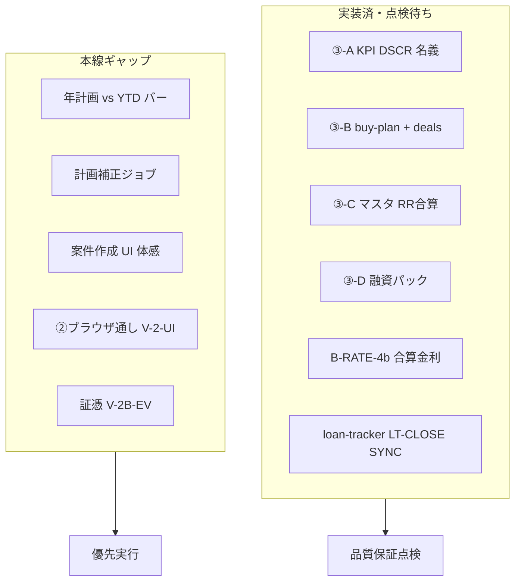

# KURASHIFT 品質保証点検 — 実行プラン（2026-08-13）

編集整理版を docs に固定したもの。  
**点検結果（Wave0 実施済）**: [`KURASHIFT_品質保証点検ログ_20260813.md`](./KURASHIFT_品質保証点検ログ_20260813.md)

---

# KURASHIFT 品質保証点検 — 実行プラン（編集整理 2026-08-13）

**宛先**: 品質保証点検者（次ロール）  
**編集者の役割**: 開発者成果の文言・要件の整合、残処置の優先順位付け、受け入れ基準の明確化（コード実装はしない）  
**本番**: https://jarvis-trade-desk.vercel.app/  
**入口ドキュメント（実装後に同内容を書き出す）**: [`docs/KURASHIFT_編集者引き継ぎ_不動産AB_20260813.md`](docs/KURASHIFT_編集者引き継ぎ_不動産AB_20260813.md)／[`docs/KURASHIFT_検証プラン.md`](docs/KURASHIFT_検証プラン.md)／[`docs/KURASHIFT_実務者引き継ぎ.md`](docs/KURASHIFT_実務者引き継ぎ.md)

---

## 1. 編集者判定 — ③-A / ③-B（開発者成果）

### 顧客意図との対応（合格の型）

| 意図 | 実装 | 編集者判定 |
|---|---|---|
| レーン分離 | `RealEstateLaneNav` 全 `/realestate/*` | **意図どおり** |
| A=今の資産の進捗 | `/realestate` KPI・DSCR・名義切替・YTD | **骨格合格**。年計画バー未 |
| B=長期→今狙う→実行 | `/buy-plan` → Focus → `/deals` | **意図どおり** |
| LP同型の長期感 | events 年表 | **合格（読みやすさは QA で要確認）** |
| 合算金利・RR vs 返済 | B-RATE-4b・C の合計列 | **別イテで実装済・本点検に含める** |

### 編集者が QA に依頼する「文言・体感」点検（実装前でも可）

1. レーンラベルが顧客にとって迷子にならないか（A／Bプラン／千三つ／C／D）
2. Focus「今狙う」が Notion 条件（戸建・20%・300万・土地値60%・愛知中心）と Excel criteria で矛盾していないか
3. DSCR 注記「簡易＝月家賃÷月返済／厳密 NOI ではない」が誤解を生まないか
4. 年表の `action` 生値が読みにくくないか（色分けは後続改善可）

### 編集者が「仕様として閉じる」こと

- Notion Focus 要約は **静的補助**。正本は Excel `kurashift_buy_plan_criteria`（鮮度ズレ時は Excel 再取込）
- DSCR は **簡易カバレッジ**として仕様固定（NOI 版は後段バックログ）
- 融資パック送信は **コピーのみ**（outbound-confirm）— 仕様どおり

---

## 2. 現状マップ（仕様満足度）

| 柱 | 仕様上のゴール | いま | 満足まで |
|---|---|---|---|
| **0 前提** | ログイン・設定・worker | 済 | 煙テストのみ |
| **① 資産** | 把握／提案／実行 | 概ね済 | 体感＋安全境界再確認 |
| **② 計画・税** | LP年次・税 | CLI済・UI体感残 | **V-2-UI**／証憑 |
| **③-A** | 運用進捗・計画差分 | KPI＋DSCR | **計画vs実績**／補正 |
| **③-B** | 長期＋実行 | buy-plan＋deals | 案件1件通し・メール候補 |
| **③-C** | 保有＋ローン投影 | 済＋RR/DSCR | as-of鮮度確認 |
| **③-D** | 提出パック | 済（個人/法人/無担保） | 1案件チェック通し |
| **横断** | 未承認で実弾なし | ルールあり | 毎回確認 |

検証プラン上の「③ Phase1〜6 未実装」表記は **陳腐化**。QA は下表の **現行到達** を正とする。

---

## 3. 残処置の優先実行プラン（確定順）

編集者がプラン残（買い進め長期／融資パック／検証プラン RE・V・B-RATE）を統合した **実行順**。

### Wave 0 — 品質保証点検（本プランの主成果・今すぐ）

**目的**: 実装済みを「使える／使えない」に切り分ける。コード変更なし。

| ID | 点検内容 | 合格基準 |
|---|---|---|
| **QA-0** | ログイン・本番 URL | ダッシュボード表示 |
| **QA-A1** | `/realestate` 名義合算／個人／法人 | KPI・表が切り替わる |
| **QA-A2** | DSCR・RR・月返済・家賃−返済 | 3物件で数字あり。注記が読める |
| **QA-A3** | CF月50万ギャップ・買い進め版ラベル | 表示あり |
| **QA-B1** | `/realestate/buy-plan` 年表 | canonical 版・年度ブロック・イベント行>0 |
| **QA-B2** | Focus・銀行枠・プラン→千三つ導線 | リンク到達 |
| **QA-B3** | `/realestate/deals` ファネル件数・Jobs | 送信ボタンなし |
| **QA-C1** | `/realestate/properties` RR合計 vs 月返済・DSCR | キャラメル2本合算が見える |
| **QA-D1** | `/realestate/finance-pack` 商品×名義×共通マイナ | 不足コピー／下書きコピー可・送信なし |
| **QA-R1** | Discover §B-RATE-4 と画面合算が一致する感覚 | キャラメル合算≈2.55% |
| **QA-SAFE** | テーマ実行・Zaim本番が未承認で走らない | live=false／確認UI |

**成果物**: 点検ログ（合格／欠陥／文言指摘）。欠陥は優先度 P0/P1/P2。

### Wave 1 — 欠陥修正＋編集磨き（QA結果後）

- P0: 表示バグ・ナビ切れ・誤数値
- P1: 年表 action 正規化、Focus 静的文と Excel の食い違い解消（Excel 再取込 or 文言修正）
- P2: コピー・スクリーンショットを docs へ

### Wave 2 — 本線ギャップ埋め（仕様満足の残り）

| 優先 | ID | 要件 | 参照 |
|---|---|---|---|
| 1 | **RE-1b** | ③-A: 年計画 vs YTD の差分バー（個人／法人／合算） | 検証プラン RE-1 |
| 2 | **V-2-UI** | `/lifeplan?mode=annual`・`/roi`・`/tax` ブラウザ通し | 検証プラン |
| 3 | **RE-3b** | ③-B: 案件1件を draft→内見まで体感（メール候補 or 手動） | deals |
| 4 | **3C-ASOF** | キャラメル本担保 as-of 再確認（提出前ゲート） | LT-CLOSE |
| 5 | **RE-2** | ③-A 計画補正 dry-run→承認 | 後段可 |
| 6 | **V-2B-EV** | 税理士証憑0件のクエリ見直し | 検証プラン |
| 7 | **OPS-DEPLOY** | Git→Vercel 自動デプロイ確認 | 手動デプロイ依存の解消 |

### Wave 3 — バックログ（本線合格と混ぜない）

- B-RATE-2/5、B-IFA-1（返信待ち）、厳密 NOI-DSCR、kenbiya、自動問い合わせ、Lab立花

---

## 4. 仕様チェックリスト（「全て満足」の定義）

品質保証は次を **すべて Yes** にしたとき「現行仕様を満足」と宣言する。

**不動産 ③**

- [ ] 4レーンがナビで分離され、迷子にならない
- [ ] A: 合算／個人／法人で進捗 KPI が見える
- [ ] A: RR・返済・DSCR（簡易）が説明付きで見える
- [ ] B: 長期年表が LP 的に読める
- [ ] B: 今狙う条件→千三つへ進める
- [ ] C: 物件×名義×ローン×RR合計×合算金利
- [ ] D: 物件／運転／フリー／教育 × 個人／法人、マイナ共通、送信しない
- [ ] ローン正本はトラッカー投影のみ（二重入力なし）

**横断**

- [ ] ①②の主要画面が開ける（V-2-UI）
- [ ] 未承認実弾なし（QA-SAFE）
- [ ] 秘密が画面・ジョブ詳細に出ていない

**宣言しないもの（意図的除外）**: 厳密 NOI、年計画補正の自動 Numbers 書戻し、開拓 CRM、証憑全件。

---

## 5. 品質保証点検者への依頼文（このまま渡す）

1. Wave 0 の **QA-0〜QA-SAFE** を本番で実施し、表形式で結果を残す（URL・スクショ・合否・欠陥ID）
2. 欠陥は P0/P1/P2。P0 があれば実装ロールへ即戻す
3. 検証プラン [`docs/KURASHIFT_検証プラン.md`](docs/KURASHIFT_検証プラン.md) の「いまの位置」を **③レーン現行到達に合わせて更新する案**を点検コメントに書く（編集／実装が反映）
4. Wave 2 に進む前に、顧客へ「本線満足の定義（§4）」の合意を取る
5. 完了時: `docs/KURASHIFT_品質保証点検ログ_YYYYMMDD.md` を新規作成

**参照パス**

- 開発者→編集: [`docs/KURASHIFT_編集者引き継ぎ_不動産AB_20260813.md`](docs/KURASHIFT_編集者引き継ぎ_不動産AB_20260813.md)
- ロジック: [`docs/KURASHIFT_loan_tracker_Discover.md`](docs/KURASHIFT_loan_tracker_Discover.md) §B-RATE-4
- 融資パック: [`docs/KURASHIFT_融資提出パック.md`](docs/KURASHIFT_融資提出パック.md)
- 買い進め Job: [`docs/KURASHIFT_買い進めJob仕様.md`](docs/KURASHIFT_買い進めJob仕様.md)

---

## 6. 承認後の機械作業（編集ロール）

ユーザーが本プランを承認したら:

1. 本内容を `docs/KURASHIFT_品質保証点検_実行プラン_20260813.md` に書き出し
2. 編集者引き継ぎ doc に「QA へ回付済」とリンク追記
3. プラン frontmatter（買い進め長期の pending 残骸）を実装済に同期
