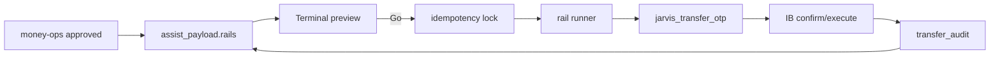

# 資金送金アシスト — 点検者向け仕様（2026-08-14）

**宛先**: アプリ品質点検者  
**顧客意図（要約）**: money-ops 承認後、Jarvis が各レールを開き、取得可能な OTP は自動入力し確認〜実行まで進める。ユーザーはレール Go・アプリ専用 OTP・生体／パスキーのみ。無人の無確認記帳はしない。

**本番 URL**
- KURASHIFT: https://jarvis-trade-desk.vercel.app/money-ops
- Jarvis ダッシュボード（気づき）: https://jarvis-dashboard-amber.vercel.app/

**実務者設計**: [`docs/KURASHIFT_送金アシスト_実務者設計_20260814.md`](KURASHIFT_送金アシスト_実務者設計_20260814.md)  
**親機能（引落バッファ）**: [`docs/KURASHIFT_カード引落支払い_点検者向け仕様_20260814.md`](KURASHIFT_カード引落支払い_点検者向け仕様_20260814.md)（R6'）

---

## 1. 顧客要件（Must）

| ID | 要件 | 受け入れの見え方 |
|---|---|---|
| R6' | アシスト実行可。承認＝計画合意のみ。取得可能 OTP は Jarvis。アプリ OTP・生体はユーザー。無人無確認記帳なし | 承認だけでは資金が動かない。Go＋照合 OK のときだけ実行クリック可 |
| T1 | 宛先ホワイトリストのみ | ホワイトリスト外への自動入力が無い |
| T2 | 金額の三重一致 | plan／CLI／確認画面 DOM が一致しないと実行しない |
| T3 | OTP: gmail／sms は自動取得入力。値はログに残さない。app はユーザー | `otp_channel` どおり。監査は `otp_obtained` bool のみ |
| T4 | 本番は Terminal.app | 運用コマンドに Terminal 手順がある |
| T5 | `rails[]` が money-ops で見える | 各レールの status／otp_channel／amount が表示される |
| T6 | 監査ログ・秘密なし | `transfer_audit` に PW／OTP／口座全文が無い |
| T7 | failed 時は資金状態を明示 | 失敗理由と「資金は動いていない／不明」が分かる |
| T8 | 無料枠・時間帯超過で止め、有料化しない | 超過時は起動拒否 |
| T9 | idempotency ロック | 同一キーの二重 `running` が無い |
| T10 | done は証跡必須 | 完了画面／出金減／着金のいずれ＋監査 |
| T11 | 出金元残高 − keep ≥ amount | 不足なら起動停止 |
| T12 | OTP／口座全文をチャットに出さない | 失敗時も「取得失敗」のみ |

---

## 2. OTP チャネル（正）

| `otp_channel` | 取得 | 入力 | 例 |
|---|---|---|---|
| `gmail_api` | Gmail API | Jarvis | メール OTP 行 |
| `sms_messages` | Mac Messages `chat.db` | Jarvis | SMS OTP 行 |
| `app_onetime_pw` | 不可 | **ユーザー** | 東海労金（現行） |
| `passkey_or_bio` | 不可 | **ユーザー** | 一部アプリ |
| `none` | — | — | 追加認証なし（稀） |

---

## 3. 状態機械（レール単位）

| status | 意味 |
|---|---|
| `pending` / `previewed` | 未着手／プレビュー済 |
| `running` | ブラウザ操作中 |
| `otp_fetch` / `otp_submit` | OTP 取得・入力中（Jarvis） |
| `waiting_user` | アプリ OTP／生体のみ |
| `executing_click` | 実行ボタン押下 |
| `verifying` | 証跡待ち |
| `done` / `failed` | 完了／失敗 |

`done` の証跡（1つ以上必須）: 完了画面テキスト／出金元残高の amount 以上の減少／宛先着金。

---

## 4. アーキテクチャ（点検地図）

| 層 | 正本 |
|---|---|
| レール定義 | `config/kurashift_transfer_rails.yaml` |
| OTP | `scripts/jarvis_transfer_otp.py` |
| ロック／監査 | `scripts/jarvis_transfer_audit.py` |
| UI | `apps/trade-desk` money-ops／`cardSettlementBuffer.ts` |
| テンプレ IB | `215_kamiooya/C1_cursor/browser_automation/`（東海労金） |

---

## 5. 点検チェックリスト

- [x] R6' が docs／UI（承認ダイアログ・プレイブック文言）に反映
- [x] `otp_channel` がレール設定にあり、gmail／sms 経路が動く（モック可）
- [x] 承認だけで記帳されない
- [x] 三重金額一致・残高ガード・ロックがコードにある
- [x] OTP 値がログ／チャットに出ない
- [x] 東海労金は app OTP で `waiting_user` になる
- [x] Terminal.app 手順が運用コマンドにある
- [x] `transfer_audit` が gitignore
- [x] Wave2: エアウォレット初回着金ゲート＋SMS OTP 自動（proven 後に本額）
- [x] Wave3: 滋賀／京都 `otp_channel` 調査結果を YAML に反映（現行=app／自動配線済み）

---

## 6. 既知の制約（バグ扱いしない）

- 東海労金ワンタイム PW はアプリ専用 → ユーザー一手が残る（技術限界）
- 滋賀・京都 IB 振込確認も現行は `app_onetime_pw`（調査 2026-08-15）。メール／SMS 切替時は YAML のみ変更
- Cursor 統合ターミナルの Enter 自動消費 → 本番は Terminal.app
- エアウォレットは初回着金証明ゲートがある（Wave 2）。proven 前の本額 Go は拒否
- PayPay 等 blocked レールは起動禁止
