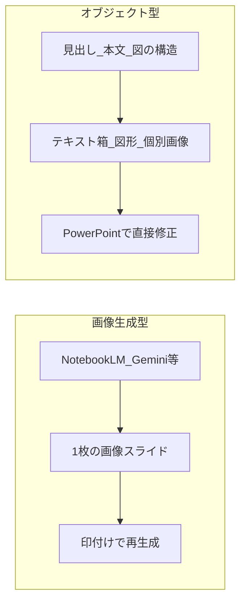
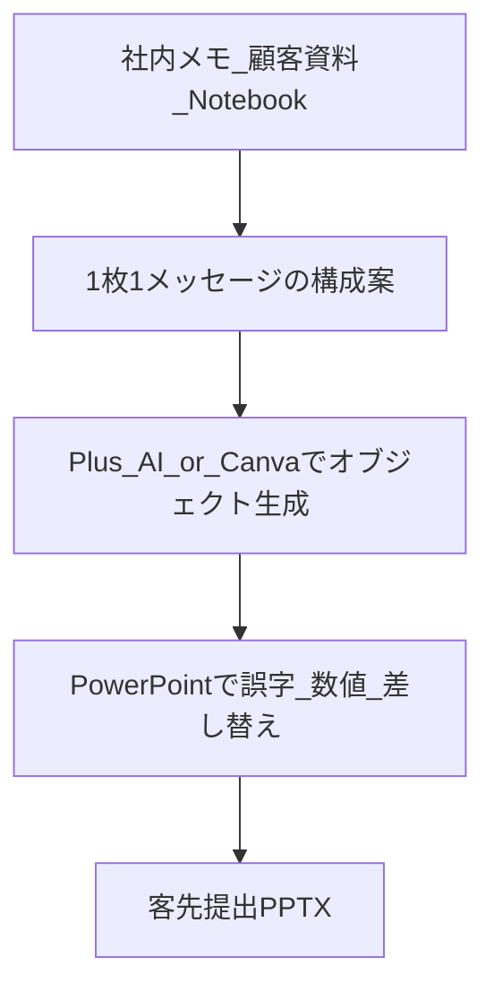

# AI説明資料：後から直しやすい作り方

**目的**: NotebookLM／Gemini／ChatGPT で作った説明資料の「誤字・言い回し」を、印付け再生成に頼らず直せるようにする。  
**想定読者**: 客先提出・社内説明のスライドを AI で下書きする人（Jarvis／本人）。  
**関連**: [Plus AI 導入手順](Plus_AI_導入手順.md) · [プロンプト雛形](プロンプト雛形_ブランドテンプレ前提.md) · [NotebookLM→編集可能PPTX変換](NotebookLM_編集可能PPTX変換手順.md)

---

## 1. 結論（先に）

ご懸念はツールの使い方不足ではなく、**NotebookLM／Gemini／ChatGPT のスライド生成が「デザイン済み画像」として描画するアーキテクチャ**に起因します。NotebookLM の「Download PowerPoint」も、中身は **PNG/JPEG を PPTX に包んだもの**で、テキストボックスとしてはクリック編集できません。

「画像に印をつけて AI に直させる」以外で楽にするには、次のどちらか（または併用）が必要です。

1. **最初から編集可能なオブジェクト（テキスト／図形／個別画像）として作る**
2. **画像スライドを後から構造化 PPTX に再構築する**（変換ツール）

お客さま提出品質を重視するなら、**本番は「オブジェクト型」、NotebookLM は「構成・トーン・下書き」に役割を限定する**のが最も安定します。

「ワンスライド・ワンメッセージ」＋イラストトーン指定は **内容設計として残す**。捨てるのは **最終成果物を画像のまま納品物にすること**だけです。

---

## 2. 問題の分解

| 軸 | 画像生成型（現状の NotebookLM 等） | オブジェクト型（推奨の本番） |
|----|-----------------------------------|------------------------------|
| 見た目の完成度 | 高い（イラスト込み） | テンプレ／ツール次第（初期はやや控えめ） |
| 誤字1文字の修正 | AI 再生成か画像編集 | クリックして直す |
| 要素の差し替え | ほぼ不可 | 可能 |
| PPTX の意味 | 「見た目の入れ物」 | 「編集可能な正本」 |

---

## 3. 解決策の3系統

### 系統A：ネイティブ編集可能な AI（おすすめ本線）

PowerPoint／Google スライドの **中で**生成するため、最初からテキスト箱・図形として残る。

| ツール | 特徴 | PPTX編集性 | 向き |
|--------|------|------------|------|
| [Plus AI](https://plusai.com/) | PPT／Slides アドイン。ネイティブ生成 | 最高（エクスポート不要） | 客先提出・ブランドテンプレあり |
| Microsoft Copilot（PowerPoint） | M365 内で生成 | 高いが注意：Insert で**画像埋め込み**になる場合あり | 既に Copilot 契約がある場合 |
| ChatGPT for PowerPoint | PPT 内で下書き・編集 | ネイティブ方向（プラン要確認） | ChatGPT 課金＋PPT 運用 |
| [Beautiful.ai](https://www.beautiful.ai/) | スマートテンプレでレイアウト固定 | 高い | デザイン一貫性が最優先 |
| [SlideSpeak](https://slidespeak.co/) 等 | 文書→デッキ、クリーンな PPTX | 高い | 資料起こし→提出用 PPT |

**使い方の型（NotebookLM の踏襲）** — 詳細は [Plus AI 導入手順](Plus_AI_導入手順.md) と [プロンプト雛形](プロンプト雛形_ブランドテンプレ前提.md)。

1. NotebookLM／Gemini で「1枚1メッセージ」の **アウトライン＋トーン指示**だけ作る（画像デッキは任意）
2. アウトラインを Plus AI（または Copilot）に渡し、**既存ブランド PPT テンプレ**上に生成
3. イラストは「スライド全体」ではなく、**1枠の画像プレースホルダ**として差し込み
4. 誤字・数値・言い回しは PowerPoint で直接修正

### 系統B：デザイン特化 → あとで変換（現状維持の延長）

NotebookLM の見た目を活かしつつ、後工程で編集可能にする。手順は [NotebookLM→編集可能PPTX変換](NotebookLM_編集可能PPTX変換手順.md)。

| 手段 | 役割 |
|------|------|
| NotebookLM の **Revise（スライド単位修正）** | 画像のまま部分再生成（印付けより楽） |
| Alai / PreciseDeck / Codia NoteSlide / WPS AI 等 | PDF／画像 → **本物のテキスト箱付き PPTX** |

**向き**: NotebookLM のビジュアルを捨てたくない期間のつなぎ。  
**注意**: OCR・再レイアウトでフォントずれが残る。変換は **保険**であり、本線にすると確認工数が増えやすい。

### 系統C：構造化パイプライン（質と編集性の両立が最も強い）

1. **構成**: 「タイトル／ワンメッセージ／根拠3点／ビジュアル指示」を表にする（[プロンプト雛形](プロンプト雛形_ブランドテンプレ前提.md)）
2. **骨組み**: 自社マスター PPT に AI がテキストだけ流し込む（Plus AI）
3. **装飾**: イラストは別生成し、**画像オブジェクトとして配置**（背景ごと焼き付けない）
4. **校正**: 人間（または別 LLM）がテキストだけ校正 → PPT 上で確定

**いけともゆるキャラ向けの本線（2026-07-27 PoC 済み）**: NotebookLM で **文字なし／余白あり** のゆるイラストを出し、PowerPoint で画像を背面・**テキスト箱を前面**に載せる。誤字は箱だけ直す。DALL-E 等で画像に文字を焼き込まない。手順の正本は [運用_ゆるイラスト画像＋PPTテキスト重ね.md](運用_ゆるイラスト画像＋PPTテキスト重ね.md)。

---

## 4. 推奨ワークフロー（本番）

**NotebookLM＝構成・トーン設計 → Plus AI（または Canva）＝編集可能スライド生成 → PowerPoint で最終修正**

| 優先 | 第一候補 | 第二候補 |
|------|----------|----------|
| 直しやすさ最優先・PPT 提出 | **Plus AI** | Copilot（画像 Insert に注意） |
| 見た目最優先・リンク共有可 | **Gamma** | Beautiful.ai |
| NotebookLM 品質を残す | NotebookLM → **Alai／PreciseDeck 変換** | WPS／NoteSlide |
| コスト抑えめ・Google 中心 | Canva / Gemini in Slides | Plus AI（Slides） |
| 文書・議事録から起こす | SlideSpeak / Plus AI | Copilot（Word→PPT） |

### やめる／減らすこと

- 客先提出物の正本を「画像スライド」にしない
- Copilot／生成 AI の「Insert＝画像貼り付け」を無批判に使わない
- 「全部をイラスト込みで1枚生成」→ 誤字のたびに全体再生成、というループ

### 質を落とさないコツ

- ブランドマスター（色・フォント・余白・ロゴ）を先に固定する
- イラストは「全面背景」ではなく「右1/3の差し替え画像」にする
- ワンスライド・ワンメッセージを守り、情報密度を上げすぎない
- 事実・数字はソースノートからコピーし、AI に暗記させない（NotebookLM の強み）

---

## 5. まず試す実験（1〜2時間）

同じ「ワンスライド・ワンメッセージ」原稿を3経路で作り、**誤字1箇所を直す時間**で比較する。

1. NotebookLM → 現行どおり（印付け修正）
2. 同原稿 → Plus AI でネイティブ生成 → PowerPoint で1文字修正
3. NotebookLM PDF → Alai 等で変換 → PowerPoint で1文字修正

評価軸は「初稿の美しさ」だけでなく **「誤り修正に何分かかるか」「客先フォント／ロゴが入るか」**。

---

## 6. DX互助会スライド手順との関係

- **公開 HTML・ゆるイラスト中心**（DX勉強会など）: 従来どおり [`.cursor/commands/dx-slides-from-outline.md`](../../.cursor/commands/dx-slides-from-outline.md) ＋ NotebookLM Studio → PNG → `*_cute.html`
- **客先提出の編集可能 PPTX**: **本ガイドの系統A（Plus AI）** を正とする。NotebookLM は構成・トーンまで

---

## 7. まとめ

- NotebookLM の PPTX は本質的に画像である
- 「要素ごとに直す」に近い正解は、**最初からオブジェクト型**（Plus AI 等）か **再構築変換**
- **ワンメッセージ設計とトーン指定は残し、最終レンダリングだけオブジェクト型に切り替える**のが最適解
- 客先提出では **構成 AI × テンプレ PPT × 差し替えイラスト** が結果的に速く・正確
