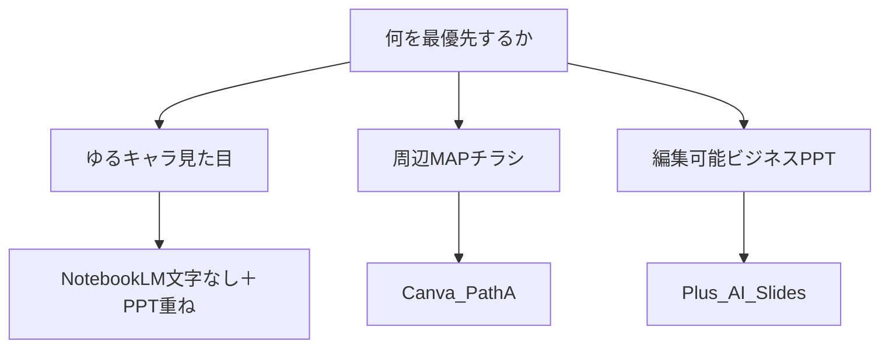

# Plus AI 加入価値まとめ（検証要約）

要約日: 2026-07-27  
対象: トライアル（m19m）継続課金の要否  
根拠: Drive `200_NoteBookLM/99_PlusAI検証_20260727/` 一式＋周辺MAP／ゆるイラスト運用

---

## 1. 結論（先に）

**いまの本業だけを見るなら、Plus AI への有料加入は推奨しない。**

**解約済み（2026-07-27）**: Stripe 課金ポータルで Basic トライアルをキャンセル済み。  
無料トライアルは **2026-08-03 まで利用可** → 以降は自動課金されず利用不可。理由選択「不要になった」。

| 分岐 | 判断 |
|------|------|
| 成果物の中心が **いけともゆるキャラ** と **周辺MAPチラシ（Canva）** | **加入不要** |
| 毎月、客先／社内向けに **ビジネス寄りの編集可能 PPT** を何度も作る | そのときだけ加入を再検討 |

Plus AI は「直しやすいビジネスPPT」には効くが、いまの本命デザイン（ゆる一体）と本命チラシ（実地図＋吹き出し）には効かない——検証でその線引きが確定した。

---

## 2. 今のやり方（現状ポートフォリオ）

検証後の役割分担は次のとおり。Plus を足さなくても回る。

| 成果物 | 今の本線 | 誤字・直し方 |
|--------|----------|--------------|
| ゆるキャラ説明スライド | NotebookLM（構成・トーン）→ **文字なしイラスト** → PPTでテキスト箱重ね | テキスト箱だけ直す |
| 周辺MAPチラシ | Raimo（## H）→ `shuhen-map`（実地図）→ **Canva Path A** | Canva上で直す |
| 客先・社内の一般説明PPT | 手組み、または NotebookLM 画像（問題あり） | 画像のままは印付け再生成になりがち |

関連正本:

- [運用_ゆるイラスト画像＋PPTテキスト重ね.md](運用_ゆるイラスト画像＋PPTテキスト重ね.md)
- [検証_周辺MAP_地図下地AI配置.md](検証_周辺MAP_地図下地AI配置.md)
- [AI説明資料_後から直しやすい作り方.md](AI説明資料_後から直しやすい作り方.md)（系統A/B/C）
- AI×周辺MAP: `15_Canva手順_印刷用仕上げ_PathA.md` / `10_フェーズAtoC_ハイブリッド方針.md`

---

## 3. Plus AI で広がる幅（できることの拡張）

ここだけが、今のやり方に対する **明確なプラス**。

| 広がること | 内容 | 条件 |
|------------|------|------|
| **Slides（Fully editable）生成** | アウトラインから、本物のテキスト箱・図形の PPTX が出る。誤字はクリックで直せる | Images を選ばない |
| **NotebookLM画像デッキの再構築** | 文言を OCR／アウトライン化し、編集可能デッキに作り直せる | **見た目はビジネス／ノート風に変わる**（ゆる一体は消える） |
| PPT／Google スライド内アドイン | アプリを行ったり来たりせず、提出用オブジェクトをその場で足せる | ブランドテンプレがあるとさらに効く |

向いている依頼の例:

- 「構成案がある。客先に渡すので誤字を自分で直せる PPT がほしい」
- 「NotebookLM の説明資料を、見た目は捨てて編集可能版にしたい」
- DX／社内向けの、ゆるキャラ必須ではない進捗・方針デッキ

---

## 4. 広がらない／やらないこと

| やりたいこと | Plus AI の現実 | 代わり |
|--------------|----------------|--------|
| NotebookLM と同じゆるキャラ一体型 ＋ 文字クリック編集 | **ほぼ不可**（Slides＝編集可だがゆるにならない／Images＝焼き付き） | 文字なし絵＋PPTテキスト重ね |
| 実地図の上に吹き出しを AI 配置 → PPT編集 | **不可**（配置にならない） | Canva Path A |
| Images モードで仕上げ | 全面 JPEG。NotebookLM と同じ直しにくさ | 使わない |
| 「魔法で画像PPTXの文字を解除」 | しない。中身を **作り直す** だけ | アウトライン再投入 |

---

## 5. 検証リンク（証拠）

Drive: `200_NoteBookLM/99_PlusAI検証_20260727/`

| フォルダ／ファイル | わかったこと |
|--------------------|--------------|
| `00_検証結果.md` | Slides＝編集可／Images＝全面画像 |
| `04_NeighborhoodMap_…` | NotebookLM画像PPTXはそのまま直せない。Slides再構築で編集可（見た目変化） |
| `05_ゆるキャラテイスト検証` | ゆる一体＋編集性は Plus 単独ではトレードオフ |
| `06_画像下テキスト重ねPoC` | PPT手置きのテキスト重ねは成功（Plus不要） |
| `07_周辺MAP_地図下地AI配置PoC` | 地図上AI配置は失敗。Canva本線維持 |

N1側の短い正本: [検証_周辺MAP_地図下地AI配置.md](検証_周辺MAP_地図下地AI配置.md) / [運用_ゆるイラスト画像＋PPTテキスト重ね.md](運用_ゆるイラスト画像＋PPTテキスト重ね.md) / [Plus_AI_導入手順.md](Plus_AI_導入手順.md)

---

## 6. 加入判断チェック（自分用）

次を満たすときだけ、有料継続を考える。

1. 月に **複数回**、「ビジネス寄りの編集可能 PPT」が必要
2. そのとき **ゆるキャラ一体型は不要**（または別経路で絵だけ足す）
3. Canva／手組み／文字なし＋PPT重ねでは間に合わない

いまの比重（ゆる説明・周辺MAP）が大きいなら、チェックは満たさない → **解約でよい**。

将来、客先提出の「直しやすいPPT」が主戦場になったら、この要約を読み返して再判断する。

---

## 7. 解約記録

| 項目 | 内容 |
|------|------|
| 実施日 | 2026-07-27（8/2 を待たず実施） |
| 結果 | キャンセル済み。8/3 以降の自動課金なし |
| ポータル | https://app.plusdocs.com/billing-portal |
| 注意 | PowerPoint アドイン削除は課金停止とは別（今回はポータルで解約済み） |
| カレンダー | admin「Plus AI トライアル解約確認」は不要になったため削除可 |

---

## 8. 一言で社内／いけともに言うなら

「AIが絵を描き、PowerPointやCanvaが文字を持つ。Plus AIは“文字を最初から編集可能にする箱”には強いが、ゆるキャラ一体や実地図チラシの置き換えにはならない。」
