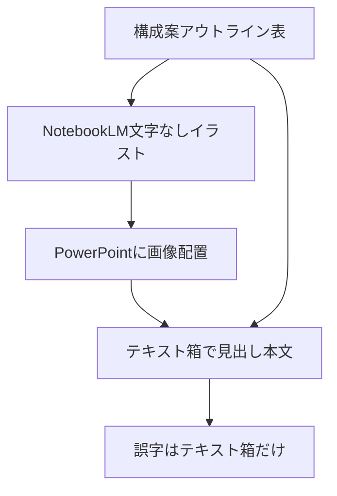

# 運用：ゆるイラスト画像 ＋ PowerPoint テキスト重ね

**目的**: いけともゆるキャラ（cute-illustration）の見た目を保ちつつ、誤字・言い回しを PowerPoint で直接直せる最終成果物にする。  
**親ガイド**: [AI説明資料_後から直しやすい作り方.md](AI説明資料_後から直しやすい作り方.md)（系統Cの具体化）  
**スタイル**: [NotebookLM_マスタースタイル_cute-illustration.md](NotebookLM_マスタースタイル_cute-illustration.md)  
**プロンプト**: [プロンプト雛形_ブランドテンプレ前提.md](プロンプト雛形_ブランドテンプレ前提.md)  
**PoC**: Drive `200_NoteBookLM/99_PlusAI検証_20260727/06_画像下テキスト重ねPoC/`（2026-07-27 成功）

---

## 1. 結論

| やり方 | ゆるキャラ | 文字の後編集 |
|--------|------------|--------------|
| NotebookLM 完成画像のまま | ○ | × |
| Plus AI Slides だけで再現 | ×（検証済み） | ○ |
| **画像（文字なし）＋ PPT テキスト箱** | ○ | ○（推奨本線） |

**PowerPoint に貼った画像の上に、テキストボックスで文字を載せられる（標準機能・PoC済み）。**

DALL-E / v0 などで画像に文字を焼き込むのは禁止（編集性が消える）。LLM は「コピペ用の文言案」まで。載せる場所は常に PPT のテキスト箱。

---

## 2. フロー

```text
① アウトライン表（見出し・ワンメッセージ・箇条書き）＝文言の正本
② NotebookLM Studio：文字なし／タイトル余白ありのゆるイラスト
③ PowerPoint：画像を背面に全面配置 → 余白にテキスト箱・マーカー図形
④ 誤字・数値はテキスト箱だけ直す（画像は再生成しない）
```



| 役割 | 担当 |
|------|------|
| 文言の正本 | アウトライン表 |
| 見た目・ゆるキャラ | NotebookLM（文字を画像に入れない） |
| 最終提出物 | PowerPoint（画像下層＋テキスト上層） |
| 文言の下書き補助 | Cursor / ChatGPT（貼るだけ） |

---

## 3. レイアウト方針

### 本線 A：全面イラスト ＋ 余白ゾーンにテキスト重ね

1. NotebookLM に「タイトル帯・本文エリアは空白。文字・擬似文字禁止」と指示
2. 出力画像を PPT に全面配置（背面）
3. 余白に見出し・本文のテキスト箱。黄マーカー帯は **図形**（編集可能）

### 保険 B：右1/3イラスト・左テキスト

余白が空かない・文字が画像に混ざるときに切替。編集性は高いが一体感は弱い。  
プロンプト雛形 §3（枠用イラスト）を使う。

---

## 4. NotebookLM 用プロンプト（文字なし・余白あり）

Studio／チャットにそのまま使える。

```
【用途】PowerPoint の下地イラスト。スライド全体サイズで1枚。
【スタイル】マスタースタイル（cute-illustration）厳守。白背景・水彩風ゆるイラスト・細いペン線・2〜3頭身。
【レイアウト】
- 上部中央〜左に「タイトル用の大きな空白帯」（何も描かない）
- その下に「本文・箇条書き用の空白」
- キャラ・地図・アイコンは右下または余白の外に寄せる
【禁止】画像内に文字・数字・ロゴ・吹き出しの文言・Lorem・仮文字を一切入れない。
【内容のビジュアル指示】（アウトラインのビジュアル指示を1文）
【出力】文字なしのイラスト1枚のみ。
```

ブレたとき（文字が入った／余白がない）:

```
文字・仮文字をすべて消して、タイトル用と本文用の空白を広く取り直してください。イラストは端に寄せる。
```

---

## 5. PowerPoint 配置チェックリスト

- [ ] 画像は1枚・背面（「最背面へ移動」）
- [ ] 見出し・本文はすべてテキスト箱（クリックでカーソルが出る）
- [ ] 強調帯は画像ではなく図形
- [ ] アウトライン表と文言が一致
- [ ] 誤字1文字を直して保存できることを提出前に確認

### コピペ用の文言

アウトライン表から見出し／ワンメッセージ／箇条書きをコピーし、テキスト箱に貼る。  
LLM に「提出用の短い日本語に整えて」と頼む場合も、**出力はテキストのみ**（画像生成しない）。

---

## 6. やらないこと

- NotebookLM の文字入り完成スライドを提出正本にする
- DALL-E / v0 / Plus Images で文字ごと画像化する
- Plus AI にゆるキャラ一体再現を期待する
- 誤字のたびにイラスト全体を再生成する

---

## 7. いけとも／社内への一言

「AIが絵を描き、PowerPointが文字を持つ」分業。  
ゆるキャラは維持したまま、誤字直しはテキスト箱だけ。
