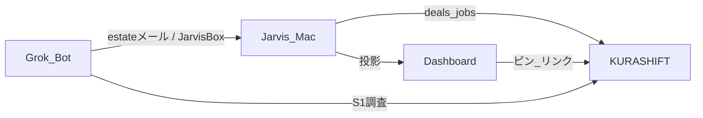
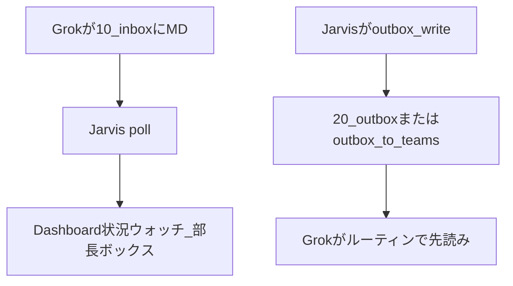

# 連動確認チェックリスト（Dashboard × KURASHIFT × Grok）

更新: 2026-08-30  
看板: Notion **AI・Raimo**（タイトル `[T-xx]` / `[L-xx]`）  
残り棚正本: [`docs/残り棚_アプリ受け入れ_20260830.md`](残り棚_アプリ受け入れ_20260830.md)

## いまやること（実感用）

同時に進めるのは **Wave 1（T-02〜T-05）だけ**。次の通しは **T-02 本日分 9:00**。

1. このファイルと Notion `[T-02]` を開く
2. 下の「T-02 手順」を上から触る
3. 使える → Jarvis に `T-02 意図OK`／違う → `T-02 変更要望: …`
4. Jarvis がコメント「タスク完了したよ」を付けてから完了 → 看板から消える

## 完了の定義（3状態）

| 状態 | 意味 | Notion |
|---|---|---|
| 実装済 | コード・画面・Bot がある | 進行中 |
| 手元確認済 | 松野が T を一度触った | 進行中（メモ） |
| 意図OK | 自分の運用として使える | 定型コメント後に完了 → 看板非表示 |

- T: 松野の意図OKがトリガ
- L: Jarvis とホークの両方の完了判断
- 定型: `タスク完了したよ（Jarvis・松野意図OK・T-03）`
- 戻す: `T-03 戻して`

変更要望: `T-03 変更要望: 欲しいのは…`

---

## Wave 1 — 連動の本線（WIP）

本番 Dashboard: https://jarvis-dashboard-amber.vercel.app/  
本番 KURASHIFT: https://jarvis-trade-desk.vercel.app/  
看板: https://app.notion.com/p/394f6bbe5a76800d9cefc97abea7941e?v=394f6bbe5a7680ac9e6f000cb554aa73  
ダッシュレーン: https://jarvis-dashboard-amber.vercel.app/ai-raimo

### T-01 JarvisBox 往復（最初の通し） — **意図OK 2026-08-30**

システム: Grok / Dashboard

やること:

1. admin Drive `【with Grok bot】/10_inbox_from_grok/` に未処理 MD があるか見る（試験に 2026-08-29 分を使ってよい）
2. ダッシュボード `/situation` に「部長ボックス」相当が出るか
3. 必要なら Jarvis に「re 向け outbox に試験メモ」と依頼（対外送信ではない）
4. Grok 不動産 Daily の Jarvisボックス先読みでそのメモが見えるか（次のルーティンまで待ってよい）

合格: コピペなしで、箱を介して往復している実感がある。状況ウォッチの部長ボックスは **見出し・箇条書きで読める**（1行に潰れていない）。

### T-02 本日分 9:00

システム: Grok / Dashboard / KURASHIFT

1. 不動産Daily（またはホーク DM）で「本日分」
2. estate に `[Grok部長] 日報` が来る
3. Jarvis 取込後、ウォッチや `/realestate/vendors` に変化がある

### T-03 S1 → deals

システム: Grok / KURASHIFT  
UI: https://jarvis-trade-desk.vercel.app/realestate/deals

1. `[Grok調査]` が estate に来る（または既存の Grok 行 deal を開く）
2. 方式・土地値・HZ・聞く が見える
3. deal 詳細の証憑リンクが開く
4. 取込後、その Gmail が既読
5. PDF 中身の自動読取は **L-07**（人が開く）

### T-04 deals 判断（送信なし）

1. 確認した / 対象外
2. 問合せプレビュー（From=estate）まで。実送信は T-05

### T-05 Tier1 実送信 ＝ L-06

UI: https://jarvis-trade-desk.vercel.app/realestate/deals?tab=candidates&inquiry=ready  
手順: [`docs/KURASHIFT_Tier1_問合せ_初級者手順.md`](KURASHIFT_Tier1_問合せ_初級者手順.md)

まず1件（確認後送信）。できれば5件＋poll。既存残 `tier1-five-sends`。

---

## Wave 2 — Wave 1 のあと

| ID | 内容 | 開く |
|---|---|---|
| T-06 | 仲介返信 18:00（S5→S3、愛知なら S7 準備。銀行送信なし） | Grok チャンネル |
| T-07 | ホーム＋状況ウォッチ＋引落ピン → money-ops | [/](https://jarvis-dashboard-amber.vercel.app/) [/situation](https://jarvis-dashboard-amber.vercel.app/situation) [/money-ops](https://jarvis-trade-desk.vercel.app/money-ops) |
| T-08 | パートナー見直し・確認後送信モーダル（実送信は任意） | [/partner](https://jarvis-dashboard-amber.vercel.app/partner) |
| T-09 | グルコン＋Grok材料（L-01 / L-04） | [/glucon](https://jarvis-dashboard-amber.vercel.app/glucon) [/glucon/materials](https://jarvis-dashboard-amber.vercel.app/glucon/materials) |
| T-10 | Zaim と課金 | [/zaim](https://jarvis-dashboard-amber.vercel.app/zaim) [/billing](https://jarvis-dashboard-amber.vercel.app/billing) |

---

## Wave 3 — 週次・周辺

| ID | 内容 | 開く |
|---|---|---|
| T-11 | ホーク週次＋家族コーチ（L-02） | 日曜 20:00 / 21:00 |
| T-12 | Tier2 本番レビュー（目安 2026-09-06）。Tier3 は同意まで触らない | [/realestate/deals/tier2](https://jarvis-trade-desk.vercel.app/realestate/deals/tier2) |
| T-13 | 天気お知らせ | ch「天気お知らせ」 |
| T-14 | lifeplan / MQ / lenders（L-05） | [/lifeplan](https://jarvis-trade-desk.vercel.app/lifeplan) [/mq](https://jarvis-trade-desk.vercel.app/mq) [/realestate/lenders](https://jarvis-trade-desk.vercel.app/realestate/lenders) |
| T-15 | 周辺一括（digest 1レーン、ETC、Vポイント、Quiet Edge、資料、オプチャ） | ダッシュ各ページ |

---

## 役割

| 誰 | やること |
|---|---|
| 松野 | T を1件。意図OK / 変更要望。週1で棚の捨て・延期 |
| Jarvis | 実装・棚更新。完了は定型コメントのあとだけ |
| ホーク | 未閉じT / 来週の L 最大3 / 捨て候補。done は定型コメント |

新規アプリ機能は、Wave 1 が意図OK（または明示スキップ）になるまで原則増やさない。
