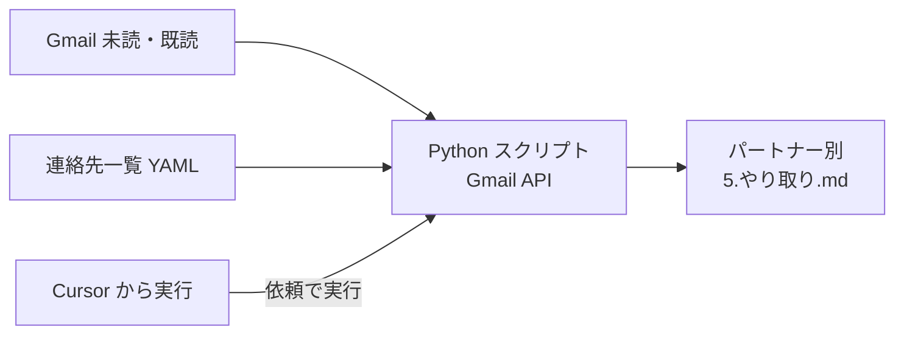
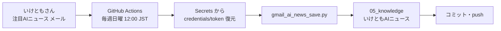
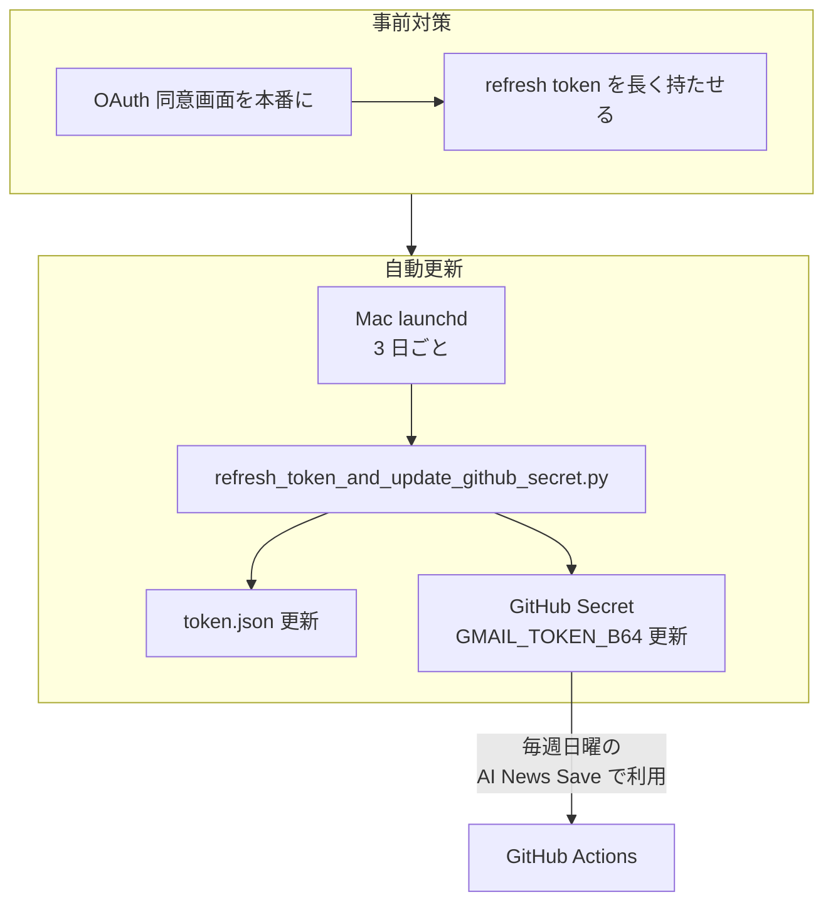
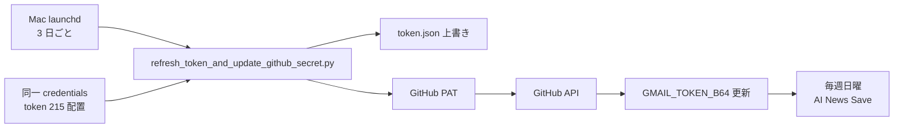
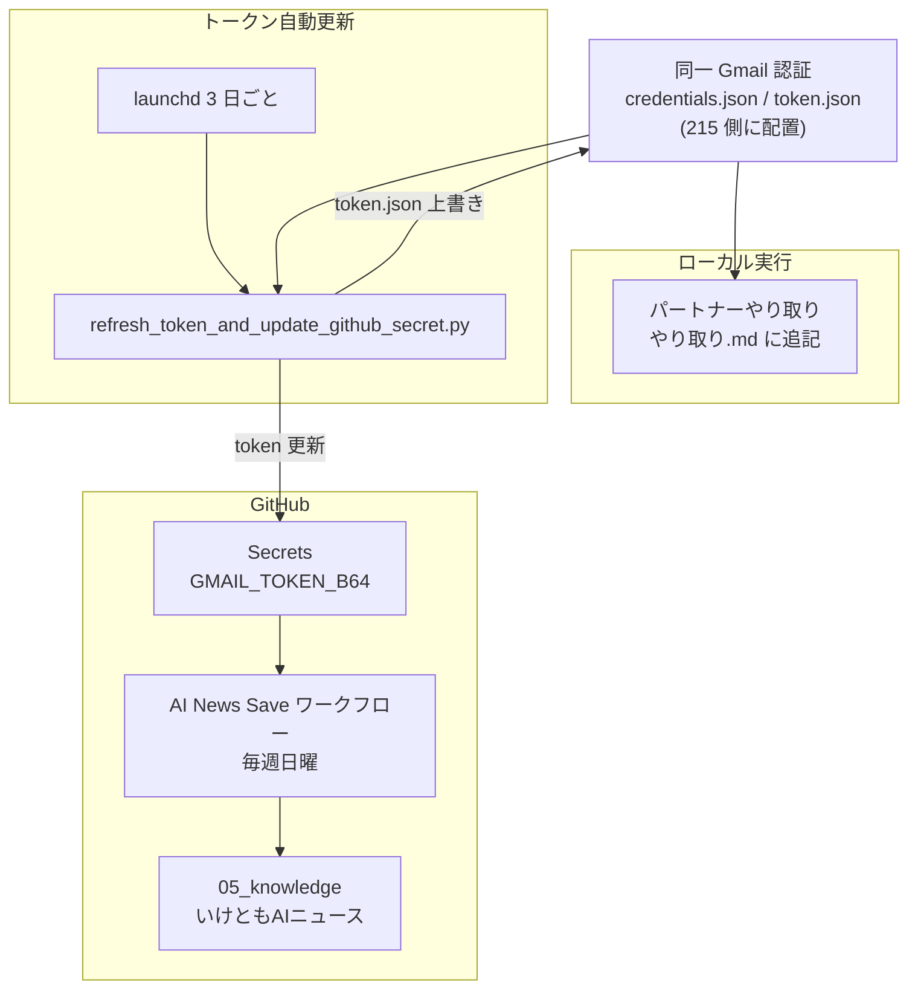

# DX互助会メンバー向け「Gmail API 活用の取り組み」紹介

**スライド形式で見る**: 同じフォルダの **`DX互助会向け_GmailAPI活用の取り組み紹介.html`** をブラウザで開くと、スライド形式で表示されます（上下スクロールでスライドを切り替え）。

このドキュメントでは、Gmail API を活用した次の 3 つの取り組みを、図解とステップでまとめています。

1. **カーソルで Gmail API を活用し、パートナーとのメールやり取りをやりやすくした仕組み**
2. **Gmail のニュースメール（いけともAIニュース）を、定期的に DX 互助会のナレッジに入れる仕組み**
   - (a) Gmail API と GitHub で定期自動実行にした点
   - (b) GitHub の仕組みを活かして Gmail トークン切れが起きないようにした対策
3. **上記で使う「同じ Gmail 認証」の全体像**

---

## 1. パートナーとのメールやり取りをやりやすくする仕組み

Cursor（AI 付きエディタ）と Gmail API を組み合わせ、パートナー社からのメールを取得し、連絡先一覧と照合して、パートナー別フォルダの「やり取り」メモに自動で追記する仕組みです。**同じ Gmail 認証（credentials / token）を、後述の「いけともAIニュース」とも共有**しています。

### フロー図

### やったこと・ステップ（概要）

- **Google Cloud** でプロジェクト作成、**Gmail API** を有効化し、OAuth 認証情報（`credentials.json`）を取得
- **連絡先一覧（YAML）** にパートナー社のメールアドレスを登録
- 初回のみブラウザで Google にログインし、`token.json` を取得
- **Cursor のルール**で「パートナーからのメールを確認して」と依頼すると、スクリプト（`gmail_to_yoritoori.py` 等）が実行され、該当パートナーフォルダの `5.やり取り.md` にメール内容が追記される
- パートナー用のスクリプトやフォルダ構造は別のワークスペース（215）にあり、詳細は別途セットアップ手順を参照

---

## 2. Gmail のニュースメールを定期的にナレッジに入れる仕組み（いけともAIニュース）

いけともさんから届く「注目AIニュース」メールを、Gmail API で取得し、DX 互助会のナレッジ（`05_knowledge/いけともAIニュース/`）に Markdown などで保存する仕組みです。

### (a) Gmail API ＋ GitHub で定期自動実行にした点

GitHub Actions を使い、**毎週日曜 12:00（JST）** に自動でメール取得・保存・コミットまで行うようにしました。

#### フロー図

#### やったこと・ステップ（概要）

- Gmail で「注目AIニュース」を、**特定差出人**や**転送ルール**で受信できるように設定
- `credentials.json` と `token.json` を **Base64 化**し、GitHub リポジトリの **Secrets**（`GMAIL_CREDENTIALS_B64`、`GMAIL_TOKEN_B64`）に登録
- **`.github/workflows/ai-news-save.yml`** で「毎週日曜」と「手動実行」を定義
- ワークフロー内で Python 環境構築 → Secrets から認証ファイル復元 → `gmail_ai_news_save.py` 実行 → 保存先へコミット・push

**参照**: [いけともAIニュース保存_セットアップ手順.md](いけともAIニュース保存_セットアップ手順.md)、[いけともAIニュース_転送ルールの作り方.md](いけともAIニュース_転送ルールの作り方.md)

---

### (b) GitHub の仕組みを活かした Gmail トークン切れ対策

GitHub Actions はリポジトリの **Secrets** に保存した `GMAIL_TOKEN_B64` で Gmail にアクセスします。このトークンは時間が経つと期限切れになるため、「**事前対策**」と「**自動更新**」の 2 段構えで、トークン切れによるエラーを避けるようにしました。

#### 対策の全体像

#### フロー図（自動更新の流れ）

#### やったこと・ステップ（概要）

- **Google OAuth 同意画面**を「本番」にし、refresh token の有効期限を延ばす
- **スクリプト**で Gmail token を更新し、同じ内容を **GitHub の `GMAIL_TOKEN_B64`** に API で反映
- **GitHub の Fine-grained PAT**（Secrets: Read and write）を発行し、スクリプトから環境変数などで利用
- **launchd（plist）** で 3 日ごとに上記スクリプトを実行するよう設定

**参照**: [token自動更新_セットアップ手順.md](token自動更新_セットアップ手順.md)

---

## 3. 全体の関係（同じ Gmail 認証の使われ方）

パートナーやり取り・いけともAIニュース・トークン自動更新では、**同一の Gmail 認証**（同じ Google アカウントの `credentials.json` / `token.json`）を使っています。どこでどう使われているかを 1 枚で整理した図です。

- **パートナーやり取り**: 同じ token をローカルで参照し、やり取り.md に追記
- **いけともAIニュース**: GitHub Secrets に Base64 化した token を登録し、Actions で利用
- **トークン自動更新**: 同じ credentials/token で token を更新し、ローカルの token.json を上書きするとともに、GitHub の `GMAIL_TOKEN_B64` を API で更新

---

## 参照・注意

- 各仕組みの**詳細なセットアップ手順**は、本文中のリンク先（同フォルダ内の各 .md）を参照してください。
- トークン更新時は「**いけともAIニュース**」と「**パートナーやり取り**」の両方に影響します。215 と DX 互助会の手順をまとめて確認することを推奨します。
