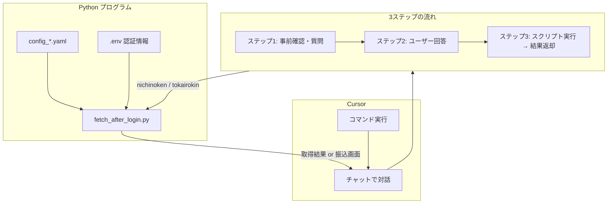

# DX互助会メンバー向け「ブラウジングオートメーション」の取り組み紹介

**スライド形式で見る**: 同じフォルダの **`DX互助会向け_ブラウジングオートメーションの取り組み紹介.html`** をブラウザで開くと、スライド形式で表示されます（上下スクロールでスライドを切り替え）。

---

Cursor（AI 付きエディタ）と Python（Playwright）を組み合わせ、**ログインが必要な Web サイト**に自動でアクセスし、情報取得やフォーム入力を行う取り組みです。Gmail API とは別の「ブラウザ操作の自動化」として実施しています。

---

## 1. 実施内容（コマンドで使用したもの）

実施した内容は、**Cursor のコマンド**として登録した 2 種類です。

| コマンド | 対象サイト | 主な用途 |
|----------|------------|----------|
| **nichinoken-fetch** | 日能研 MY NICHINOKEN | ログイン → お知らせ・スケジュール等を取得 → 知りたい内容に答える |
| **東海労金-振込** | 東海労金インターネットバンキング | ログイン → 振込画面へ遷移 → フォーム自動入力 → OTP 入力で実行 |

いずれも **Cursor のチャットでコマンドを実行**すると、AI が手順に従って Python スクリプトを呼び出し、結果を返す流れです。

**補足**：Cursor のコマンドは、**Claude の Agent Skills（エージェントスキル）と同等のことができる**仕組みです。特定のタスクの手順を事前に定義しておき、チャットで選択するだけで同じ流れで実行できます。

---

## 2. Claude の Agent Skills とは（参考）

いけともワークショップ（Notion の記事メモ）の資料によると、**Claude の Agent Skills** は次のような仕組みです。

- **定義**：特定のタスク（例：Excel VBA マクロ設計）を自動化するための「事前定義された手順」を AI に渡す機能
- **登録方法**：Claude で「カスタマイズ」→「スキル」→「プラス」ボタン → 配布された ZIP ファイルをアップロード → スキル名を入力して使用開始
- **例**：Claude Excel VBA Designer は、インプットとアウトプットの Excel ファイルを渡すだけで、自動的にマクロを設計・生成するスキル
- **オープンフォーマット**：Claude だけでなく、他の AI ツール（ChatGPT、Google Antigravity 等）でも利用可能な形式で配布されている
- **エージェントチーム機能**：複数 AI モデルの連携が可能（例：調査をエージェントに任せ、結果を NotebookLM に蓄積して図解する、といった使い方）

Cursor のコマンドは、**「事前定義された手順を AI に渡し、選択するだけで同じ流れで実行する」**点で、Claude の Agent Skills と同等の考え方です。違いは、Cursor では Markdown ファイル（`.cursor/commands/` 内）に手順を書き、スラッシュコマンド（`/`）で一覧から選ぶ形で使うことです。

---

## 3. コマンドの実行の仕方（チャット画面のイメージ）

「コマンドってどう使うの？」という方向けに、実際のチャット画面をイメージした流れを説明します。

### 3.1 チャットにどうやって入力するか

Cursor のチャット（Composer または Chat）の入力欄に `/` を打つと、**スラッシュコマンドとして登録したものが一覧で表示**されます。言葉で直接コマンドを入力するのではなく、**あらかじめ登録された選択肢の中から選ぶ**形です。

一覧から **nichinoken-fetch** や **東海労金-振込** を選んで送信すると、コマンドの手順が開始されます。

### 3.2 選択後にどんな表示が出るか

コマンドを選択して送信すると、AI は **いきなりスクリプトを動かさず**、まず質問や確認を返します。

**日能研（nichinoken-fetch）の場合の例：**

```
【AI の返答】
知りたい内容は何ですか？（例：3月1日の公開模試、口座振替、個別面談の案内など）
```

**東海労金（東海労金-振込）の場合の例：**

```
【AI の返答】
東海労金のログインIDとパスワードは .env に設定済みですか？
未設定の場合は、このチャットで渡すか、browser_automation の .env に
TOKAIROKIN_USER と TOKAIROKIN_PASS を追加してください。
```

このように、**選択したコマンドの「ステップ 1」に書かれた質問・確認**が、そのままチャットに表示されます。

### 3.3 質問に回答した後にどうなるか

ユーザーが質問に回答すると、AI がその内容を受け取り、**ステップ 2 → ステップ 3** へ進みます。

**日能研の例：**

| ユーザーの入力 | AI の動き |
|----------------|------------|
| 「3月の公開模試について知りたい」 | スクリプト（`fetch_after_login.py nichinoken`）を実行 → 取得結果ファイルを読み、3月の公開模試に関する箇所を抜き出して返答 |

**東海労金の例：**

| ユーザーの入力 | AI の動き |
|----------------|------------|
| 「三菱UFJ 熱田支店、口座 xxx、1万円」 | 振込内容を確認したうえで、`fetch_after_login.py tokairokin --bank-name "三菱UFJ銀行" ...` を実行 → ブラウザが起動し、フォーム入力まで自動で進む → OTP 入力で一時停止 |

**ポイント**：  
「何を聞くか」「いつスクリプトを動かすか」がコマンドに書かれているため、AI が迷わず同じ手順で進みます。**一度コマンドを登録しておけば、毎回同じ流れで使える**のがコマンドの便利さです。

---

## 4. 日能研と振込の事例：Python プログラムとコマンドの結びつき

### 4.1 全体の流れ



### 4.2 日能研の情報取得（nichinoken-fetch）

**コマンド**が実行されると、AI はコマンド内の手順に従って動きます。

| ステップ | コマンドの指示 | 実際の動き |
|----------|----------------|------------|
| 1 | いきなりスクリプトを動かさない | 「知りたい内容は何ですか？（例：3月1日の公開模試、口座振替、個別面談の案内など）」と質問 |
| 2 | ユーザーの回答を待つ | ユーザーが「〇〇について知りたい」と答える |
| 3 | スクリプト実行 → 取得 → 質問に答える形で返す | `python fetch_after_login.py nichinoken` を実行し、出力ファイルを読み、該当箇所を抜き出して返答 |

**Python プログラム側**（`fetch_after_login.py`）の動き：

1. `config_nichinoken.yaml` と `.env` から設定・認証を読み込む
2. Playwright でブラウザを起動し、日能研 MY NICHINOKEN にログイン
3. お知らせ・メッセージ・月間スケジュール（PDF）などを取得
4. 結果を `500_Obsidian/02_Clippings/日能研/日能研_取得結果_YYYYMMDD_HHMMSS.md` に保存

**コマンドとプログラムの結びつき**：

- コマンド（nichinoken-fetch.md）が「いつ・何を聞くか」「どのパスで実行するか」「出力をどう読むか」を AI に指示
- AI がその指示に従い、適切なタイミングで `fetch_after_login.py nichinoken` を実行
- 出力ファイルを読み、ユーザーが知りたいテーマに絞って返答

### 4.3 東海労金の振込（東海労金-振込）

**コマンド**が実行されると、同様に 3 ステップで進みます。

| ステップ | コマンドの指示 | 実際の動き |
|----------|----------------|------------|
| 1 | 認証情報の確認 | 「東海労金のログインIDとパスワードは .env に設定済みですか？」と案内 |
| 2 | 振込内容の確認 | 「振込先（銀行・支店・口座番号）・振込金額を教えてください」と聞く |
| 3 | スクリプト実行 | `python fetch_after_login.py tokairokin --bank-name "三菱UFJ銀行" --branch-name "熱田支店" --account xxxxxxx --amount 10000` など、パラメータ付きで実行 |

**Python プログラム側**の動き：

1. `config_tokairokin.yaml` と `.env` から設定・認証を読み込む
2. 東海労金インターネットバンキングにログイン → 合言葉（自動）→ 振込画面へ遷移
3. `--bank` `--branch` `--account` `--amount` が渡されていれば、`config_tokairokin.yaml` の `transfer_form` に従いフォームを自動入力
4. ワンタイムパスワード（OTP）入力で一時停止 → ユーザーが手動で OTP を入力し、振込を実行

**コマンドとプログラムの結びつき**：

- コマンドが「認証確認」「振込内容の確認」「実行コマンドの形式」を AI に指示
- AI がユーザーから得た振込先・金額をコマンドライン引数に変換して実行
- 振込は金銭操作のため、実行前に必ず内容をユーザーに確認させる旨もコマンドに記載

### 4.4 共通の仕組み

| 要素 | 日能研 | 東海労金 |
|------|--------|----------|
| **Python スクリプト** | `fetch_after_login.py`（共通） | 同上 |
| **サイト指定** | `nichinoken` | `tokairokin` |
| **設定ファイル** | `config_nichinoken.yaml` | `config_tokairokin.yaml` |
| **認証** | `.env` の `NICHINOKEN_USER` / `NICHINOKEN_PASS` | `.env` の `TOKAIROKIN_USER` / `TOKAIROKIN_PASS` |
| **コマンド保存場所** | `500_Obsidian/.cursor/commands/` | 同上 |

---

## 5. ルールの使い方とコマンドの使い方のポイント

### 5.1 ルール（.cursor/rules）の使い方

- **ルール**は、AI が「どのワークスペースで何をすべきか」を判断するための指示です。
- 例：`command-location.mdc` では「コマンドを登録するときは `500_Obsidian/.cursor/commands/` に保存する」と指定しています。
- これにより、**どのフォルダで作業していても**、コマンドの保存先が一貫します。
- ルールは `alwaysApply: true` にすると、そのワークスペースを開いている間は常に適用されます。

**ポイント**：  
「こういう依頼をされたらこう動く」というパターンをルールに書いておくと、AI が迷わず同じ手順で動いてくれます。

### 5.2 コマンド（.cursor/commands）の使い方

- **コマンド**は、**具体的な手順を書いたプロンプト**です。ユーザーが「このコマンドを実行して」と指定すると、AI がその手順に従って動きます。
- 日能研・東海労金のコマンドは、いずれも **3 ステップ**で構成されています：
  1. 最初に何を聞くか（質問・確認）
  2. ユーザーの回答を待つ
  3. 回答を受けてからスクリプトを実行し、結果を返す

**ポイント**：

| ポイント | 説明 |
|----------|------|
| **いきなりスクリプトを動かさない** | 日能研では「知りたい内容」、東海労金では「認証」「振込内容」を先に確認してから実行するよう、コマンドに明記しています。 |
| **絶対パス・カレントの指定** | スクリプトの場所（`215_神・大家さん倶楽部/C1_cursor/browser_automation/`）と、仮想環境の有効化方法をコマンドに書いておくことで、AI が正しい場所で実行できます。 |
| **出力の読み方** | 日能研では「直近の取得結果ファイルを開き、ユーザーの質問に答える形で返す」と指定。AI がファイルを探して内容を解釈する手順が明確になります。 |
| **セキュリティ・確認** | 振込は金銭操作のため、「実行前に振込内容をユーザーに確認させる」とコマンドに書いてあります。 |

### 5.3 ルールとコマンドの役割分担

| 種類 | 役割 | 例 |
|------|------|-----|
| **ルール** | ワークスペース全体で守る方針・場所の指定 | コマンドは `500_Obsidian/.cursor/commands/` に保存する |
| **コマンド** | 特定のタスクの手順（いつ何を聞くか、どう実行するか） | 日能研の情報取得、東海労金の振込 |

ルールで「どこに何を置くか」を決め、コマンドで「そのタスクをどう進めるか」を細かく指示する、という分担にすると運用しやすくなります。

---

## 6. まとめ

- **実施内容**：日能研の情報取得と東海労金の振込を、Cursor のコマンドとして登録し、Python（Playwright）スクリプトと連携させました。
- **結びつき**：コマンドが「いつ・何を聞くか」「どのスクリプトをどう実行するか」「結果をどう返すか」を AI に指示し、AI がその通りに `fetch_after_login.py` を呼び出して結果を返します。
- **ポイント**：ルールで保存場所や方針を統一し、コマンドでタスクごとの手順を明確に書くことで、再現性の高い自動化が実現できます。

---

## 参照

- **Claude Agent Skills の説明**：Notion「神大家 東海DX互助会」内の「いけともワークショップ_google AI studio」「いけともワークショップ_Excel自動化」の記事メモ（添付資料含む）
- コマンドファイル：`500_Obsidian/.cursor/commands/nichinoken-fetch.md`、`東海労金-振込.md`
- Python スクリプト：`215_神・大家さん倶楽部/C1_cursor/browser_automation/fetch_after_login.py`
- ルール（コマンド保存場所）：`215_神・大家さん倶楽部/.cursor/rules/command-location.mdc`
